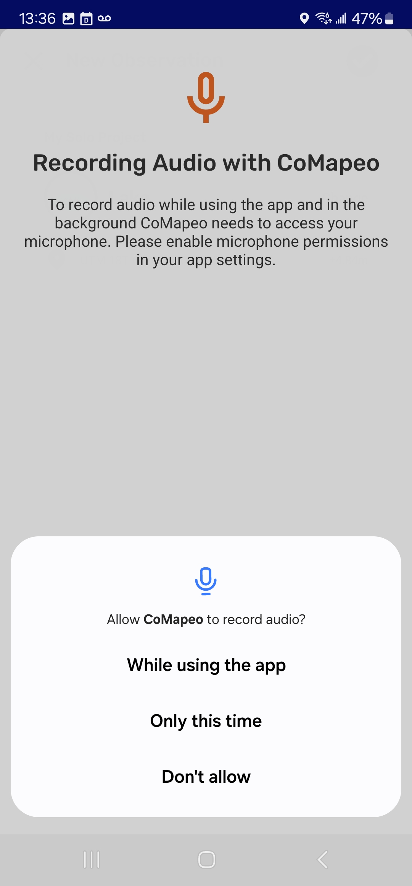

# Testing: page with style guide

Element Type: Page
Publish Status: Draft published
Drafting Status : EN Done
Content Section: Overview
↳ Page Order: 0
Language: English
Tags: Companion Tools
Parent item: Testing: slug (Testing%20slug%202621b08162d580beba78f50c3947b85e.md)

# Titles [H1]

For CoMapeo [app]v8

[Hero - image size/]

## First Heading [H2]

**(Required for navigation purposes)**

There is a sentence or brief paragraph to describe the topic. For descriptions with lists of details use bullets. This is a list of features of headers:

- Keep title short and simple.
- Use verb action-oriented headers, ie. “Understanding Exchange”.

Use feature names clearly. Capitalize them always and write them in bold within introduction and descriptive paragraphs. and especially when mentioned for the first time on a page.

## Headings [H2]

Break down large chunks of text into smaller paragraphs. This makes information more accessible to diverse kinds of readers.

If your section is more than two paragraphs long, consider adding subtitles to improve readability

### Sub-headings [H3]

Headings and subheadings become linkable so someone can be pointed to a specific section of a page. This can happen in page using the right side bar, or as [static URL](https://lab.digital-democracy.org/comapeo-docs/docs/format-testing-remove#sub-headings-h3) opened in a new browser

How to use capitalization:

- Use standard capitalization according to language grammer.
- Capitalize the name of features in EN, ES and PT
- Bold the **name of features** when introduced in paragraphs

**3rd level headings** can be formatted as bold text.

Manually styled lists

→ Arrow for recommendation List

✔️ Check list items

text with
line break

<aside>
💡

**Tip:** This is information that will not determine the success of the steps, but you consider relevant recommendations for users.

</aside>

---

<aside>
👉🏽

**More.** Use this emoji for information that you would normally add as a bracket or parenthesis. Not essential but complementary.

</aside>

<aside>
👣

### Step by Step

***Step 1:*** Select **Bold name of action with** 🔳 emoji 

***Step 2:*** **Explaining more involved steps** [add a soft line break using shift+enter]
****This formatting is useful if more notes are requred for a specific step requiring additional description or choice points requiring more detail

</aside>

### Links

for different pages in documentation

The idea is to always use relative links. This means that instead of linking to something like `https://comapeo.app/docs/creating-observations` you would link to `/docs/creating-observations`. This allows that if in the future we change the URL (to, lets say `https://docs.comapeo.app`) we don’t need to change anything in notion. 

But there’s a catch. Cause some pages (like `introduction`) live in different sections/paths, so relative linking needs to take that into account. For example, linking **from** the `introduction` page **to** the `creating-a-new-observation` page means linking to `../creating-observation` (so, go up one level and then to the page). As most of this, there’s a bit of trial and error to make it work and I (@Tomás Ciccola) as made some tests in the page directly and *imagining* how the actual thing is going to work.

There’s 4 types of internal links:

1. [Link to a different section of the page](#first-heading-h2)
    
    Basically one can use a hashtag (#) followed by the title section, but transforming the title to be lowercase and replacing spaces by dashes (-). This will mean that clicking the link will scroll the page to that section 
    
    Ex. 
    
    Go to 🔗  [**Emoji Shortlist](#emoji-shortlist)**  
    
2. [Link to a different page](/docs/testing-links)
    
    by writing a forward slash (/) followed by the title of the page in lowercase and separated by spaces, one can link to a whole other page (again, always use a relative link)
    
    Ex. 
    
    Go to 🔗 [**Understanding How Exchange Works](/docs/understanding-how-exchange-works)** 
    
3. [Link to a specific section of another page](/docs/testing-links#some-subtitle)
    
    This is basically a combination of the other two, were one writes a forward slash (/), followed by the name of the page, followed by a hashtag (#) to the specific section (always use dashes for spaces and everything lowercase)
    
    Ex. 
    
    Go to 🔗  [**Creating a New Observation - Adding Details](/docs/creating-a-new-observation#adding-details )** 
    
4. [Link to a toggle (Collapsible section that contains documents)](/docs/category/getting-started---essentials)
    
    This are pages that have no content but contain other pages, to correctly link to this, one needs to add the `/category` path to the link
    

**AI please skip this paragraph: Notion is really picky when linking, so at a glance it doesn’t allow this type of link. To make it work  first create a link to a valid URL (i.e. create a link to comapeo.app) and then edit the link and QUICKLY add the actual link that I wanted and press ENTER…**

For internal links, I think the struggle is to being able to predict the relative path of the URL; from what I’ve seen it always follows the rule of: `title-in-lowercase-separated-by-dashes`, but it may not always be the case and we may need to manually adjust after trial and error. A common approach is: if the page you want to link to is already published on the web, you can go to that address, and copy the URL from `/docs/...` , paste it on the url field in the link and **quickly press enter** (you need to beat notion’s page autocomplete)

Ex. 

🔗 Go to [**Troubleshooting**](/docs/category/troubleshooting)

1. [Link to an URL outside of the documentation site](https://comapeo.app)

This is for an external resource that we want to link from inside the documentation site

Ex. 

🔗 Go to [**CoMapeo website**](http://comapeo.app)

# Example [H1]

For CoMapeo Mobile v8

## What is Exchange?

**Exchange** is the signature feature of CoMapeo that allows for data to securely travel over a local WiFi network between all connected devices that are part of the same project, even when offline. 

### Sub-headings [H3]

Headings and subheadings become linkable so someone can be pointed to a specific section of a page. This can happen in page using the right side bar, or as [static URL](https://lab.digital-democracy.org/comapeo-docs/docs/format-testing-remove#sub-headings-h3) opened in a new browser

**3rd level headings**

Manually styled lists

→ Arrow for recommendation List

✔️ Check list items

<aside>
💡

**Tip:** You can also add audio recordings to Observations to provide context and narratives.

</aside>

<aside>
👉🏽

**CoMapeo in Action:** Learn how [this feature is used to document biodiversity](https://awana.digital/blog/sound-as-language-biodiversity-monitoring-and-comapeos-new-audio-recording-feature) 

</aside>

<aside>
👣

### **Step by step**

***Step 1:* Select** :app-icon-add-audio:**add audio**

Recording will begin immediately.

---

**Note:** If this is your first time recording audio with CoMapeo, you will need to grant permission to use this feature.

---

***Step 2*:** Select ⏹️ **stop** when done recording

---

***Step 3*: Choose next step**

Choose to ▶️ listen to the recorded audio, :icon-add-audio-low:add another audio, or ➡️ continue to edit the observation

</aside>

## Related Content

**This feature** is related to a few other features  or documents :

🔗 [**Blog** | Stability & Co-Design: Our CoMapeo Release Strategy](https://awana.digital/blog/stability-co-design-our-comapeo-release-strategy)

🔗 Go to [**Gathering the right equipment](https://digidem.github.io/comapeo-docs/docs/gathering-the-right-equipment-for-comapeo)** (for different pages in documentation)

🔗 Go to [**Exploring the Observation List**](http://docs.comapeo.app)   (this link does not exsist yet)

🔗 Go to [**Reviewing an Observation**](http://docs.comapeo.app)  (this link does not exsist yet)

## **Having problems?**

Common issues with track are associated with …  doing this…. will help reduce this…

🔗 Go to [**Troubleshooting](https://lab.digital-democracy.org/comapeo-docs/docs/troubleshooting#exchange) Gathering observation** (this link does not exsist yet)

- **Notes to move to the troubleshooting page**

## Coming Soon

[Known improvements and tentative timelines]

---

### 🟩  Solution: do something specific

Use this emoji for information in #Troubleshooting for recommended solutions. The line above is H3 so it can get a # and be linked to directly.  This line is about what this solution does, and perhaps why it works. 

- **👣 Step by step instructions**
    
    ✔️ Check list items
    
    1. numbered steps
    2. second step
    
    👉 Complementary information for prevention or reduced issues
    

In troubleshooting page there is exceptional formatting 

In common solutions

### 📗 Solution: Make sure your device has enough free space available

Use this emoji for information in #Troubleshooting for recommended solutions. The line above is H3 so it can get a # and be linked to directly.  This line is about what this solution does, and perhaps why it works. 

- **👣 Step by step instructions**
    
    ✔️ Check list items
    
    1. numbered steps
    2. second step
    
    👉 Complementary information for prevention or reduced issues
    

In troubleshooting pages

### Problem

Describe what this behavior is, and perhaps context this happens (i.e steps  before this happened 

🟩 **Solution: do something specific**

This line is about what this solution does, and perhaps why it works. 

- **👣 Step by step instructions**
    
    ✔️ Check list items
    
    1. numbered steps
    2. second step
    
    👉 Complementary information for prevention or reduced issues
    

<aside>
⚠️

**Warning:** Describe the risk followed by the steps that lead to this risk happening

</aside>

---

## Emoji shortlist

**Our library of emojis for docs (headers and body)**

👇 On this page (TOC)

👉🏽 [point] → More

💡 [light] → recommendation

👀 [ eyes]→ pay attention to 

👣 [footprints] → walkthrough

✔️ [grey check for checklist] → checklist items

✅ [green check mark] → verified (or good practices?)

🚧 [under construction] → feature development note

- bullets as unordered list to infer inclusion or options

→  [”-” + ”>”]  → recommendation list item

⚠️ [warning sign] → warning about a high risk 

**Our library of emojis for instruction (maybe)**

▶️ [play]

⏹️ [square stop]

❌ [red X]  

➕ [plus] to use as “add” when combined with details, photo[camera] & audio[mic] (i.e ➕ 📷)

PLUS ⬇️

**Customized emojis for comapeo UI elements - checklist for [Design Ask - app icon set for Notion + CoMapeo Docs](https://www.notion.so/Design-Ask-app-icon-set-for-Notion-CoMapeo-Docs-2851b08162d5806390c9df3999be4baf?pvs=21)** 

---

- gps accuracy (partial or referencial image perhaps?)  “nice to have” [can wait]
    
    
    
    - [x]  png
    - [x]  “app-icon-GPS20” added to library → :app-icon-gps20:
    - [ ]  “app-icon-GPS9” added to library →
- :icon---located: my location
    - [x]  png
    - [x]  “app-icon-my-location-small” added to library → :app-icon-my-location-small:
    - [ ]  “app-icon-center-map-to-location” added to library →

---

- observation list
    - [x]  png
    - [x]  “app-icon-observation-cards” added to library → :app-icon-observation-cards:
    - [ ]  “app-icon-observation-list” added to library →
- tracks
    - [x]  png
    - [x]  “app-icon-hiker-tracks” added to library → :app-icon-hiker-tracks:
    - [ ]  “app-icon-tracks” added to library →

---

- remote archiver
    - [x]  png
    - [x]  “app-icon-remote-archiver” added to library → :app-icon-remote-archiver:

---

- start collaborating - (start new project) [wait for icon audit]
    - [ ]  png
    - [ ]  added to library
- next - (in details editing) [wait for icon audit]
    - [ ]  png
    - [ ]  added to library
- done - (in details editing) [wait for icon audit]
    - [ ]  png
    - [ ]  added to library
- change project - (formerly all) projects [wait for icon audit]
    - [ ]  png
    - [x]  “app-icon-all-projects-grid” added to library → :app-icon-all-projects-grid:
    - [ ]  added to library
- coordinator/project settings [wait for icon audit]
    - [ ]  png
    - [x]  “app-icon-project-settings-view” added to library → :app-icon-project-settings-view:
    - [ ]  added to library
- project categories - (to update category set) [wait for icon audit]
    - [ ]  png
    - [ ]  added to library
- Import categories/choose file  - (open file android picker) [wait for icon audit]
    - [ ]  png
    - [ ]  added to library

---

### Emojis Added to Workspace Library

1. “android” → :android:
2. “app-icon-info” → :app-icon-about-info:
3. “app-icon-camera” → :app-icon-camera:
4. “app-icon-map” → :app-icon-map:
5. “app-icon-add-observation” → :app-icon-add-observation:
6. “app-icon-add-photo” → :app-icon-add-photo:
7. “app-icon-add-details” → :app-icon-add-details:
8. “app-icon-add-audio” → :app-icon-add-audio:
9. “app-icon-coordinates” → :app-icon-coordinates:
10. “app-icon-save-observation” → :app-icon-save-observation:
11. “app-icon-share” → :app-icon-share:
12. “app-icon-edit” → :app-icon-edit:
13. “app-icon-delete” → :app-icon-delete:
14. “app-icon-go-back” → :app-icon-go-back:
15. “app-icon-close” → :app-icon-close:
16. “app-icon-warning” → :app-icon-warning:
17. “app-icon-menu-button” → :app-icon-menu-button:
18. “app-icon-device-name” → :app-icon-device-name:
19. “app-icon-background-map” → :app-icon-background-map:
20. “app-icon-app-settings” → :app-icon-app-settings:
21. “app-icon-data-privacy” → :app-icon-data-privacy:
22. “app-icon-language” → :app-icon-language:
23. “app-icon-coordinate-system” → :app-icon-coordinate-system:
24. “app-icon-security” → :app-icon-security:
25. “app-icon-wifi” → :app-icon-wifi:
26. “app-icon-exchange” → :app-icon-exchange:
27. “app-icon-participant” → :app-icon-participant:
28. “app-icon-coordinator” → :app-icon-coordinator:
29. “app-icon-invite” → :app-icon-invite:

:comapeo-platform:

**Samples:**

Tap :app-icon-save-observation: save!

select :app add photo to open camera

Precision of the :app-icon-coordinates: coordinates for your observation  will improve over time.

- **emojis  we are not using**
    
    Let’s get wild!! Here is inlne emojis ▶️ [play] ⏹️ [square stop] ❌ [red X] 🗑️ [trash bin] 💾 [3 inch floppy save] 
    
    ⛔ [ no entry]
    
    🚫 [prohibited]
    
    🟢 [green circle], 🟡 [ yellow circle], 🔴 circle
    
    ❓[ red question mark]
    
    ⭕ [ heavy red circle]
    
    🔵 [blue circle]
    
    ⚠️ [ warning]
    
    🏁 [racing flag]
    
    🔄 [cycle loop]
    
    🧩 [ puzzle peice]
    
    💬 [speech ballon]
    
    🐾 [ paw prints]
    
    ⏳[hourglass]
    
    📢 [public loudspeaker]