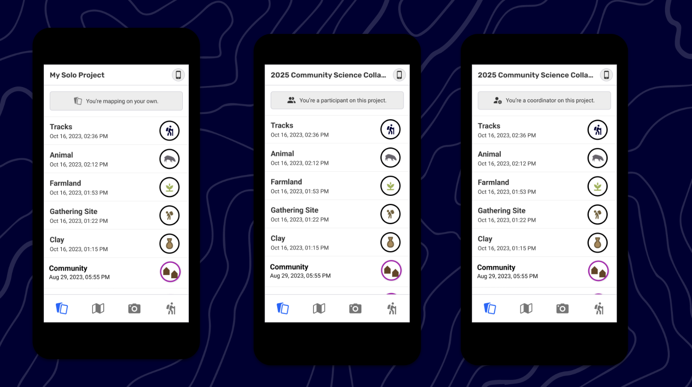
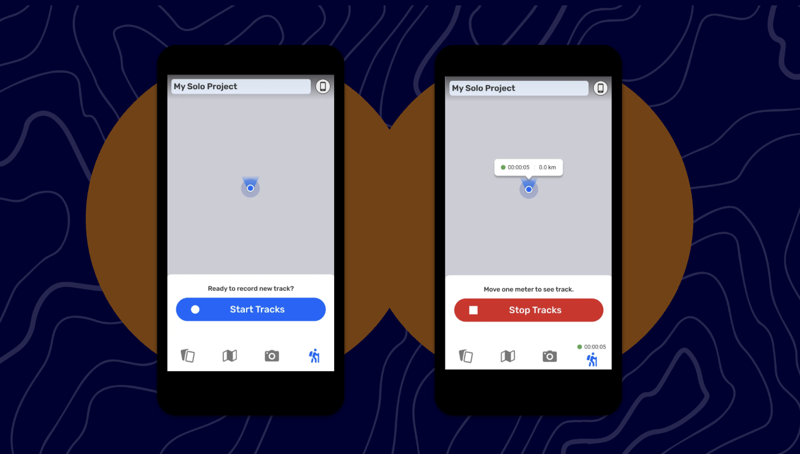
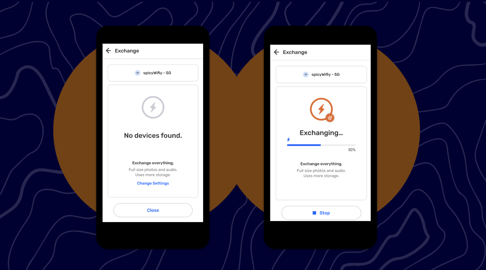
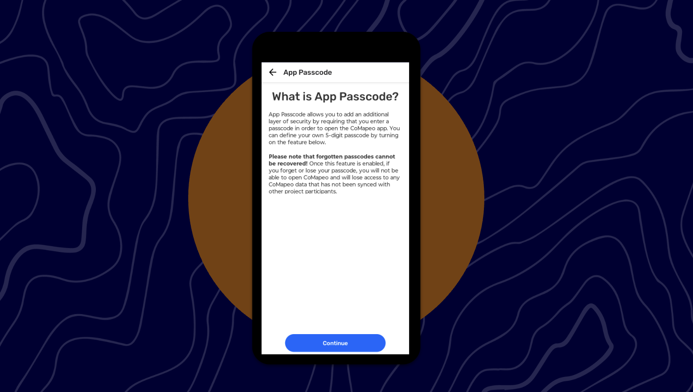

# Understanding CoMapeo’s Core Concepts and Functions

<!-- TODO: Hero image to capture. See ./placeholder_hero.txt for details. -->

## This chapter will cover

- The main data types: observations, tracks, and metadata
- How projects and roles work (solo, coordinator, participant)
- How exchange works locally and with Remote Archive
- Security basics (App Passcode, Obscure Passcode)
- Export options and file formats

## What CoMapeo helps you do

CoMapeo lets you collect and review georeferenced information on a mobile device, work solo or with collaborators on a shared project, and exchange data peer‑to‑peer or with a remote server.

## Core building blocks

- Observations
  - A single record you create on the map. You can add photos and, in recent versions, audio recordings. Observation metadata (date/time, GPS, accuracy, altitude, speed) can be viewed and shared when needed.

  
- Tracks
  - GPS traces you record to document paths and movement. Tracks appear in your observation list and link to observations made while tracking. Saving a track requires that you moved; if you start and stop without moving, it will not save.

  
- Projects
  - You start on “My Solo Project” (mapping on your own). Rename it to create a team project and become a Coordinator. Coordinators can invite devices; invited devices join as Participants.
- Exchange (Sync)
  - Exchange data with nearby devices. Exchange Settings include “Exchange Everything” (all media) and “Exchange Previews Only” (reduced media to save space).

  
- Remote Archive
  - Optional server participant for exchanging and storing data over the internet. Add a server URL in Project Settings; requires HTTPS. In 1.2.0, removing a server after adding it is not supported.

  
- Security features
  - App Passcode locks the app with a 5‑digit code. Obscure Passcode (00000) opens a “decoy” app state with no accessible data when you need to hide real data quickly.

  
- Data export
  - Export observations (GeoJSON, or ZIP with media) and tracks (GeoJSON). File names include the project name and date.
- Photo and observation metadata
  - Photo Info shows photo metadata and a “Validated by CoMapeo” header. Observation Metadata screens show whether data is validated (collected automatically) or un‑validated (manually entered) and can be shared.

  
- Maps
  - Map File Picker lets you add a custom map from a file on your device without placing files in special folders.

## How the pieces fit together

- Create observations on the map. Add photos and optionally record audio within the observation editor.
- Record tracks when moving; observations you make during a track are grouped with it and can be viewed from the track or observation detail views.
- Work solo on “My Solo Project” or rename it to create a shared project and invite collaborators. Your role (Coordinator or Participant) appears in the menu and project views.
- Control storage and connectivity with Exchange Settings. Use “Exchange Previews Only” on low‑space devices; keep at least one “Exchange Everything” device as your archive device.
- For remote teams, add a Remote Archive server to your project and exchange over the internet when online.
- Protect access with App Passcode; use Obscure Passcode in sensitive situations.
- Export data when you need files outside CoMapeo; choose observations with or without media, or tracks.

## Notes and version specifics

- Audio recording has a maximum of 5 minutes per recording.
- Remote Archive (Community Edition) requires an HTTPS URL and acts like a participant device that is always available for exchange.
- In CoMapeo Mobile 1.2.0, you cannot remove a Remote Archive once added.
- The “Validated by CoMapeo” photo module has planned improvements; observation metadata includes validated and un‑validated states.

<!-- TODO links to related sections will be added once those sections are finalized in ./content/ -->

Sources: context/comapeo_support_materials/quickstart_guides/audio_tracks_map_file/index.md; context/comapeo_support_materials/quickstart_guides/exchange_settings/index.md; context/comapeo_support_materials/quickstart_guides/remote_archive/index.md; context/comapeo_support_materials/quickstart_guides/security_features/index.md; context/comapeo_support_materials/quickstart_guides/observation_metadata/index.md; context/comapeo_support_materials/quickstart_guides/photo_data/index.md; context/comapeo_support_materials/quickstart_guides/data_export/index.md; context/CONTENT_INDEX.txt; context/STYLE_GUIDE.md
