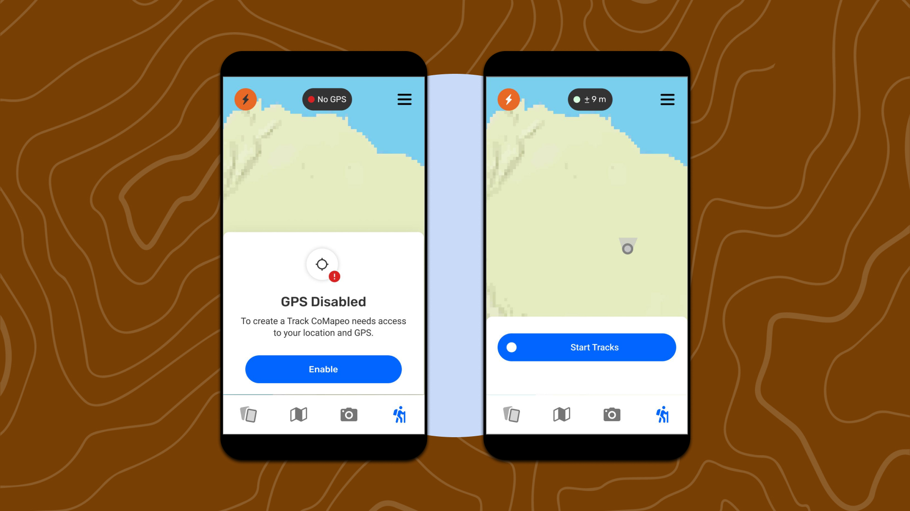

# Understanding CoMapeo’s Core Concepts and Functions

## In this page you will learn

- What CoMapeo is and the main ideas behind it
- The roles used in projects and how they relate
- A quick tour of core features and where to look next

## What CoMapeo is

CoMapeo is a major upgrade to the Mapeo platform focused on reliability, performance, and security. It is powered by a new peer‑to‑peer database called “Mapeo Core”, which enables highly requested features such as GPS tracks and audio and video recording.

## How you start

On first launch you see a Welcome screen. After getting started, CoMapeo opens on the Map view where you can begin exploring features.

## Core roles

CoMapeo uses two roles for teams: Project Coordinator and Project Participant. Coordinators invite devices that are on the same Wi‑Fi network and have the app open, and both devices must be on the same CoMapeo version.

## Key features at a glance

- Observations and Photo Info: CoMapeo exposes observation location and photo metadata in a dedicated Photo Info view that you can review and share when needed.
- Audio recordings and Tracks: Record audio for context and capture geo‑referenced tracks to document paths and boundaries.
- Map File Picker: Add a single custom map from anywhere on your device into CoMapeo.

## Exchange and storage

Use Exchange to share data among devices. Exchange Settings let you choose between Exchange Everything and Exchange Previews Only to better manage disk space on low‑memory phones.

## Security and privacy

Protect access to the app with App Passcode and use Obscure Passcode when needed.

## Remote Archive (Community Edition)

Add or remove a Remote Archive server and control how your device exchanges with that server.

## Where to go next

- Installing & Uninstalling CoMapeo
- Mapping On Your Own & Next Steps
- Understanding How Exchange Works
- Security Features
