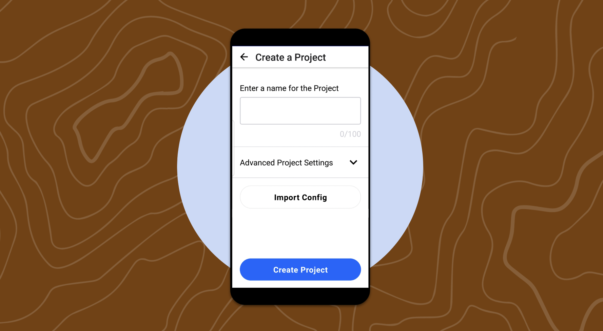

# Understanding CoMapeo's Core Concepts and Functions

## In this page you will learn

- What CoMapeo is designed for and how it keeps projects private and collaborative.
- The core building blocks: projects, roles, observations, tracks, and categories.
- How Exchange works for sharing data on a shared network.
- What to do first when opening the app and how to start mapping safely.

## Overview

CoMapeo is a digital mapping app for territory monitors that builds a private, collaborative mapping database by storing observations on devices. After onboarding (welcome, privacy choice, and device naming), the app opens to the Map view so you can explore features. If you plan to work with a team, create or join a project before you start collecting observations so everything stays aligned.

## Core concepts

- Projects and roles: A project keeps shared settings like the project name, verified devices, and the categories you use. Coordinators manage project details and invites; Participants create and share observations but cannot change project settings. Starting or joining a project first prevents losing observations later.
- Categories: CoMapeo ships with default categories. Coordinators can import a `.comapeocat` file to add custom categories, and those categories share with collaborators through project exchanges.
- Observations: Each observation saves GPS coordinates, date, time, and any media you add. You can include a description, category-specific detail fields, photos, and optional audio recordings. Coordinates and timestamps cannot be edited after saving.
- Tracks: Tracks capture movement from the Tracks option in the bottom navigation, letting you log paths alongside observations.
- Exchange: Use Exchange from the Map screen to share data with devices on the same project and Wi-Fi network. Start Exchange to send and receive updates; stop or leave the screen to end the session once syncing finishes.

## Key flows

1. Complete onboarding: accept permissions, choose whether to share metrics, and name the device so teammates can identify it.
2. Set up your project: create or join a project before gathering data to keep observations tied to the right team.
3. Start mapping: from the Map or Camera view, check GPS accuracy and tap the add button to create a new observation with the right category and details.
4. Exchange regularly: when teammates are on the same Wi-Fi network and project, start Exchange to keep everyone up to date.

## Images

## Notes

- Exchange requires all devices to have CoMapeo open on the same project and Wi-Fi network before syncing.
