# Mapping with Collaborators
For [Version Data]

To review CoMapeo's Default Category Set within the app itself, use the
following steps.
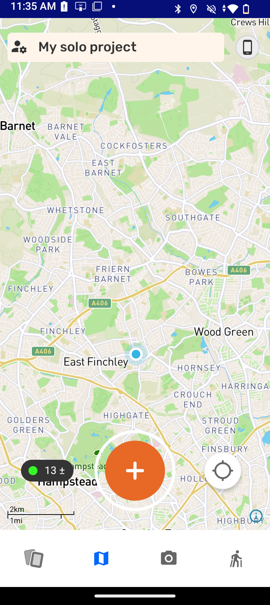
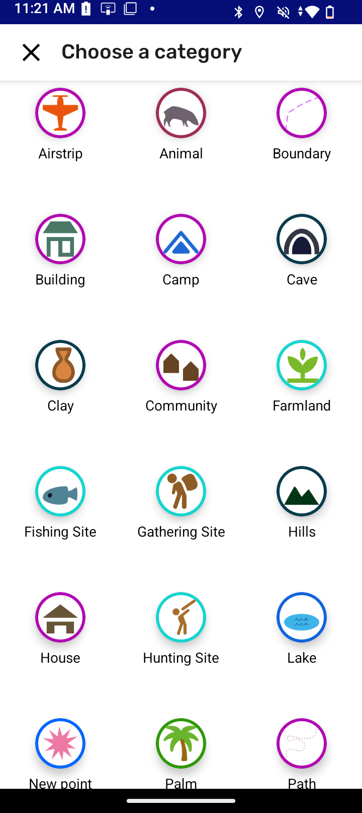
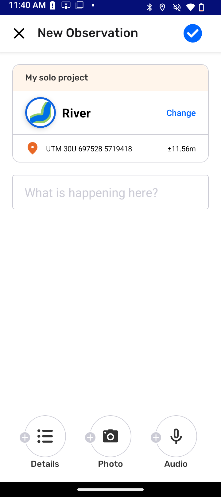 — corner of each category to find the kinds
of information you can add using this
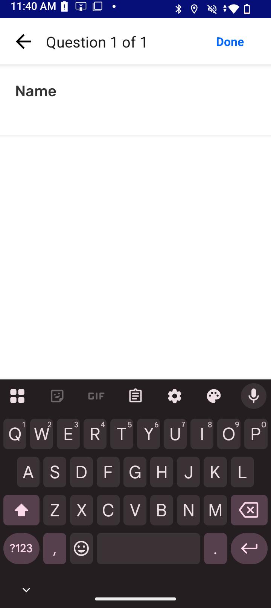
### — **Step 3**
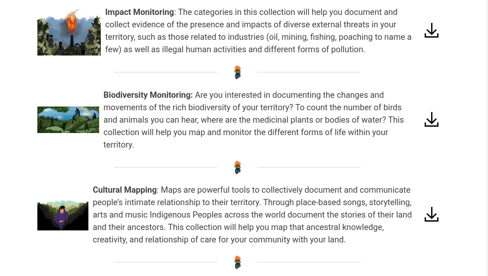 — you can explore the ones available at our
[[CoMapeo Category
Library]
](https://www.earthdefenderstoolkit.com/we
lcome-to-the-comapeo-categories-library/),
or decide to customize your own.
# Creating Custom Category Sets

**Reasons for customizing CoMapeo Category Sets**
-   Custom Categories are a powerful tool for customization in CoMapeo,
    allowing users to define specific icons, and questionnaires for
    their projects.
-   Text can be written in any language that can be typed, ensuring that
    key parts of the data collection interface can appear in the native
    language of the groups using it.
**Reflect and organize information you will need**
Initial planning and consultation with project participants is essential
to designing effective ways of organizing your data. To start the
customization process, project participants should reflect on the
project goals, what kind of data will be needed, and what properties
might be required for data outputs.
You will need to think through what to include for each of the **key
customizable areas of CoMapeo.**
-   **(https://docs.mapeo.app/complete-reference-guide/customization-options/custom-configurations/creating-custom-configurations/planning-configuration-and-data-structure/categories).**
    When collecting or creating data with CoMapeo, users assign a
    top-level category to each observation or element on the map.
-   **(https://docs.mapeo.app/complete-reference-guide/customization-options/custom-configurations/creating-custom-configurations/planning-configuration-and-data-structure/icons).**
    Each Category you include must have an icon or a small graphic to
    display to users when selecting a category.
-   [**[Details
    fields.]**](https://docs.mapeo.app/complete-reference-guide/customization-options/custom-configurations/creating-custom-configurations/planning-configuration-and-data-structure/details-fields)
    For each Category in your Category Set, you can include one or more
    structured data fields (like a mini form or questionnaire) that
    users can optionally fill out when creating a new observation or map
    element with that category.
Once you have this information, use the **CoMapeo Category Generator
Spreadsheet** to create your categories. This tool will allow you to
create and edit Categories, icons, details fields and language, and
export all this information into a **.comapeocat** file, which you will
import to your phone (and share among participants if you are on the
same project) to start documenting and exchanging information.
**If you already have a Mapeo
*configuration* file, and want to work
from there to create your CoMapeo
Category Set, start in Step 1. If you
are creating your CoMapeo Category Set
from scratch, start with Step 7.**
1.  Download Mapeo config file (ending
in .mapeosettings)into the computer
that you will use to customize your
CoMapeo Category Set.
> If you have it in a zip file, make
> sure you unzip it first and extract
> your file to have it available as
> .mapeosettings file where you can
> easily find it.
height="9.40625in"} — https://docs.google.com/spreadsheets/d/
195Zb0URLP_PP5h4_28mFu33cFem76rLO-es9rj

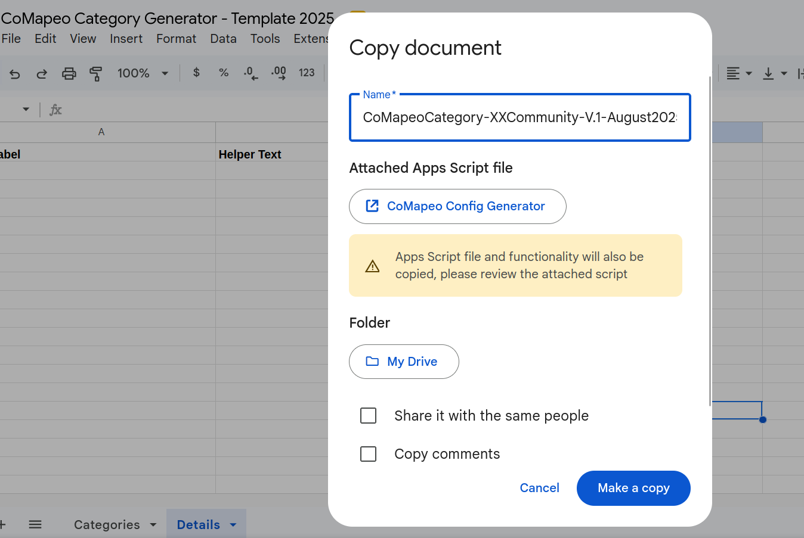
> We recommend including the name of
> your project and version in the name
> file and date, considering you might
> go through different iterations of
> customizing your categories, and you
> will want to know which is the most
> updated file.
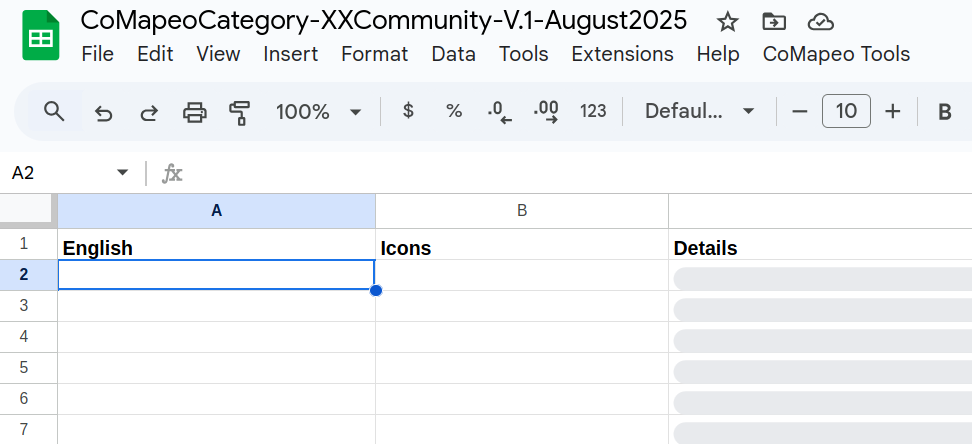 — the copy you make of the template
has **"CoMapeo Tools" on the right
of the top menu**. This means this
spreadsheet has the script that
will generate your .comapeocat
file.
-   If you want access to previous
iterations of your category file,
create a copy for each iteration,
rather than just editing their
version, and update the name and
date fo the copy.
### 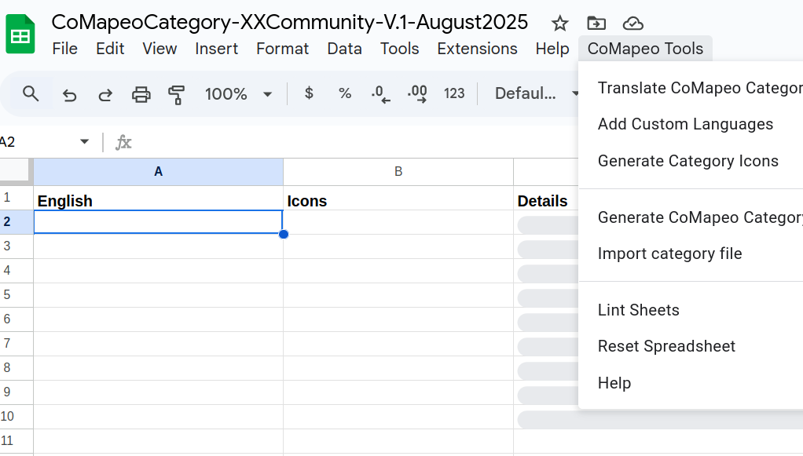
### 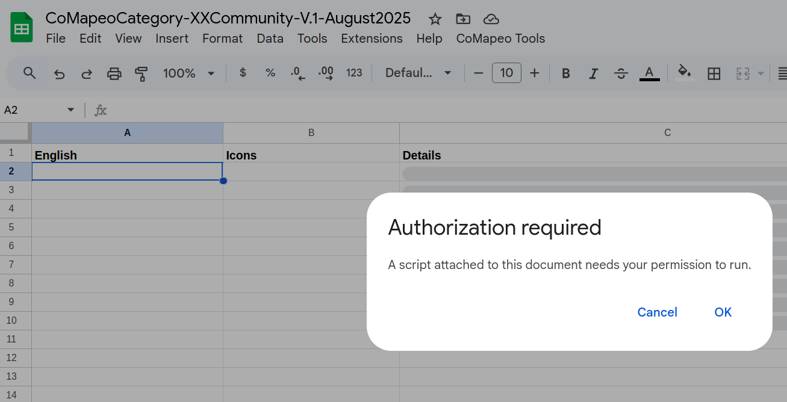 — -\> give all permissions requested
-\> select "Continue".
### — 5.  Once you have given permissions, go
back to the "CoMapeo Tools" menu
and click again on "Import
6.  If you imported your file from
Mapeo, the cells will be filled
automatically.
### — Whether you imported a Mapeo config or
}
**CATEGORIES TAB**
Here you can create each category,
customizing name, icon (image), and
details you want each to contain. You
can also add a thematic color that will
be the color of the dot displayed on
the map.
**Names** (COLUMN A)
7.  Use the column titled English (by
default) to type the name of each
category. You can change the
language to the one you are using
as your default language.
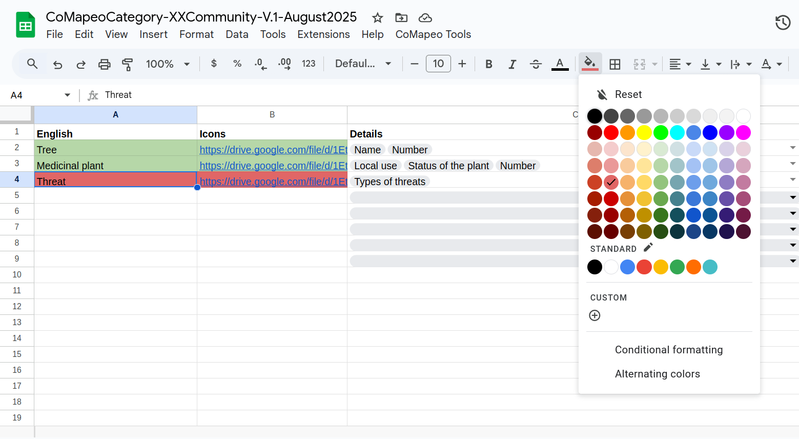 — This means you will choose the
color in which each observation
Example of thematic colors — will be shown as a point in the
in the default category — map.
set:
> To do this, click on the cells of the
 — >
> NOTE: This will not determine the
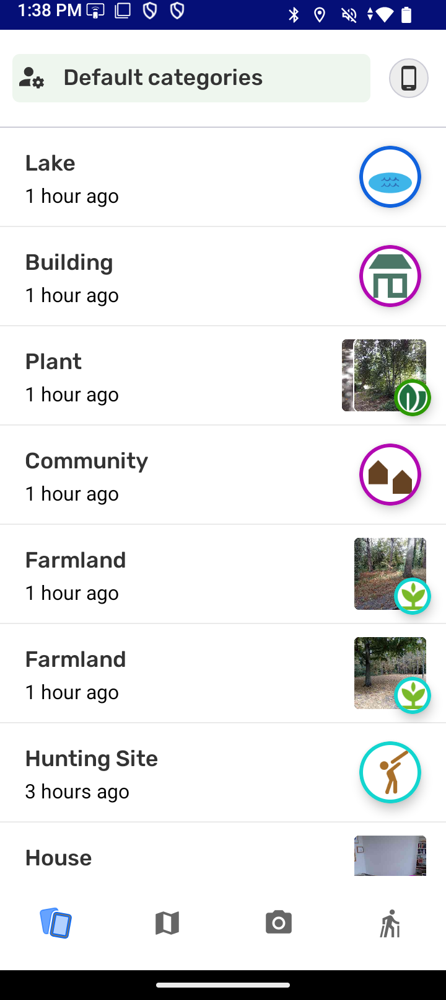 — Example of icons grouped in thematic
colors within the default category set.
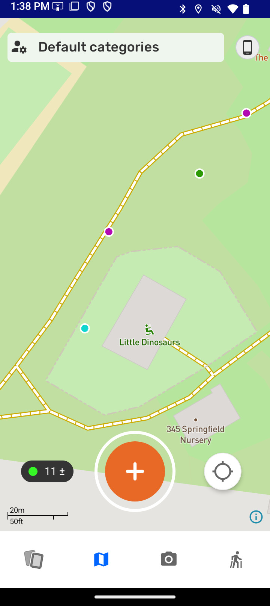 - human
ight="2.68163167104112in"} — activity
Dark red - threats
Green - plants and trees
Purple - human made paths or buildings
### — **Icons** (COLUMN B)
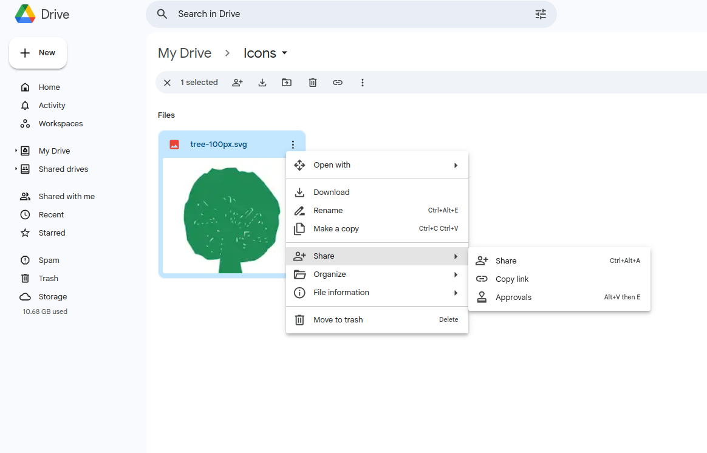 — configuration file and within the
list of files and folders find the
GDrive and name it "icons".
10. In the folder, make sure the
sharing settings are "anyone with
the link".
11. Then, right-click on the icon of
your choice and click on Share -\>
Copy Link. Copy the link and paste
it in the Icon column, next to the
category name that you want it to
represent.
### 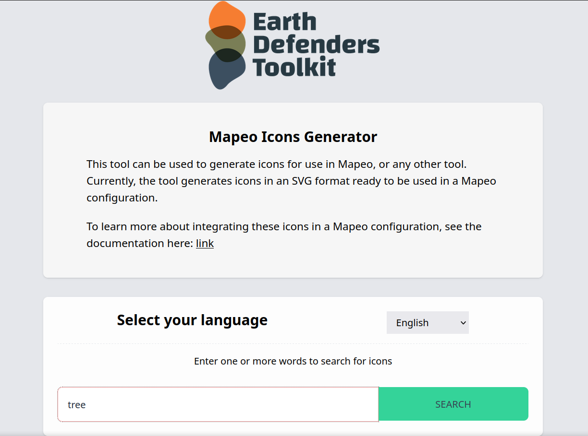 — icon
generator]](http
**
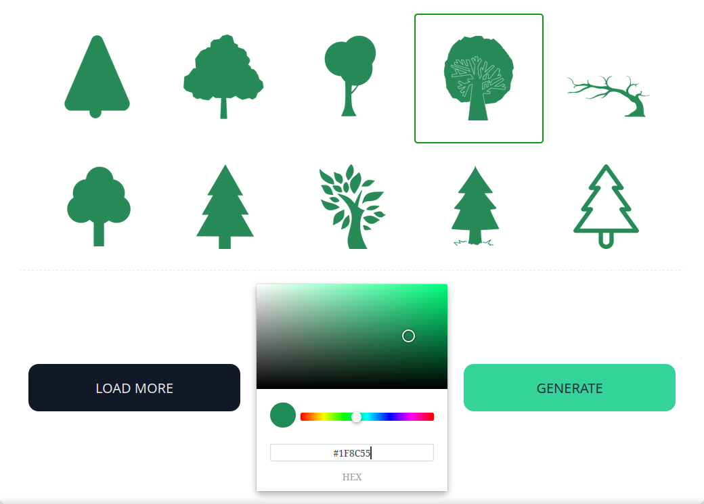
13. Follow the steps displayed on the
continue with step 10.
### 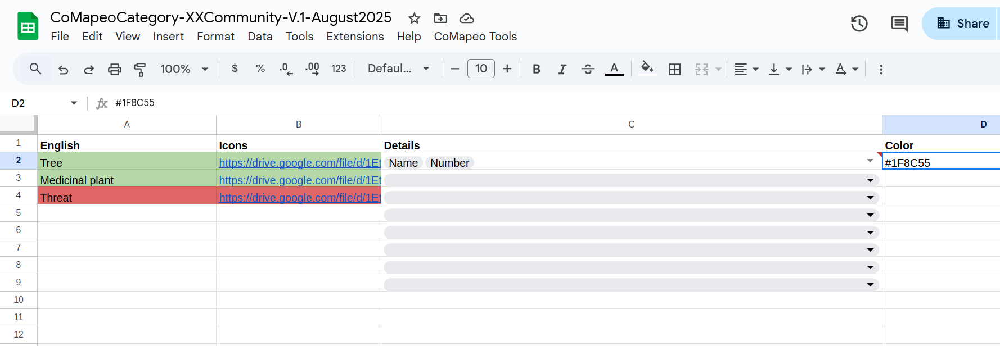 — > right image for the right category.
**Color of the icon** (COLUMN D)
14. When you create an icon using the
**CoMapeo Icon Generator, you will
find a color code below your svg
file options** (see example
#1F8C55)**.** This code indicates
the color you have chosen in the
color grid. Documenting this code
is useful if you want to use it
again in the future for this or
other icons, in this or other
design tools. On Column D you can
keep record of this color code.
> NOTE: This is an optional step as
> typing it in the spreadsheet will not
> determine the color of your icon. It
> is just a convenient place to have it
> documented.

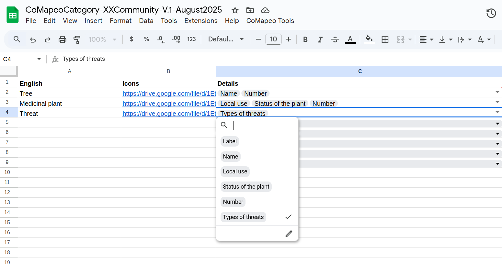
will select the details that you
want to add to each category.
> To add details to the list of
> details, go to the Details tab. Every
> detail you add to that tab, will be
> reflected on the Details column in
> the Categories tab.
### **.** — **DETAILS TAB**
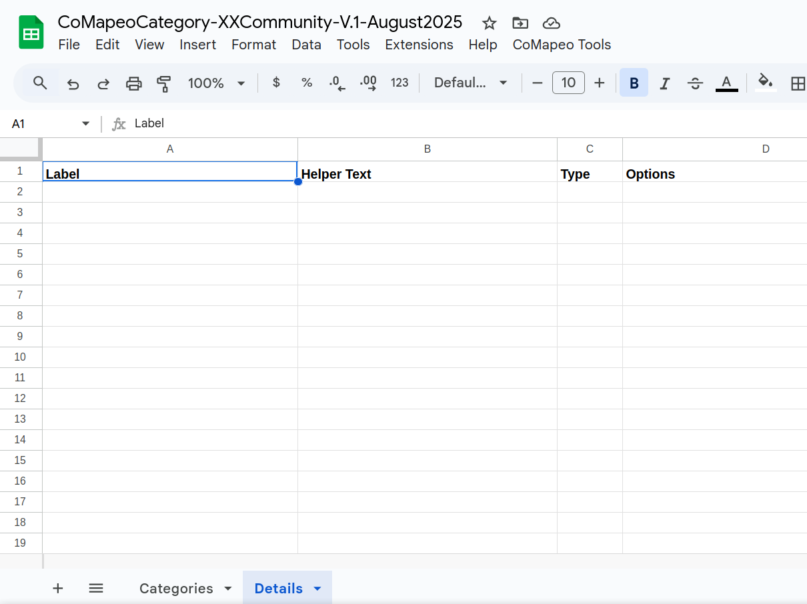 — category. You can **label** them
(which works like a title), add a
**helper text** (that explains what
that detail field is for or a
prompt question) and indicate the
**type** of response you want to
get as detail:
-   **Text** for written responses
-   **Multiple** for a list of options
-   **Number** for numerical responses
17. To write the list of multiple
options for a response, write them
within the same cell under the
Column D. Write a comma after each
option to indicate these are
separate options.
### — **Exporting file / Creating the
not show any red, orange or yellow
color indicating an error. If you want
to double check, go to CoMapeo Tools
-\> Lint Sheets and it will show you
any of these.
.
### ! — NOTE: Common errors to watch out for:
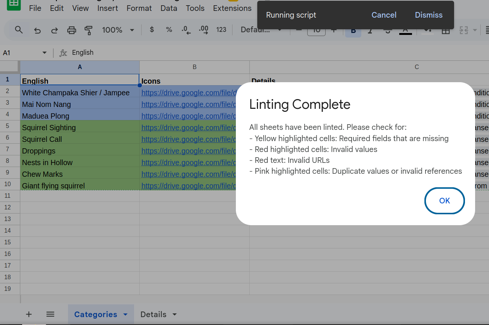
png) — that there are no commas in the labels,
especially if you have phrases longer
than 1 or 2 words. Commas indicate to
the spreadsheet the end of a label and
the beginning of the next one, so
having commas in a phrase will split it
into different labels.
-Go to the **"Categories"** tab and
check that the labels in the "Labels"
column are correct. If you find any
mistakes, go to the "Detail" tab and
correct the text there. Refresh the
spreadsheet.
If there are errors (such as commas)
you will see a red corner on the left
side of the cells under the "Detail"
columns. You can always go back to the
"Details" tab and fix typos, mistakes,
and refresh the spreadsheet.
## — 17\. Once its ready go to the top menu
### 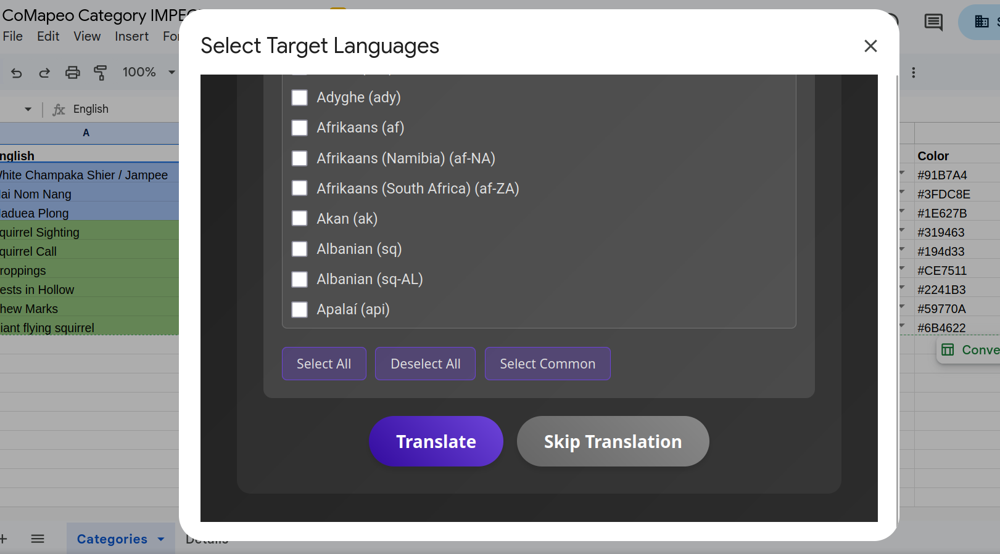 — work.
### ! — 19\. After completing 8 automatic
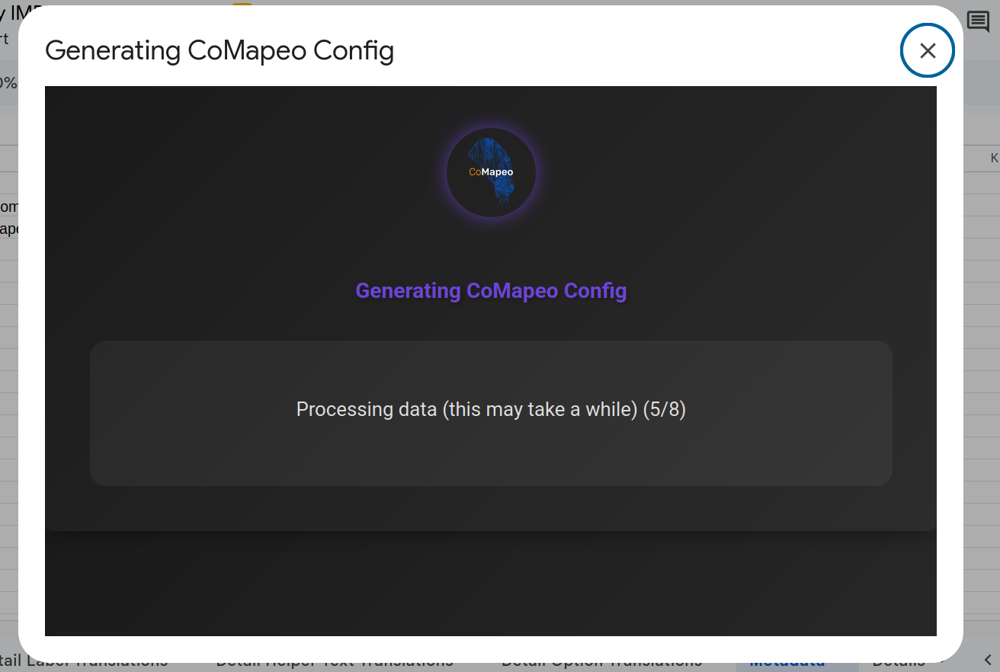
png) — be in a zip folder, open it and find it
ending in comapeocat.
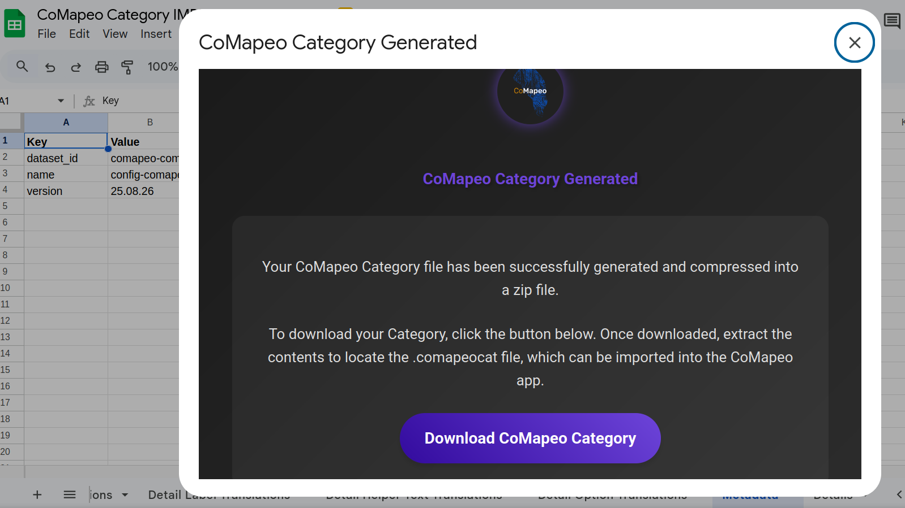
### 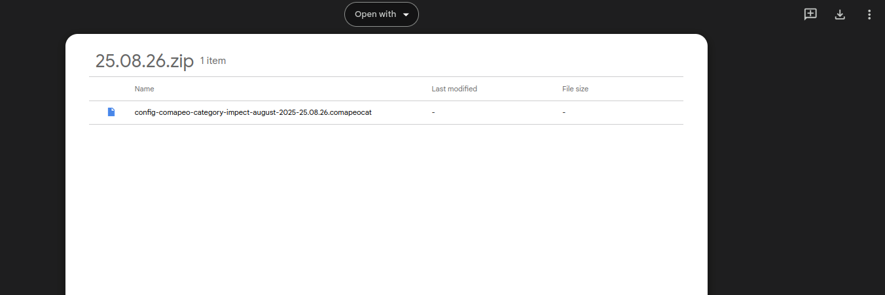 — You can use an email, Google Drive,
WhatsApp or the tool that works best
for you to get files to your phone.
### 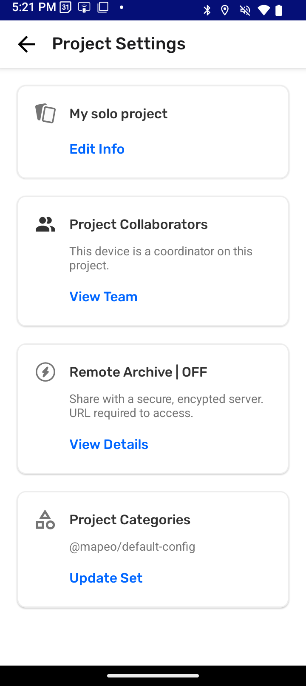 — Coordinator.
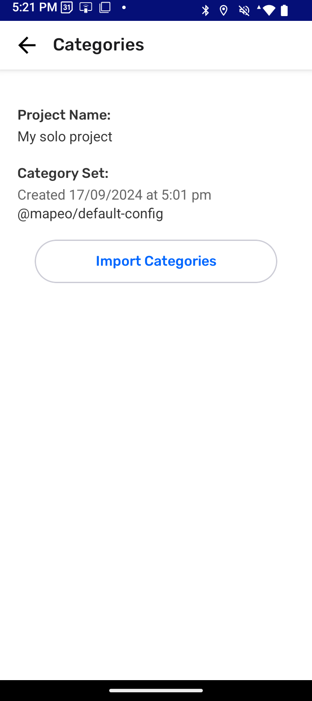
### 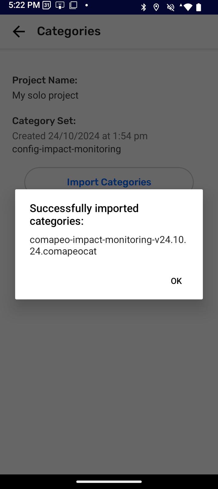
### — 23\. Invite people in your team to your
project, and they will have your
categories once they join your project.
If they are already on your project and
you want them to have the updated
Category Files, exchange information
with them and this will update their
categories.
### ![ — **Translations**
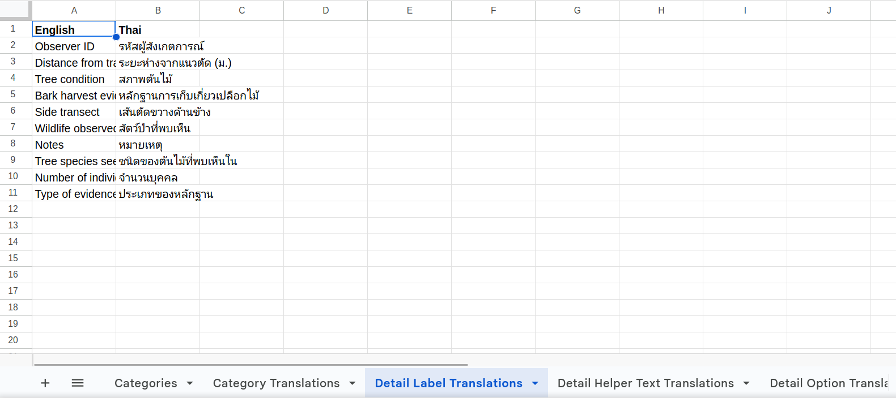
automatically creates other tabs that
you will see at the bottom of your
spreadsheet. There you can see the
automated translations from the
language you selected.
NOTE: These translations use Google
Translate and will likely need your
revision and improvement. Click on each
cell to edit or improve the
translations.
# See Also
-   [Creating a New Observation]
# (https://www.earthdefenderstoolkit.com/new-tool-mapeo-icons-generator/) blogpost by Luandro Vieira.
-   (https://www.earthdefenderstoolkit.com/welcome-to-the-comapeo-categories-library/)
    blogpost by María Alvarez
# Troubleshooting
-   ...
# Previous Versions

-   [Version Data]

-   [Version Data]

----
