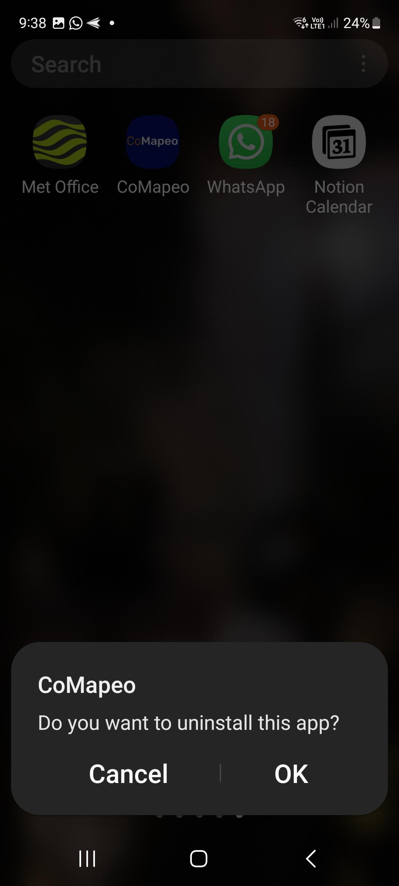

# Installing and Uninstalling CoMapeo
For [Version Data]

## **Reasons for Uninstalling CoMapeo**
You might want to uninstall CoMapeo for a number of reasons, for
example:
-   You have decided that the tool isn't the right one for you
-   You are no longer part of certain projects
-   You want to give your phone away to someone else
-   You think your device and the data are not secure
However, there are irreversible consequences to uninstalling CoMapeo, so
make sure you are sure about your reasons, and look at the checklist
below before completing the uninstallation.
## **Before Uninstalling CoMapeo**
When you uninstall CoMapeo all the data within the app will be deleted
and will not be recoverable. You will also lose access to any projects
you are part of, even if you are a coordinator. Therefore please follow
these steps before uninstalling CoMapeo.
-   If you are not part of any team projects, but are only using CoMapeo
    on your own, make sure you export any data from within all solo
    projects you have, or share any individual observation data that you
    consider important via Whatsapp / email etc.
  🔗 Go to **EXPORT DATA**
-   If you are part of one or more projects, make sure that you are up
    to date with your data exchange, so that any data you have collected
    can be part of the team data.
  🔗 Go to **UNDERSTANDING HOW EXCHANGE WORKS**
-   If you are a coordinator on a project, make sure that you set up at
    least one other device as a coordinator device for the project. If
    you fail to do this then the project will only have participants,
    and certain actions will not be possible.
  🔗 Go to **Managing a Team**
## **Uninstalling CoMapeo**
](https://drive.google.com/file/d/1heo-81t9Z9aQAp5vP3sYATVcwp6kAHzk/view?usp=drive_link)

 — CoMapeo.

 — homescreen. All the data held within
CoMapeo has been deleted from your phone.
# Troubleshooting
## **Deleting your app data**
You might want to delete your app data without deleting CoMapeo off your
phone. This might be useful if you have come across bugs or want to
start fresh with CoMapeo. Clearing data deletes all the contents of the
app, and resets it back to its default state, like when it was first
installed. If you have limited or no internet access this might be
useful, as you can start from scratch by deleting app data, without
having to re-download CoMapeo from the playstore.
## **Instructions**
Steps might vary slightly depending on Android version, but will be
something like:
1.  Go to **Settings** and then **Apps & notifications** (or just
    **Apps**)
2.  Tap **CoMapeo**
3.  Tap **Storage** or **Storage & cache** and then **Clear data** (make
    sure you clear data and not just cache)
4.  **Confirm** that you want to clear the data
On Android 11 and higher, "Clear data" was renamed to "clear storage".
Some older Android versions may also have a Clear data button directly
on the app info screen.
# Coming Soon
[Known improvements and tentative timelines]
# Previous Versions

-   [Version Data]

-   [Version Data]

----
