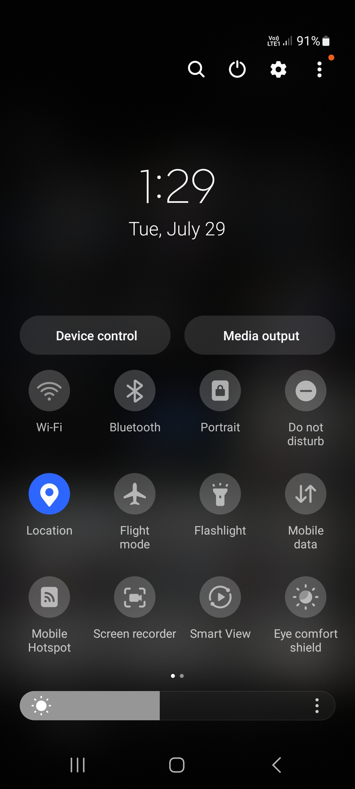
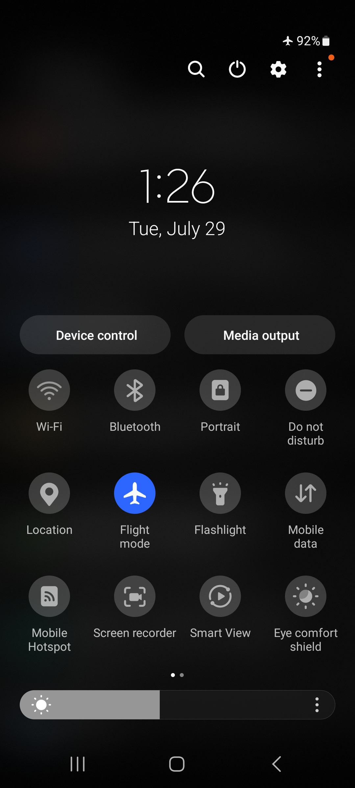
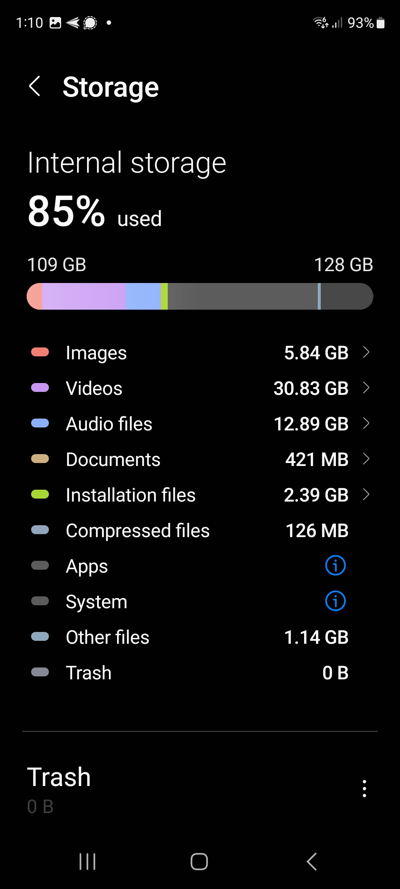

# Device Setup & Maintenance for CoMapeo

Element Type: Page
Drafting Status : To Improve after launch
Content Section: 10-Preparing to use CoMapeo
↳ Page Order: 6
Language: English
Parent item: Device Setup and Maintenance for CoMapeo (Device%20Setup%20and%20Maintenance%20for%20CoMapeo%202331b08162d5800daf10f07c30d8abe0.md)

### Why is it important to maintain my device?

Looking after your mobile device or computer to keep it well maintained helps it stay fast, secure, and free from performance issues. 

<aside>
💡

**Tip:** Consider carrying out the steps below to optimize your smartphone for using CoMapeo.

</aside>

<aside>
🚧

Recommendations for computers and use of CoMapeo Desktop coming soon

</aside>

# Setting up your device to use CoMapeo Mobile

Here you will learn what to do on your :android: Android smartphone or tablet phone (outside of CoMapeo) to get the best performance from it as you start to use it.

### ✔️ Checklist

<aside>
✅

**Turn on GPS:** Make sure your Location / GPS is turned on on your phone. You can usually find this in the quickfind menu, located by pulling down from the top of the screen.

---

</aside>

<aside>
✅

**Check Battery life**: To optimize battery life during data collection use flight mode. If possible bring an external battery pack and phone charging cable to recharge whilst in the field. Also try and make sure that other apps are not running in the background, draining your battery.

---

</aside>

<aside>
✅

**Manage and maintain storage**

CoMapeo isn’t a large app, and the observation data (GPS coordinates and notes) don’t take up very much space. However if you start taking lots of photographs, or recording audio, these can begin to fill up your memory. 

- Manage your storage use by deleting unwanted apps within Settings > Apps > Sort by "Last used" or "Size".
- If you have lots of photos and videos in your phone gallery, consider moving them to an SD card or other storage.
    
    
    
    
</aside>

---

### Good maintenance procedures for your phones

<aside>
🔒

**Secure your phone**

- Make sure you have a strong PIN, pattern, or fingerprint to open the screen - to keep CoMapeo data safe if you lose your phone, or it falls into the wrong hands.
- You can also secure access to CoMapeo by setting an app passcode: see **Working with an App Passcode**
    
    [https://lh7-rt.googleusercontent.com/docsz/AD_4nXf1OnelE9H8_r3QVCjY1G5fwU9XnaEUXGxL62qUI9bFbc_swvCpzxvdfi1levGc-VhGLWDOEwsZfjlkJEZTrieG9_Mr00AGHtzRhSonthNp56NuIDDh0fr-KJlMshWlKjonRgYX?key=gp1SR_ESd4345K1Ci1LIHQ](https://lh7-rt.googleusercontent.com/docsz/AD_4nXf1OnelE9H8_r3QVCjY1G5fwU9XnaEUXGxL62qUI9bFbc_swvCpzxvdfi1levGc-VhGLWDOEwsZfjlkJEZTrieG9_Mr00AGHtzRhSonthNp56NuIDDh0fr-KJlMshWlKjonRgYX?key=gp1SR_ESd4345K1Ci1LIHQ)
    
</aside>

<aside>
✅

**Keep your operating system updated**

**Step 1.**

Go to Settings

**Step 2.**

Tap on Software Update

</aside>

<aside>
✅

**Keep your android apps updated**

**Step 1.**

Open Google Play Store

**Step 2.**

Open main menu (Google profile picture)

**Step 3.**

Select Manage apps and devices

**Step 4.**

If you have good internet access, select “Update all”. If you have limited internet access, select “See details” to manually update  specific apps you use regularly. Remember to select CoMapeo.

</aside>

<aside>
👀

**Practice a regular maintenance routine**

**Step 1.**

Reboot / Restart your phone

**Step 2.**

Run a malware scan

**Step 3.**

Check your storage

**Step 4.**

Check you battery usage

[https://lh7-rt.googleusercontent.com/docsz/AD_4nXfFZB09c6KVbsCbBFM0SIh3KF_nZJFlirtp6H3lg08iXoIvBBY8z56wjsCmmUquMYBKfdzjL66R2Iz3stX_FIwN0V3DLzrJaqNXq_McwLaAH605Z4Yu7JbvtEwHjoEOlNrPmGU7Bw?key=gp1SR_ESd4345K1Ci1LIHQ](https://lh7-rt.googleusercontent.com/docsz/AD_4nXfFZB09c6KVbsCbBFM0SIh3KF_nZJFlirtp6H3lg08iXoIvBBY8z56wjsCmmUquMYBKfdzjL66R2Iz3stX_FIwN0V3DLzrJaqNXq_McwLaAH605Z4Yu7JbvtEwHjoEOlNrPmGU7Bw?key=gp1SR_ESd4345K1Ci1LIHQ)

</aside>

### Protect your phone against physical damage

**Smartphone cases.**

Depending on your phone's durability, choose a case that offers appropriate protection for the environment in which you will be using it, ideally waterproof and shock-resistant.

**Weather Considerations.**

If you are working in environments with extreme heat or cold, bear in mind that these can also impact your phone. It might shut down at very high and very low temperatures.

[https://lh7-rt.googleusercontent.com/docsz/AD_4nXd-2cXkjKLv08LntfdiZU1L0mptIeDppeYesE8vWm7Y3FscwGZrvZrZ6yVyjPf5oYj71uMeDdwJhxdvP-UkHD_xvDAWgoLuDY-1B9FAgEfSHs6T8SInAJNR2rxgxzhIs9ZDudLd?key=gp1SR_ESd4345K1Ci1LIHQ](https://lh7-rt.googleusercontent.com/docsz/AD_4nXd-2cXkjKLv08LntfdiZU1L0mptIeDppeYesE8vWm7Y3FscwGZrvZrZ6yVyjPf5oYj71uMeDdwJhxdvP-UkHD_xvDAWgoLuDY-1B9FAgEfSHs6T8SInAJNR2rxgxzhIs9ZDudLd?key=gp1SR_ESd4345K1Ci1LIHQ)

---

### Examine CoMapeo Mobile on Android

To learn about the space and permissions being used by CoMapeo, open the App Management streen for CoMapeo

<aside>
👣

Android Setting → App Management → CoMapeo

If coMapeo is on the homescreen, long press CoMapeo app  icos to open app options

</aside>

# Setting up your computer to use CoMapeo Desktop

# Related Content

Go to 🔗 [**Installing CoMapeo & Onboarding**](/docs/installing-comapeo--onboarding/) 

## Having Problems?

Go to 🔗 [**Troubleshooting: Setup and Customization](/docs/troubleshooting-setup-and-customization)**