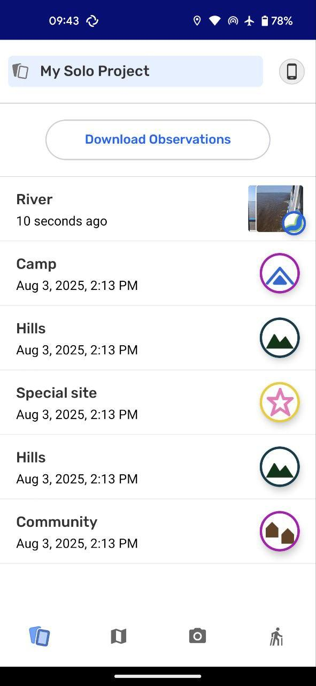

# Creating a New Observation
For [Version Data]

1.  [Creating a New Observation]
2.  [Creating a New Track]
3.  Adding Audio Recording to Observations [COMING SOON]
# Reviewing Observations
1.  [Managing the Observations List]
2.  [Reviewing an Observation] --- Details, GPS Info, and
    Photo Info
3.  [Sharing Outside Your Project]
# Managing Projects
1.  [Creating a New Project]
2.  [Adjusting Categories Set]
3.  [Inviting Collaborators]
4.  [Managing a Team]
5.  Managing Multiple Projects [COMING SOON]
# Managing Data & Privacy
1.  [Adjusting Data Sharing & Privacy]

6.  [Working with an App Passcode]
# Exchanging Observations
1.  [Understanding How Exchange Works]
2.  [Using a Remote Archive]
# Sharing Observations Outside of CoMapeo Mobile
# Ending a Project
# Troubleshooting
1.  [I can't start CoMapeo]
2.  [I have problems with GPS in CoMapeo Mobile]
3.  [I have problems with the camera in CoMapeo Mobile]
4.  [I want to update app permissions in CoMapeo Mobile]
# Glossary
# Miscellaneous
Understanding CoMapeo's Core Concepts and Function
Understanding CoMapeo's Core Concepts and Functions
For [Version Data]

# What is CoMapeo?
CoMapeo is a mapping and territory-monitoring tool created together with
Indigenous communities. It was designed to respond directly to their
priorities: documenting what is happening on their lands, telling their
stories, and protecting their rights.
Unlike many digital tools that are expensive, complex, or dependent on
the internet, CoMapeo is simple to learn, works offline, and keeps full
control of information in the hands of the community. This means it can
be used in remote areas, on affordable phones, and by people with
different levels of digital experience.
Because it was co-designed with Indigenous partners across multiple
continents, CoMapeo reflects their knowledge and way of working.
Communities use it to map cultural sites, monitor environmental threats,
record oral histories, and strengthen their stewardship of the land.
At its core, CoMapeo is more than a piece of software: it is a tool for
accessibility, autonomy, and collaboration --- enabling frontline
communities to gather and share information safely, in ways that serve
their own goals.
# What are CoMapeo's core concepts and functions?
-   Observations: Observations are the main way to collect information
    in CoMapeo. Besides the location, timestamp and category, they can
    also include photos, audios and details.
-   Tracks: Tracks let you record paths or boundaries as you move across
    the land. They are useful for documenting trails, patrol routes,
    rivers, or territory borders.
-   Projects: Projects organize your mapping work, either individually
    or with collaborators. They define the categories, team members, and
    settings for how data is collected and managed.
-   Exchange: Exchange is how devices share and synchronize project
    data. It allows collaborators to keep their observations up to date,
    even without internet access.
# Observations
<https://drive.google.com/file/d/14l9AjdANFSzhtCC94h0DHw2Xolt11_Yq/view?usp=drive_link>
Observations are the heart of CoMapeo. They allow you to capture data
about what you see in the field, including text, photos, audios, and
location.

💡 Tip: You can also add audio recordings to Observations to provide
context and narratives
# Tracks

Tracks let you record paths or boundaries while moving through the
landscape. They are useful for mapping trails, rivers, borders, or
patrol routes.
**Step 1**
Open the Tracks menu (walking man icon).
The app may ask for GPS permission.
**Step 2**
Tap **Start Track** to begin recording your
path.
**Step 3**
As you move, CoMapeo will draw a line on
the map and log your observations along the
way.
**Step 4**
To stop, reopen the Tracks menu and tap
**Stop Track**. You can then name and save
it
# Projects

Projects are how you organize your mapping work. They can be used for
solo mapping or for collaboration with a team.
**Step 1**
When you first open CoMapeo, you begin in
"My Solo Project".
**Step 2**
To collaborate, rename your project and
invite other devices to join.
**Step 3**
Coordinators can invite collaborators,
manage settings, and enable features like
Remote Archive. Participants can contribute
Observations and Tracks
💡 **Tip**: Since CoMapeo v5, you can now have **multiple projects** on
the same device without losing data
# Exchange

Exchange is how CoMapeo devices share and synchronize data with each
other, ensuring everyone in a project has the same information.
**Step 1**
Open the Exchange screen from the menu.
**Step 2**
Select whether you want to exchange
**everything** (all media) or **previews
only** (lighter data use).
**Step 3**
Make sure devices are on the same Wi-Fi
network, or use **Remote Archive** to
exchange over the internet
# [Related Content]
[Concise paragraphs]
-   Creating and Managing a Team
-   Data Export and Backup
-   Security Features
# Troubleshooting
[Links to resources for address known issues.]
-   Observation not saving? → Check your storage space and permissions.
-   Tracks not recording? → Verify GPS is enabled and location
    permissions are set to "Precise."
-   Exchange not working? → Make sure devices are on the same Wi-Fi
    network, or Remote Archive is configured.
# Coming Soon
[Known improvements and tentative timelines]
# Previous Versions

-   [Version Data]

-   [Version Data]

----
