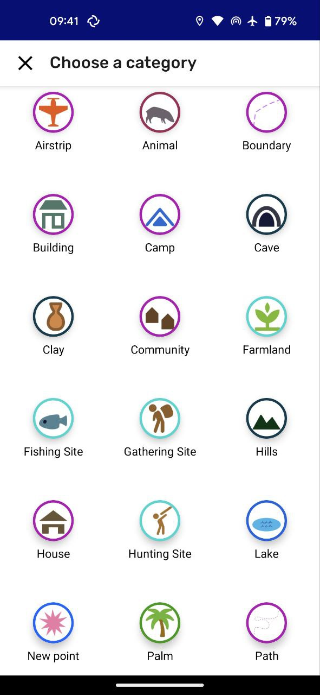
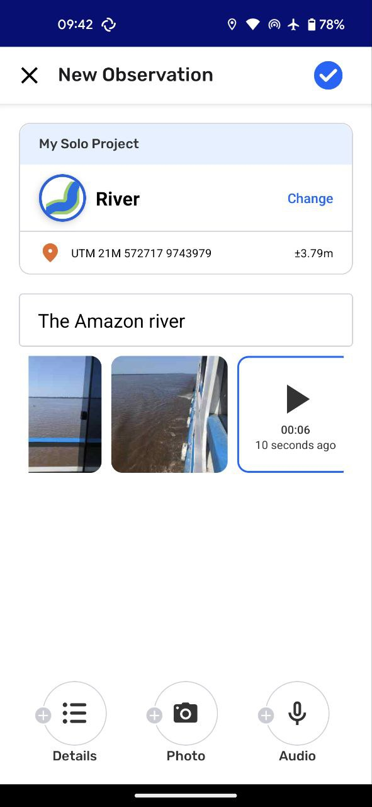

# Creating a New Observation

 [Source: context/sources/screenshots/photo_4997224093216518214_y.txt]

## In this page you will learn

- Start and save a new observation from the Map or Camera view. [Source: context/sources/setup_guide/setup_guide.md]
- Add descriptions, details, photos, and audio before saving. [Source: context/sources/setup_guide/setup_guide.md]
- Know what stays fixed after saving and what can be edited later. [Source: context/sources/setup_guide/setup_guide.md]

## Overview

Create observations from the Map or Camera tab by tapping the orange “+” button, choosing a category, and filling in the editor before saving. Join or create your project before team mapping so collected observations stay available when you start collaborating. [Source: context/sources/setup_guide/setup_guide.md]

## Core concepts

- Projects protect data continuity: observations made before joining or creating a project are removed when you later join one, so set up the project first. [Source: context/sources/setup_guide/setup_guide.md]
- Categories organize what you collect; selecting a category opens any category-specific detail fields. [Source: context/sources/setup_guide/setup_guide.md]
- GPS coordinates and timestamps lock in when you save; other fields are editable later based on role (Participants edit their own, Coordinators can edit all). [Source: context/sources/setup_guide/setup_guide.md]

## Key flows

1. Start from Map or Camera, tap the orange “+” button, and pick the category that fits what you are recording. [Source: context/sources/setup_guide/setup_guide.md]
2. Add a short description, complete any detail fields, take photos, and optionally record up to five minutes of audio; confirm the location looks correct. [Source: context/sources/setup_guide/setup_guide.md]
3. Tap Save to store the observation; it appears in the Observations list and can be edited later (within role permissions) except for location and time. [Source: context/sources/setup_guide/setup_guide.md]

## Images

 [Source: context/sources/screenshots/photo_4997224093216518213_y.txt]
 [Source: context/sources/screenshots/photo_4997224093216518212_y.txt]

## Notes

- Audio recordings are saved as part of the observation; keep recording under five minutes. [Source: context/sources/setup_guide/setup_guide.md]
- Participants can edit only their own saved observations; Coordinators can edit any observation in the project. [Source: context/sources/setup_guide/setup_guide.md]

Sources: context/sources/setup_guide/setup_guide.md; context/sources/screenshots/photo_4997224093216518214_y.txt; context/sources/screenshots/photo_4997224093216518213_y.txt; context/sources/screenshots/photo_4997224093216518212_y.txt
