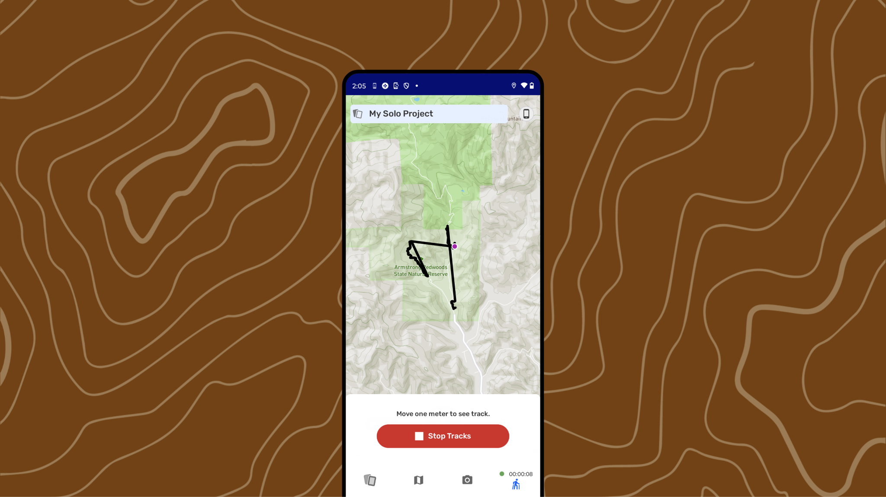

# Creating a New Track

Element Type: Page
Drafting Status : Editing in progress
Assignment Notes: AI Assignment: PS Doc section → Creating a New Track (https://www.notion.so/AI-Assignment-PS-Doc-section-Creating-a-New-Track-23b1b08162d580af935bfc3482a0272f?pvs=21)
↳ Assignment Target Date: December 1, 2025
Content Section: 20-Gathering Observations & Tracks
↳ Page Order: 25
Language: English
Parent item: Creating a New Track (Creating%20a%20New%20Track%202331b08162d5800c90bae220cd979c53.md)

For CoMapeo Mobile v8

# Creating a New Track

## What is a Track?

Tracks let you record paths or boundaries while moving through the landscape. They are useful for mapping trails, rivers, borders, or patrol routes.

---

<aside>
👣

### Step by step

**Step 1:** Open the Tracks menu  The app may ask for GPS permission.

---

**Step 2:** Tap **Start Track** to begin recording your path.

---

**Step 3:** As you move, CoMapeo will draw a line on the map and log your observations along the way.

---

**Step 4:** To stop, reopen the Tracks menu and tap **Stop Track**. You can then name and save it

</aside>

---

## Recording tracks in remote areas

low GPS  precision

multiday trips

multileg trips

---

## Related Content

Go to 🔗 [**Exploring the Observation List**](/docs/exploring-the-observations-list)    

## **Having problems?**

🔗 Go to [**Troubleshooting: Observations & Tracks](/docs/troubleshooting-observations-and-tracks)** 

---

<aside>
🚧

## Coming soon - More information

</aside>