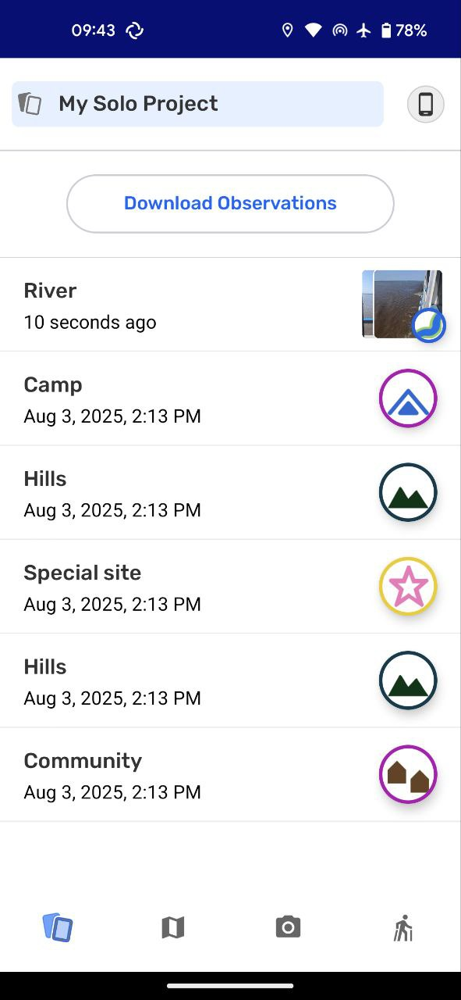

# Exploring the observations list

## In this page you will learn

- What appears in the observations list and how it reflects exchanges.
- How editing permissions differ for participants and coordinators.
- How to start exporting observations or tracks from the list.

## Overview

The observations list is the hub for everything saved on your device. Use it to scan recent observations, see contributions exchanged from teammates, and start exports when you need files outside CoMapeo.

## Core concepts

- The list shows every observation on the device, including ones received through Exchange.
- Observations created on other devices display a blue line on the side. Participants can edit only the observations collected on their own device, while coordinators can edit all observations.
- The Download Observations button on this screen opens export options for all observations, observations with media, or tracks.

## Key flows

1. Open the observations list from the List tab in the bottom navigation to review recent entries and thumbnails.
2. Check the blue line indicator to confirm which observations came from other devices and whether you can edit them based on your role.
3. Tap Download Observations to choose an export: All Observations (GeoJSON), All Observations with Media (ZIP with media and GeoJSON), or Tracks (GeoJSON), then share through your device’s options.

## Images

