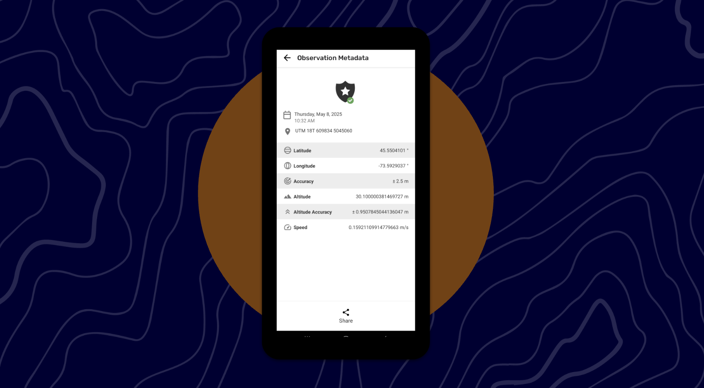
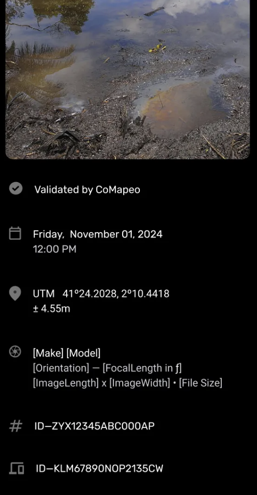

# Reviewing an Observation

## In this page you will learn

- Open an observation and reach its metadata.
- Interpret validated vs manually entered metadata and share it.
- Check photo details with Photo Info.

## Overview

Review saved observations to confirm data and share proof. Open an observation from the list, tap the header or coordinates to reach metadata, see whether location data is validated or manually entered, and share it by email or WhatsApp. Tap a photo to open Photo Info for device and GPS details.

## Core concepts

- Observation metadata lists GPS and time fields and shows when data is validated or manually entered.
- Sharing sends the metadata summary by email or WhatsApp using CoMapeo’s wording.
- Photo Info exposes a photo’s timestamp, location, device, and IDs for verification.

## Key flows

1. Open the observation list and tap an observation to view its details.
2. Tap the header bar or the coordinates bubble to open Observation Metadata.
3. Use Share in the metadata view to send validated or manual-entry summaries by email or WhatsApp.
4. Tap a photo thumbnail to open Photo Info and review or share photo metadata.

## Observation metadata

- Tap the date-and-shield bar or the coordinates bubble in an observation to open Observation Metadata.
- The metadata view lists date, time, coordinates, accuracy, altitude, altitude accuracy, and speed, and notes when coordinates were entered manually.
- For validated data, Share composes email or WhatsApp text with project name, category, timestamp, coordinates, accuracy, altitude, altitude accuracy, and speed marked as validated.
- For manually entered coordinates, Share text notes the location was manually entered and omits validation claims.
- Known issue: shared email formatting is not ideal; improvement is planned.

## Photo Info

- Tap a photo thumbnail to open the Photo Info screen for that image.
- Photo Info displays validation status, timestamp, GPS coordinates, device and camera details, photo size, observation ID, and device ID.
- An upcoming update will expand the “Validated by CoMapeo” module to summarize how quickly and how far from the observation location the photo was taken and which device captured it.

## Notes

- Use Observation Metadata and Photo Info to verify authenticity before sharing outside the project.
