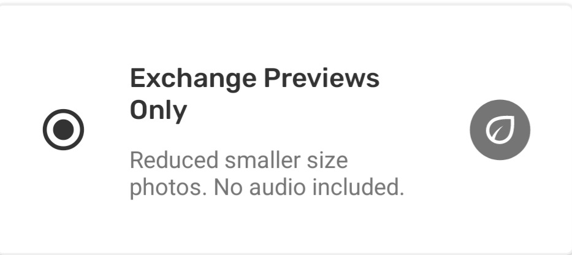
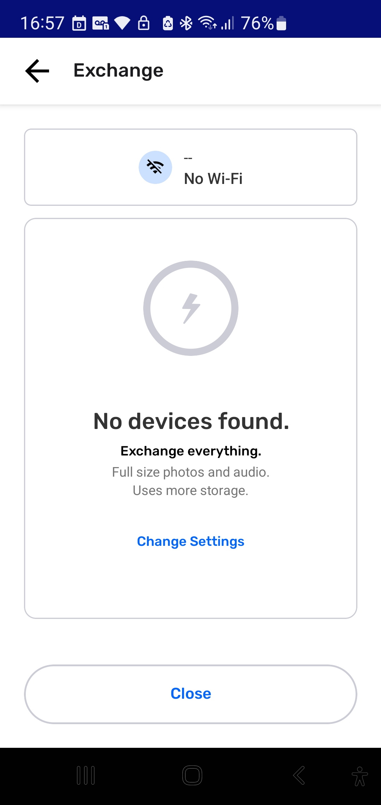

# Understanding How Exchange Works

Element Type: Page
Drafting Status : To Improve after launch
Assignment Notes: Assignment: PS Doc section → Exchanging Observations (pg1)[Understanding How Exchange Works] (https://www.notion.so/Assignment-PS-Doc-section-Exchanging-Observations-pg1-Understanding-How-Exchange-Works-2331b08162d580bd8996df3802390d2a?pvs=21)
↳ Assignment Target Date: August 25, 2025
Content Section: 60-Exchanging Observations
↳ Page Order: 61
Language: English
Parent item: Understanding How Exchange Works (Understanding%20How%20Exchange%20Works%202331b08162d5807da9c4d06531385a2c.md)

# Understanding How Exchange Works

## What is Exchange on CoMapeo?

**Exchange** is the signature feature of CoMapeo that allows for data to securely travel to all connected devices that are part of the same project. This helps ensure everyone in a project has the same information.

**What data is exchanged?**

- project data including
    - project info (name and description)
    - team data
    - observations (with associated media and metadata)
    - tracks
    - current category sets
    - Remote archive settings (if used)

**What if there is a data conflict?**

A data conflict is when two or more teammates have different information stored on their device about a specific data item. In the **unusual and rare** case that this occurs, CoMapeo uses the **timestamp** associated with the data item in question and picks the most recent as the solution for the data conflict.

- This allows for edits of observations to be updated with teammates during exchange.
- The newest Category set will be exchanged with teammates so all are using the lates available version.

### What connections does CoMapeo use?

**Offline connections are possible a router that provides over local Wi-Fi.** 

This functionality was designed for people in remote areas where internet connection is limited or not available. This means teammates can exchange data when they are together, no matter where in the world they are.

<aside>
💡

A router serves as a wireless bridge between devices connected to it even when it is not connected to the internet. 

</aside>

Go to 🔗 [**Using Exchange offline**](/docs/using-exchange-offline) 

**Online connections are possible with the setup of a local server** 

For those projects that require Exchange more frequently than in person activities are possible, we have introduced *Remote Archiving* that allows a server address to be added to specific project settings in CoMapeo

Go to 🔗 [**Using a Remote Archive](/docs/using-a-remote-archive)** 

### Understanding How Exchange Works

Exchange works by detecting peer devices that are connected to the same network and are part of same  projects in CoMapeo It allows the project data to transfer between numerous devices, once an user taps “start”. At the end of the process all those who exchanged data will be able to see new observations and tracks collected by their teammates on the map screen and in the observation list. 

<aside>
💡

**Tip:** Data collected with CoMapeo only travels to devices that are members of respective projects. 

</aside>

<aside>
👉🏽

**More:** Learn about  how membership to projects is managed

Go to 🔗 [**Managing a Team**]( /docs/managing-a-team)

</aside>

There is no central server hosted by Awana Digital or 3rd parties used to upload nor download CoMapeo collected data (amongst other Project data). (Learn more about the CoMapeo Data Privacy Policy {Link}). 

Instead, project data is distributed to every teammate that uses the Exchange feature. What this means is that data collected as part of a team is collective data visible to all who are members of the same project, along with any updated project settings. This kind of decentralized data distribution in a team provides the benefit of having a backup of information on all devices that exchange regularly. 

<aside>
💡

**Tip:** There are exchange settings that allow for selecting between the receipt of full size images or preview sized images to manage the amount of media stored on a device.

Go to 🔗 [**Adjusting Exchange Settings**](#adjusting-exchange-settings) for instructions 

</aside>

## Data security with Exchange

CoMapeo data is Encrypted. 

Exchange allows for collaborators to transfer data securely with each other within a project. 

To learn more about the technical mechanisms the make Exchange possible on CoMapeo read Exchange: An In-depth Look)

## Adjusting Exchange Settings

<aside>
👣

### Step by step

***Step 1:*** From the Exchange screen, tap **Change Settings**

***Step 2:*** Select from **Exchange Everything** or **Exchange Previews Only**

---

***Step 3:*** Tap **Save** to return to Exchange screen

---

</aside>

Exchange in CoMapeo creates intentional redundancy of information by cloning the data collected onto all devices participating in Exchange. Storage of media can be a concern for individuals with limited device storage, or for everyone in projects where a team is collecting a high volume of observations.

In these cases keeping exchange settings as “previews only” will help reduce the amount of storage CoMapeo uses on individual devices.

Thumbnails and Previews of photos in observations are still exchanged when this setting selected

<aside>
👁️

---

</aside>

However in some cases it may be essential for some devices to have access to the full resolution images. This is important for people with roles that involve submitting evidence or reporting back to their communities or local authorities.

<aside>
👁️

---

</aside>

## Multiple Projects & Exchange

**Exchange works securely with Multiple Projects.**

CoMapeo is engineered to keep data safe and organized, even when using a single device for more than one project

Data does not transfer between projects, and will not get mixed or modified if multiple projects are being used on any devices. 

Go to 🔗 [**Understanding Projects → Multiple projects**]( /docs/understanding-projects/#multiple-projects) 

---

## Related Content

Go to 🔗 [**Using Exchange offline**](/docs/using-exchange-offline) 

Go to 🔗 [**Using a Remote Archive](/docs/using-a-remote-archive)** 

### **Having problems?**

Go to 🔗 [Troubleshooting: Mapping with Collaborators](/docs/troubleshooting-mapping-with-collaborators)  

Go to 🔗 [Troubleshooting: Mapping with Collaborators -> Exchange Problems](/docs/troubleshooting-mapping-with-collaborators#exchange-problems)