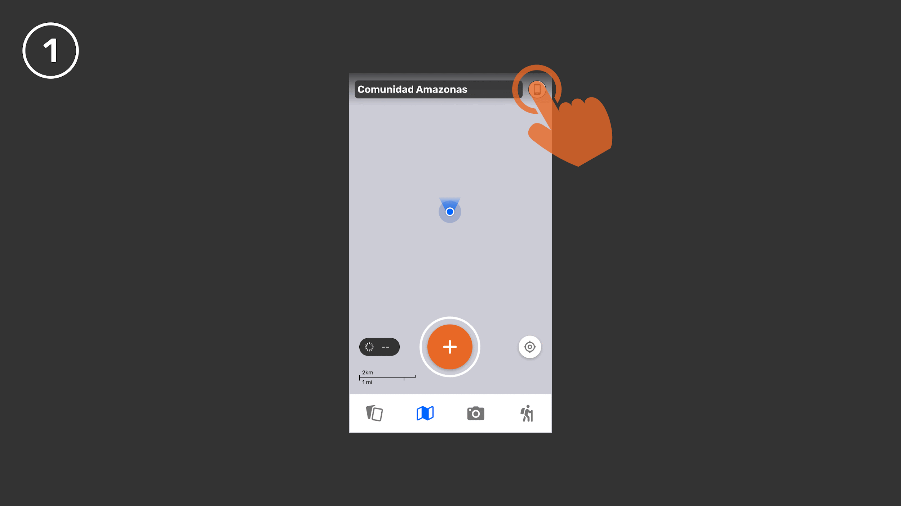
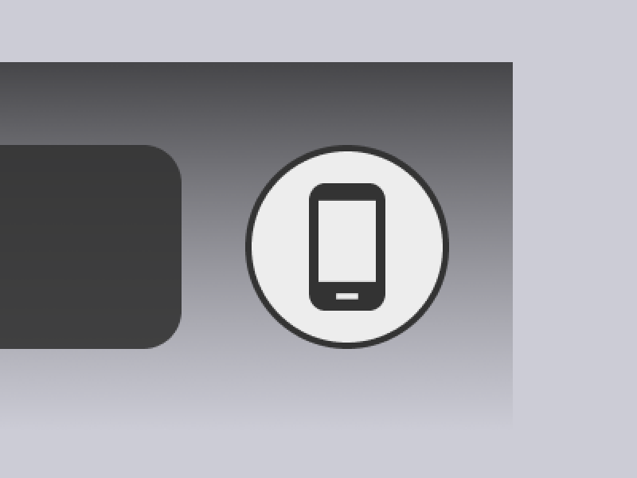
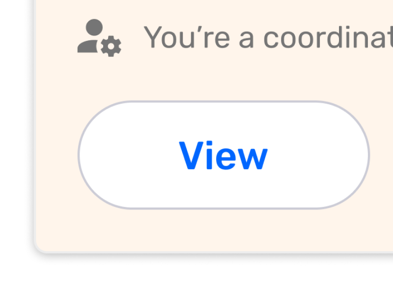
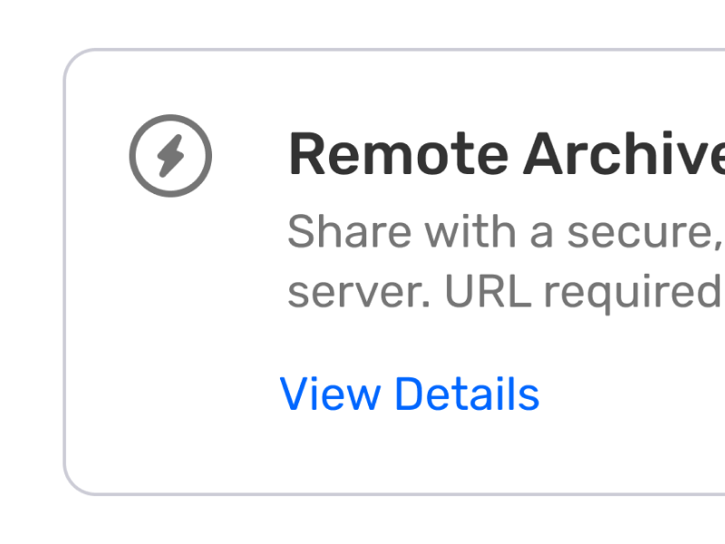
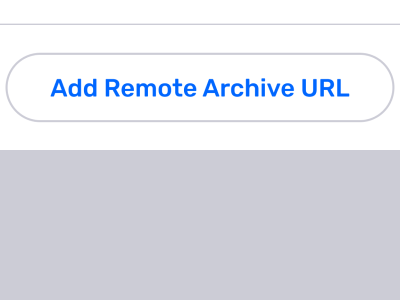
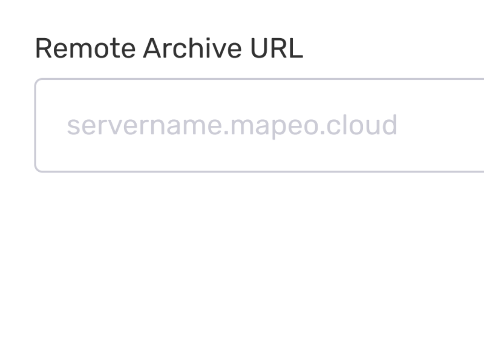
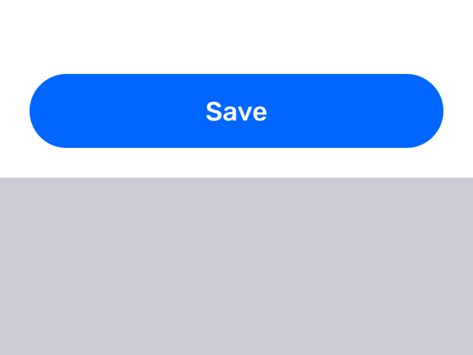
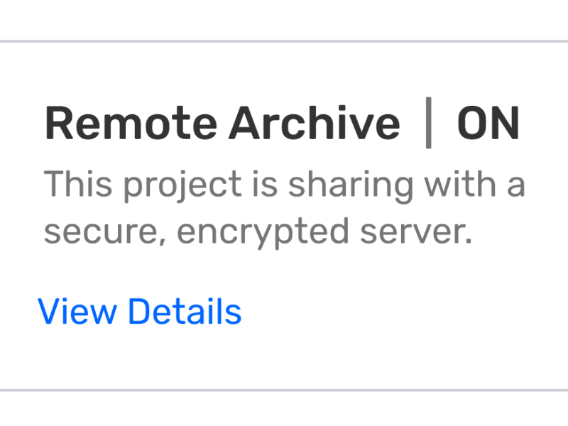

# Using a Remote Archive
For [Version Data]

A **Remote Archive** is a dedicated server that allows projects to
automatically back up their observations whenever connected to the
internet.
-   Any device can be considered a server as long as it is in perpetual
    state of being available to exchange observations.
-   Internet connectivity is required to both add a Remote Archive and
    to exchange with it.
-   Only Coordinators can enable a Remote Archive, and once enabled
    Participants can see it as part of the participants list.
-   When enabled, all new collaborators that opt-in to exchange their
    observations will automatically be doing so with the Remote Archive.
# Step 1: Generate a Remote Archive URL

Familiarity and comfort with coding will help with generating a Remote
Archive URL.
**Step 1**
Using a web browser, go to
**https://captain.comapeo.cloud**
**Step 2**
Enter with the password **4F0fm!z&i\^aHbQ**
**Step 3**
Click on \`**Apps**\` on the sidebar
**Step 4**
Under \`**Create A New App**\` select
\`**One-Click Apps/Database**\`
**Step 5**
Select \`**CoMapeo Archive Server**\`
**Step 6**
Set the \`**App Name**\` which will become
the subdomain for the Archive Server
For example: \`**alianzaceibo**\` will
become
\`**https://alianzaceibo.comapeo.cloud**\`
**Step 7**
No need to change the \`**Docker Image**\`
**Step 8**
Under \`**Token for authenticating API
request**\` it's good practice to generate
a new token, use a **[token
generato
r](https://it-tools.tech/token-generator)**
to do so
**Step 9**
Add a \`**Friendly server name**\` which
can be anything
**Step 10**
Set the \`**number of projects allowed to
register**\` which will depend on the use
case, if you're creating an archive server
for an organization it will likely have
many projects
**Step 11**
Finally click \`**Deploy**\` which will
spin the new Archive Server
**Step 12**
On \`**Apps**\` search for your newly
created app and select it
**Step 13**
Click on \`**Enable HTTPS**\` wait until
it's done
**Step 14**
Select \`**Force HTTPS by redirecting all
HTTP traffic to HTTPS**\` (this is optional
really)
**Step 15**
Select \`**Websocket Support**\` (this is
IMPORTANT)
**Step 16**
Click \`**Save and Restart**\`
**Step 17**
You new CoMapeo Remote Archive Server
should be running and ready to use on the
application
Test it out with a dummy project before
sharing with partners
# Step 2: Add a Remote Archive

Go to the project where you\'ll use a **Remote Archive**.
 — tapping the **Device Icon**
 — tap **View** **Button**
 — **Remote Archive \ — OFF** (third module
down)\
and tap **View Details**.
 — Remote Archive Button**
 — generated **Remote Archive URL**.
Attention: CoMapeo does not support
insecure HTTP servers; be sure to remove
any \`**http:**\` or replace it with
\`**https:**\`.
[Examples]
-   Correct --- \`comapeo.example\` and
\`https://comapeo.example\`
-   Incorrect ---
\`http://comapeo.example\`
 — entered, tap on the **Save** button to
proceed.
 — saved, the Remote Archive screen will
update to **ON**.
Also, when going back to Project Settings,
the third module will now display **Remote
Archive \ — ON**.
# Related Content
## Exchanging with a Remote Archive
If enabled and connected to the internet, Remote Archive will
automatically backup every time a device starts an Exchange.
Attention: On CoMapeo Mobile 1.2.0 it is not possible to not exchange
with the Remote Archive but this is a feature that may come in the
future.
  🔗 Go to **Exchanging Observations**
## Removing a Remote Archive
​​It is not currently possible to remove a Remote Archive from a Project
once added. We anticipate having the ability to remove a Remote Archive
available in late 2025.
-   When it becomes available, only Coordinators will be able to add and
    remove a Remote Archive from their projects
-   In this version and in the future, participants cannot remove the
    Remote Archive from the project.
## Troubleshooting
-   
## Coming Soon
In the coming year, improvements to Remote Archives will include:
-   Allowing Coordinators to remove a Remote Archive
-   Making it easier process to add a Remote Archive
# Previous Versions

-   [Version Data]

-   [Version Data]

----
