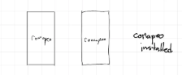

# Using Exchange Offline

Element Type: Page
Drafting Status : To Improve after launch
Content Section: 60-Exchanging Observations
↳ Page Order: 62
Language: English
Tags: Mobile
Parent item: Using Exchange Offline (Using%20Exchange%20Offline%202b61b08162d580d498fdef935daf2100.md)

# Using Exchange Offline

## Exchange with Wi-Fi

---

Exchange requires 4 things:  

- 2 or more devices with CoMapeo,
    
    
    
- devices are connected to the same WiFi connection
    
    
    
    
    
- devices belong to the same project
- new collected data
    
    
    

 Go to 🔗 [**Understanding How Exchange Works**]( /docs/understanding-how-exchange-works) for full overview and details

<aside>
👣

### Step by Step

***Step 1:*** Open the :three-line-menu-black:Menu

---

***Step 2:*** Tap :app-icon-remote-archiver: ***Exchange***

---

***Step 3:*** Exchange screen will display “Devices Found” when properly connected to a router.

Tip: Exchange Settings can be adjusted if needed

Go to 🔗 [Understanding How Exchange Works -> Exchange Settings](/docs/understanding-how-exchange-works#adjusting-exchange-settings) 

---

***Step 4:*** Tap **Start** to let connected devices know you are ready to exchange project data

---

***Step 5:*** When other devices join the Exchange, all new observations and relevant project data will be exchanged.

---

***Step 6:* Complete** will display when all observations are exchanged. Tap **Done** to return to :three-line-menu-black:Menu

</aside>

<aside>
💡

**Tip:** Offline exchange can happen fairly quickly if everyone starts exchange around the same time. 

</aside>

---

## Related Content

Go to 🔗 [**Understanding How Exchange Works**](/docs/understanding-how-exchange-works) for full explanation 

### Having Problems?

Go to 🔗 [Troubleshooting: Mapping with Collaborators -> Exchange Problems](/docs/troubleshooting-mapping-with-collaborators#exchange-problems) 

Common issues with exchange relate to connecting to the same WiFi at the same time, especially if the router or mobile hotspot is not connected with the internet. Often devices will disconnect from a WiFi source to favor one that has internet,  or is saved in the device memories. These are setting you can check to reduce issues related to WiFi connections.