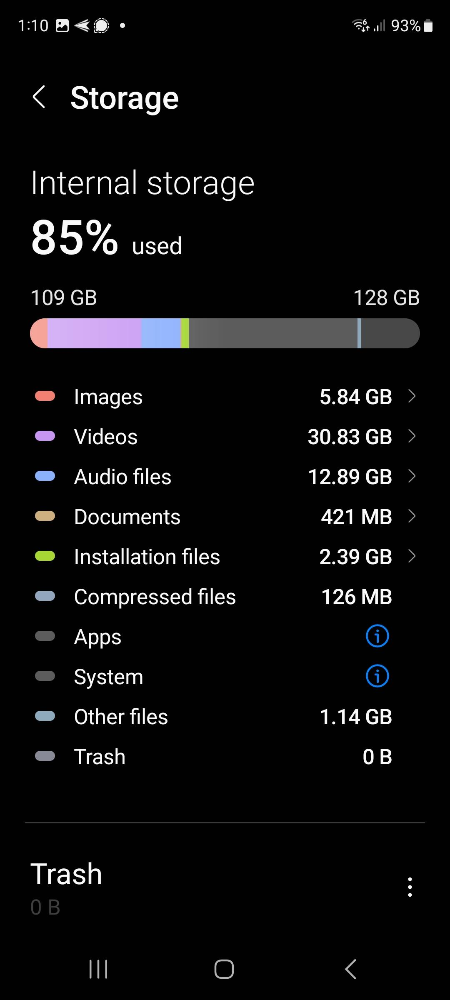

# I can t Start CoMapeo
For [Version Data]

# 
.59375in" height="21.3
33333333333332in"} — S is turned on on your phone. You can usual
ly find this in the quickfind menu, located
by pulling down from the top of the screen
.
# 
.59375in" height="21.3
33333333333332in"} — optimize battery life during data collectio
n use flight mode. If possible bring an ext
ernal battery pack and phone charging cable
to recharge whilst in the field.
# Also try and make sure that other ap
ps are not running in the background, drain
ing your battery.
 — notes) don't take up very much space.
However if you start taking lots of
photographs, or recording audio, these can
begin to fill up your memory.
-   Manage your storage use by deleting
unwanted apps within Settings \> Apps
\> Sort by \"Last used\" or \"Size\".
-   If you have lots of photos and videos
in your phone gallery, consider moving
them to an SD card or other storage.
#
#
# Related Content: Why is it important to maintain my device?
Looking after your Android phone and keeping it well maintained helps it
stay fast, secure, and free of bugs. Consider carrying out the steps
below to optimize your phone for using CoMapeo.
# Related Content: Good maintenance procedures for your phones
## **1. Secure your phone**
the wrong hands.
-   You can also secure access to CoMapeo
by setting an app passcode: see
**Working with an App Passcode**
## **2. Keep your operating system updated**
 — -   **Step 2.** Tap on Software Update
## **3. Practice a regular maintenance routine**
 — -   **Step 2.** Run a malware scan
-   **Step 3.** Check your storage
-   **Step 4.** Check you battery usage
## **4. Protect your phone against physical damage**
 — it, ideally waterproof and
shock-resistant.
-   **Weather Considerations.** If you are
working in environments with extreme
heat or cold, bear in mind that these
can also impact your phone. It might
shut down at very high and very low
temperatures.
# Troubleshooting
[Links to resources for address known issues.]
# Coming Soon
[Known improvements and tentative timelines]
# Previous Versions

-   [Version Data]

-   [Version Data]

----
