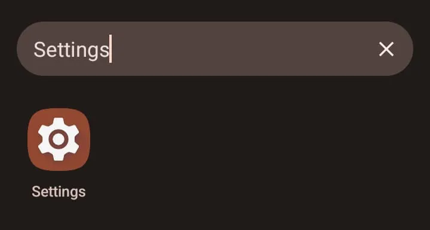
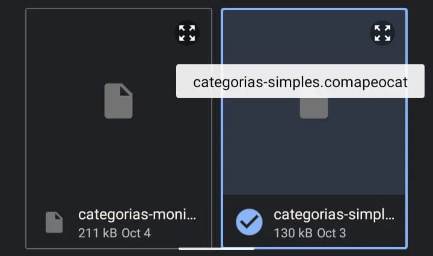
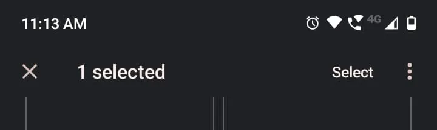
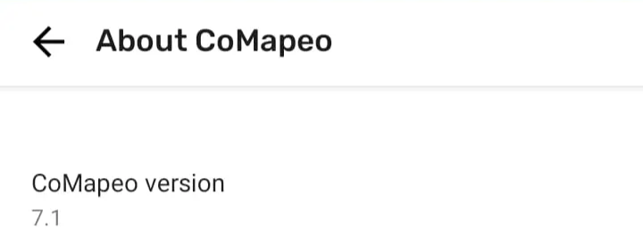

# Troubleshooting: Setup & Customization

Element Type: Page
Drafting Status : Ready for review
Assignment Notes: Assignment: PS Doc section → Troubleshooting [v0] (https://www.notion.so/Assignment-PS-Doc-section-Troubleshooting-v0-23a1b08162d58082b286e16d9f9e1fe6?pvs=21), Assignment: PS Docs → Troubleshooting v1 (https://www.notion.so/Assignment-PS-Docs-Troubleshooting-v1-2a71b08162d580b1beb3e72f4587a1c4?pvs=21)
↳ Assignment Target Date: August 21, 2025,December 1, 2025
Content Section: 90+ - Miscellaneous
↳ Page Order: 110
Language: English
Parent item: Troubleshooting: Setup and Customization (Troubleshooting%20Setup%20and%20Customization%2026a1b08162d580fe8fb5dad225dc26bc.md)

# Troubleshooting: Setup & Customization (H1)

General concept and use of this page

This troubleshooting guide helps you diagnose and resolve common issues systematically. Follow the steps in order for the most efficient problem resolution.

---

## Installation & Startup Problems

### Cannot start CoMapeo

✅ **Verify you have** :comapeo_logo_circle: **CoMapeo installed on your phone or computer.**  Follow the instructions for [Installing CoMapeo](/docs/installing-comapeo--onboarding).

### 🟩 **Solution: Clear application cache data (CoMapeo Mobile only)**

On CoMapeo Mobile, you can clear the application cache using the Android system settings. Applications typically use the cache to store non-permanent data to improve app experience and it is usually safe to remove that data. Clearing this cache may solve issues with launching CoMapeo.

<aside>
⚠️

**Warning:** CoMapeo Data including customizations and collected data will be deleted if storage data is cleared. Be careful by ensuring to select **cache** when clearing cached data.

</aside>

- **👣 Step by step instructions**
    
    **Step 1:** Go to Android settings. You can find them by going to the main android menu and search for “Settings”. It usually has a *gear* (⚙️) icon.
    
    
    
    **Step 2:** Open it, and inside it look for the “Apps” option. This will display all the installed apps in the device. It usually has a search bar where you can type
    
    
    
    **Step 3:** Type **CoMapeo** and click on it
    
    
    
    **Step 4:** Once inside the *App info* menu, select *Storage & Cache*
    
    
    
    **Step 5:** Inside *Storage*, select *CLEAR CACHE* which has a trash icon (🗑️). As said above, **beware of only selecting *CLEAR CACHE* and not *CLEAR STORAGE* since this will delete all data, basically reseting CoMapeo as if you just installed it.**
    
    
    
    **Step 6:** Once the cache data is cleared. Restart the application.
    

### 🟩 **Solution:  See** [Common Solutions - 🟩 Solution: Make sure your device has enough free space available](/docs/common-solutions/#solution-make-sure-your-device-has-enough-free-space-available)

<aside>
💣

**Still not working?**

**Uninstall and reinstall the application.**

It is important to note that uninstalling CoMapeo means **losing all the data you have collected so far**. You can only recover this data if you have previously exchanged with another device.

- [Learn how Exchange works](/docs/understanding-how-exchange-works)
</aside>

---

## App setting Problems

### Cannot start CoMapeo

### Device name is not appearing as expected

The only way to change a device name for use in CoMapeo is to use that same device and access :app-icon-app-settings: CoMapeo Settings → Device Name.  

Check the physical security of your device to identify vulnerabilities you may not be aware of

🟩 **Solution: Confirm security of your device lock**

If you have a shared device, confirm with people around you which apps are shared. It is not uncommon for curious children to play with easy to use apps

🟩 **Solution: Add a secure Passcode to CoMapeo**

Go to 🔗 [**Using an App Passcode for Security**](/docs/using-an-app-passcode-for-security) 

---

## Custom Category Set Problems

### 🟩 **Solution: Check that you’re loading the correct file**

When loading a custom category set, the app may fail in loading it. This may happen for various reasons

**CoMapeo** categories files have an extension of ***.comapeocat**.* So you need to make sure you’re loading the correct one.

- **👣 Step by step instructions**
    
    **Step 1:** After selecting the *Import Categories* button, the Android browser will appear to let you select the intended category file. But it may happen that the filename is cut, so you can’t see the full name. 
    
    
    
    **Step 2:** If you want to be sure you’re selecting the correct file, you can select and hold your finger on top of the file you want, which will show the correct file name and select that file
    
    
    
    **Step 3:** If the selected file is the intended one, press select on the top right corner
    
    
    

### 🟩 **Solution: Make sure you have a categories file compatible with your installed version of CoMapeo**

From October to November 2025 we release a version of CoMapeo (**v7**) that changed the format for custom category sets. This means that if you created a categories file before October 2025 and tried to load it on **v7** of CoMapeo or newer then the app would fail in loading at file.

- **👣 Step by step instructions**
    
    **Step 1:** Open **CoMapeo** and go to the **About CoMapeo** menu in the **Comapeo Settings** menu
    
    
    
    **Step 2:** Check the **CoMapeo version** field and see if the version is higher or equal than **7.0**
    
    
    
    **Step 3:** Check the date in which the categories file was created. This can be done from a desktop computer by checking the properties of the file.
    
    **Step 4:** If the file was created **before** October 2025, then it is possible that the categories file is incompatible with your current version of **CoMapeo**
    
    **Step 5:** Create a new categories file that is compatible with the current version of **CoMapeo.** For that, see: [Building a Custom Category Set](/docs/building-a-custom-categories-set)
    
    👉 An alternative but similar issue that can happen is having an older version of **CoMapeo** (older than **v7**) and trying to load a custom categories file that is newer than that release, which will also fail. The best solution for that case is to update the installed version of **CoMapeo**
    

---

## Custom Map Problems

---