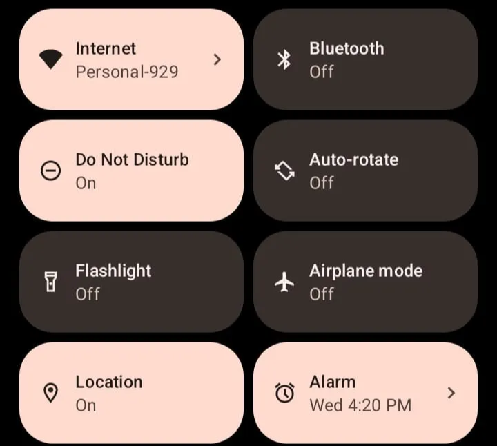
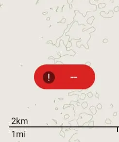
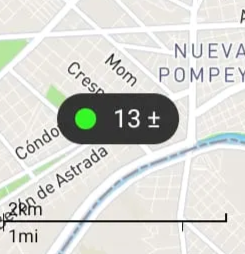

# Troubleshooting: Observations & Tracks

Element Type: Page
Drafting Status : Ready for review
Assignment Notes: Assignment: PS Docs → Troubleshooting v1 (https://www.notion.so/Assignment-PS-Docs-Troubleshooting-v1-2a71b08162d580b1beb3e72f4587a1c4?pvs=21)
↳ Assignment Target Date: December 1, 2025
Content Section: 90+ - Miscellaneous
↳ Page Order: 120
Language: English
Parent item: Troubleshooting:  Observations and Tracks (Troubleshooting%20Observations%20and%20Tracks%202a71b08162d5806794a6f927559af75e.md)

# Troubleshooting: Observations & Tracks

## Problems Creating Observations

### **Black screen when using the camera**

Typically, this is because you have not given CoMapeo permission to use the phone’s camera, or the permissions have expired due to not using CoMapeo for a long period of time. 

→ Verify that access to camera permission are set

 [**🟩  Solution: Check app permissions**](/docs/common-solutions#solution-check-app-permissions)

### Problems saving collected observations

→ If you don’t have enough space available on the device, you won’t be able to collect new data

[**🟩 Solution: Make sure your device has enough free space available**](/docs/common-solutions#solution-make-sure-your-device-has-enough-free-space-available)

## Problems Creating Tracks

→ Specifically for recording tracks you need to verify that the GPS is enabled and location permissions are set to “use all the time”. This is so that you can record a track while your device is inactive (with its screen turned off) or when **CoMapeo** is out of focus (checking another app).

 [**🟩  Solution: Check app permissions**](/docs/common-solutions#solution-check-app-permissions)

### Straight lines show on some part of tracks

Since tracks record gps information continually and through longer periods, it may happen that the device loses gps signal for a couple of seconds. This may give you inaccurate results, showing a straight line from one point to another or showing two straight lines going to some other place and back to your location. 

## **Problems with GPS**

### GPS is not activated in CoMapeo

To solve this problem, we suggest you explore the different solutions, in this order:

1. First of all, make sure that you have **GPS** enabled on your cell phone. It will be different on each phone, but **GPS** or **Location** services can usually be found in the Quick Settings menu, which can be accessed by swiping down from the top of the screen.

1. Confirm that **CoMapeo** has access to the GPS. The **GPS details** button at the top of the home screen will change from red to a green dot and the accuracy of the GPS signal  

1. If the **GPS details** button at the top of the home screen remains red , make sure you have given CoMapeo permission to use your phone's GPS. To learn more, see: [**🟩  Solution: Check app permissions**](/docs/common-solutions#solution-check-app-permissions)
2. Confirm that the GPS sensors are enabled. For it:
    1. Click on **GPS Details**
        
        
        
    2. On the **GPS Details** screen, make sure that in the **Sensor Status** section at the end of each line, it says **Yes**.
    3. In the event that one or more sensors are not activated or enabled, please check the manufacturer's manual for your device to activate it.

### **My GPS signal is very weak**

**Why does this happen?**

Normally, it happens when there is no good communication between the GPS and the satellite. There may be one or more factors that cause the problem: problems with low satellite coverage, being indoors or in places with a lot of vegetation, not having activated the phone's GPS, or damage to the device's hardware and software, among others.

**Tips to improve the GPS signal:**

- Locate in clear places or without vegetation.
- In the field, if you have a bad signal, take the phone out of the case (especially useful for CAD phones, rugged phones, etc).
- Perform a calibration of the GPS sensor. For more information check [this link](https://support.google.com/maps/answer/2839911?hl=es-419&co=GENIE.Platform%3DAndroid#zippy=%2Ccalibra-tu-tel%C3%A9fono-o-tablet).
- Validate that the date and time of your device are updated. For this, follow these steps:
    - Open the **Settings** app on your phone.
    - Click **System** and then select **Date and time**.
    - Click **Automatic**. If the option is disabled, check that the correct date, time, and time zone are selected.
    - In the event that it fails to update the time and date, turn off the Automatic date and time option, then manually change the corresponding time and date.
- Activate the high-precision function in the GPS. For more information check [this link](https://support.google.com/maps/answer/2839911?hl=es-419&co=GENIE.Platform%3DAndroid).

**If the GPS signal still does not improve...**

If, despite having tried several solutions, the GPS signal does not improve, you always have the option of using another phone or GPS device to identify the GPS data and enter it manually in **CoMapeo**. If the GPS signal at the time of saving the observation has an accuracy less than ± 10 m, **CoMapeo** will automatically offer you three options:

- Keep waiting: this will give you the option of waiting until you have better signal
- Manual Coords: you can chose this option to enter the coordinates manually, by checking with another device the correct coordinates

- Save: this will save the point to a default location, usually in the middle of the map, at a latitude and longitude of 0,0

⚠️ **Remember:** After saving an observation, you can’t edit its coordinates

### Problem name

Describe what this behaviour is, and perhaps context this happens (i.e steps  before this happened 

🟩 **Solution: do something specific**

This line is about what this solution does, and perhaps why it works. 

- **👣 Step by step instructions**
    
    ✔️ Check list items
    
    1. numbered steps
    2. second step
    
    👉 Complementary information for prevention or reduced issues
    

---

## Problems  section

---

## Problems  section

---

<aside>
📨

# **Contact Awana Digital for Support**

If you have not been able to resolve issues with the resources shared here, write us by
email us at [help@comapeo.app](mailto:help@comapeo.app)

You can also chat with us on [Discord](https://discord.gg/kWp34am3)!

</aside>