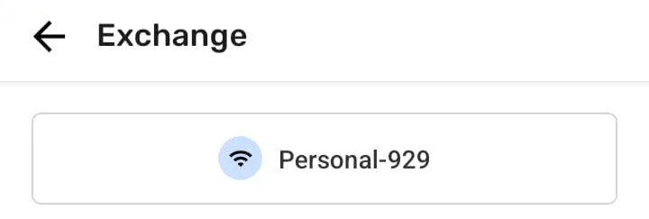

# Troubleshooting: Mapping with Collaborators

Element Type: Page
Drafting Status : Ready for review
Assignment Notes: Assignment: PS Docs → Troubleshooting v1 (https://www.notion.so/Assignment-PS-Docs-Troubleshooting-v1-2a71b08162d580b1beb3e72f4587a1c4?pvs=21)
↳ Assignment Target Date: December 1, 2025
Content Section: 90+ - Miscellaneous
↳ Page Order: 140
Language: English
Parent item: Troubleshooting: Mapping with Collaborators (Troubleshooting%20Mapping%20with%20Collaborators%202a71b08162d580398caafbe0f822d4a5.md)

# Troubleshooting: Mapping with Collaborators

General concept and use of this page

This troubleshooting guide helps you diagnose and resolve issues systematically. Follow the steps in order for the most efficient problem resolution.

## Project Setting Problems

---

## Team Invite problems

There are a number of issues that can happen when trying to invite collaborators to a team. The most common solutions are the following:

- [🟩  Solution: Check that every device is actually connected to the WiFi network](/docs/common-solutions#solution-check-that-every-device-is-actually-connected-to-the-wifi-network)
- [🟩  Solution: Check that every device is on the same WiFi network](/docs/common-solutions#solution-check-that-every-device-is-on-the-same-wifi-network)

## Teammate removal problems

## Exchange Problems

### **Discovery** **issues - “No devices found”**

When trying to exchange data between devices, it can happen that you don’t see devices from people of your team. That can happen for various reasons.

### 🟩 **Solution: check the following list to make sure you can exchange with the devices you want**

- **👣 Step by step instructions**
    
    ✔️ Confirm the are part of the same project. 
    
    ✔️ Check the list of collaborators on the **Team** page 
    
    
    
    ✔️ Confirm all devices that want to exchange data are using the same WiFi network
    
    
    
    ✔️ Close and Reopen Comapeo on devices 
    
    👉 **Remember:** CoMapeo is made to exchange information between people in physical proximity, connected to the same WiFi network. The only exception to this is if you have set up a **Remote Archive.** For that see [Using a Remote Archive](/docs/using-a-remote-archive)
    
    <aside>
    👉🏽 Devices that are in multiple projects together will discover each other even when different projects are open.
    
    </aside>
    
    ⚠️ **Connecting to WiFi networks that don’t have internet access may bring some additional issues that need the user’s attention. For a common solution to this case, see** [🟩  Solution: Check that every device is actually connected to the WiFi network](/docs/common-solutions#solution-check-that-every-device-is-actually-connected-to-the-wifi-network)
    

### Exchange is taking a really long time

### 🟩 **Solution: Reduce the number of devices connected to WiFi at the same time**

- **👣 Step by step instructions**
    
    Depending on the device that is providing the network and the number of devices that are trying to exchange, you may have issues. For example, WiFi networks created by cellphones may not be prepared to have a lot of devices connected to it. A solution is to reduce the number of devices connected to the network and exchange in parts, to make sure that every device will exchange all of the data in the project. For example:
    
    **Step 1:** You have 6 devices that want to exchange data
    
    **Step 2:** You make device 1,2 and 3 connect to the same network and exchange data
    
    **Step 3:** You make device 3,4,5 and 6 connect to the same network and exchange data
    
    **Step 4:** Finally you make device 1,2 and 3 connect again to the same network and exchange data
    
    That way:
    
    - Device 3 will carry data from device 1 and 2 and exchange it with device 4,5, and 6, and grab new collected data from device 4,5 and 6.
    - When connected again to devices 1 and 2, device 3 will exchange the new data from devices 4,5 and 5 with devices 1 and 2
    

### 🟩 **Solution: Use a router to create the WiFi network**

Routers are devices more capable of managing a lot of devices, since they are usually designed to handle a home network. 

Using a router may give better results than creating a WiFi network from a cellphone when exchanging data between multiple devices

### Exchange progress is stuck at 0%

### **🚧 Coming soon**

### **Exchange - Progress not reaching complete**

### 🟩 **Solution: Wait an extra min or two**

****Depending on the device providing the WiFi network, exchange may take longer than usual. A common case for this is when using and old phone to provide the network.

### 🟩 **Solution: Stop and restart Exchange on all devices**

- **👣 Step by step instructions**
    1. Tap Stop on all devices
    2. Verify on the exchange screen which Wifi network is being used
    3. If any devices are connected to the wrong one, reconnect to the agreed WiFi network 
    4. Tap Exchange

### 🟩 **Solution:** **Coordinate devices to connect to WiFi at the same time**

****See [🟩 Solution: Reduce the number of devices connected to WiFi at the same time](#solution-reduce-the-number-of-devices-connected-to-wifi-at-the-same-time)

### 🟩 **Solution:** **Review exchanged observations and tracks**

Displaying progress of Exchange is a very challenging thing to do consistently due to the decentralized processed used. It is possible that data has exchanged successfully but the progress in not accurately reflecting this. This issue is more common when there are numerous devices exchanging at the same time. 

For example if there are 3 devices exchanging, you may see the percentage of exchange increasing, but if a new device joins the exchange, then the percentage may lower since there’s new data to exchange

- **👣 Step by step instructions**
    
    Exit the Exchange screen to see if there is new data
    
    → View the  Map screen to see all project data on the map
    
    → View the Observation list so see all project data with visual indication  (blue marker) of new data received during exchange
    
    → To make sure you have all the exchanged data, open the exchanged observations to see if you have all the attachments. If you see attachments in the observation but you can’t open them, then it means that there’s still data to exchange.
    

## Remote Archive Problems

- Check that Remote Archive is configured.

### Quick Diagnostic Steps

1. Check the current status and error messages in the CoMapeo interface
2. Verify that all required services and connections are active
3. Review recent changes to configuration or data that might impact functionality

### Common Issues and Solutions

**Connection Problems**

- Verify network connectivity and firewall settings
- Check synchronization settings and peer discovery configuration

**Data Synchronization Issues**

- Force a manual sync and monitor for error messages
- Check available storage space and data integrity