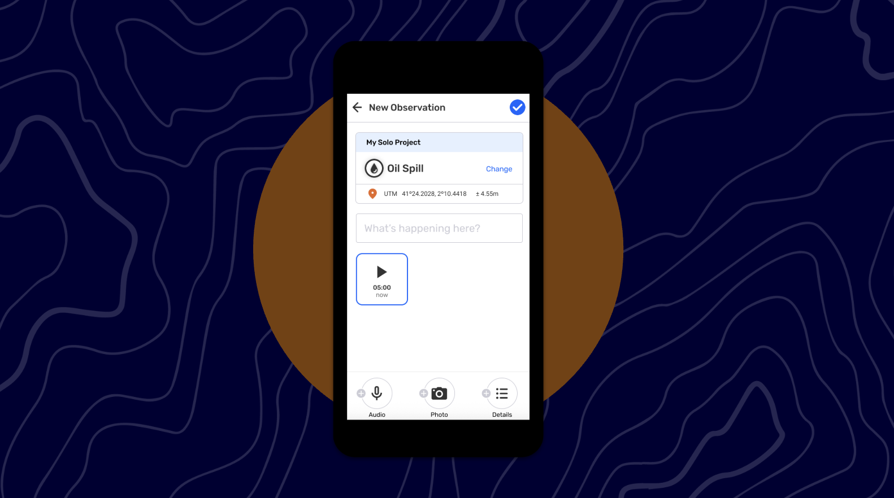
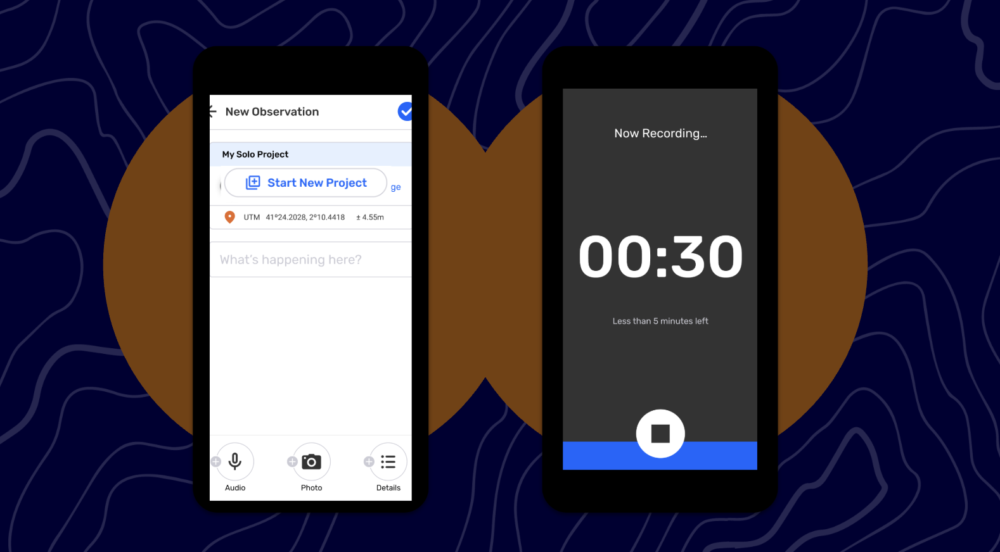
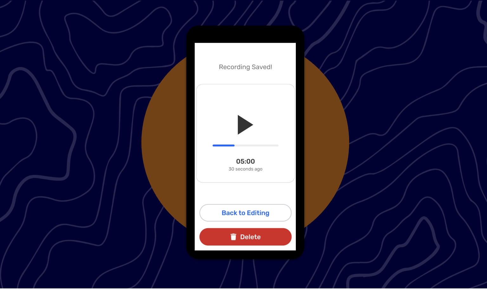
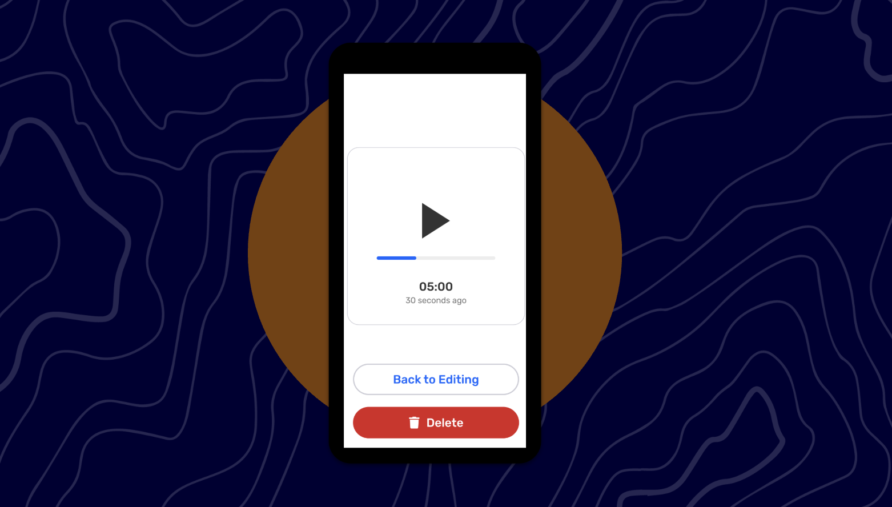
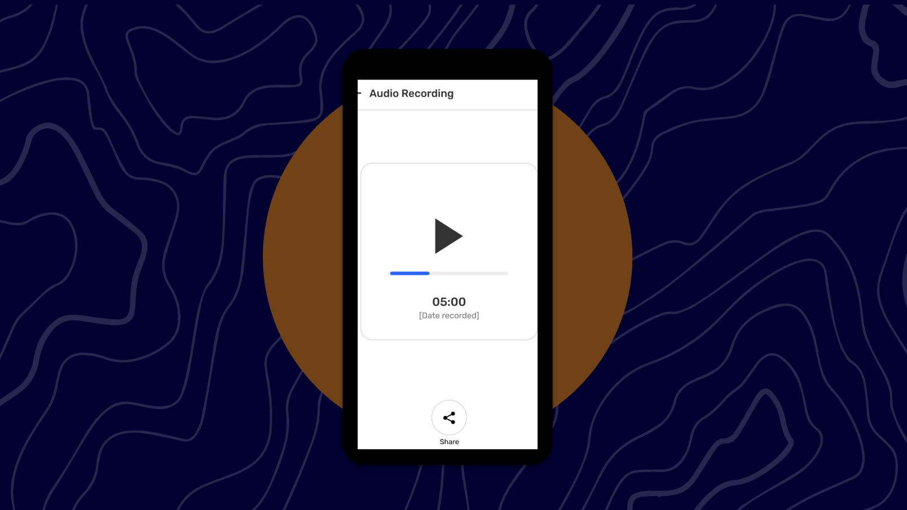

# 🏁 CoMapeo Mobile - Audio Improvements

Last Edited: September 3, 2025 5:28 PM
Guide Status: Ready to read

<aside>
📌 **A quick start guide to CoMapeo Mobile’s newest features and improvements. For internal use.**
Available in [CoMapeo V5](https://www.notion.so/Release-Notes-CoMapeo-v5-0-1de1b08162d580b38c94ec18de3a998e?pvs=21)

</aside>

---

# Audio Improvements

### Background

[Audio Recording MVP](%F0%9F%8F%81%20CoMapeo%20Mobile%201%201%200%20-%20Audio,%20Tracks,%20Map%20File%20P%201eb1b08162d58043bed7c04fbe25bee5/CoMapeo%20Mobile%201%201%200%20-%20Audio,%20Tracks,%20Map%20File%20Pic%201341b08162d5804a9000dc4718f725f5.md) was released in CoMapeo early 2025. Since then, we have been gathering feedback from the Awana Digital team and our partners during field trainings. 

### What’s New

These improvements address the following feedback:

- When tapping the Audio icon, it was expected the recording would start automatically
- Once a recording was complete, it was unclear how to proceed next
    - The UI to save a recording is unclear

### Guides

<aside>

### Starting an Audio Recording

In this version, Audio Recording only lives within the Observation Editor.

**Instructions**

1. Create a new Observations OR edit an existing Observation. 
2. Tap the Audio icon in the bottom bar.
    
    > Note: If this is your first time recording Audio you will be asked permission for CoMapeo to use your microphone and record. Please give permission for CoMapeo to use audio.
    > 
3. The New Recording screen will open and audio recording will instantly be in progress 
    
    > Note: The recording screen will fill up with blue — a horizontal block of blue starts at the bottom of the screen and slowly expands vertically to fill the screen until the entire screen is blue at 5 minutes
    > 
    
</aside>

<aside>

### Saving an Audio Recording

**Instructions**

1. When an Audio Recording is stopped (either by reaching 5 minutes or the Stop button being tapped), the Saved Audio screen will appear. 
    
    > Note: At this point, the Audio Recording is attached to the Observation BUT the Observation itself is not yet saved.
    > 
2. On the Saved Audio screen you can;
    - See the length of the recording
    - Play to the Audio Recording
    - Delete the Audio Recording
        
        > When you tap on  Delete, you will go back to the Observation.
        > 
    - Close the Audio Recording, by tapping on Back to Editing, and return to the New Observation editor.

When you tap on  Back to Editing, you will see the Audio Thumbnail version of the recording now attached to the Observation.

</aside>

<aside>

### **Reviewing an Audio Recording**

**Instructions**

1. From the Observation Editor, tap on the Audio icon
2. On this screen you can;
    - See the length of the recording
    - Play to the Audio Recording
    - Delete the Audio Recording
        
        > When you tap on  Delete, you will go back to the Observation.
        > 
</aside>

<aside>

### **Reviewing a Saved Observation with Audio Recording**

**Instructions**

1. Open the saved Observation and tap on the Audio icon
2. On this screen you can;
    - See the length of the recording
    - Play to the Audio Recording
    - Share the recording via Email or WhatsApp
</aside>