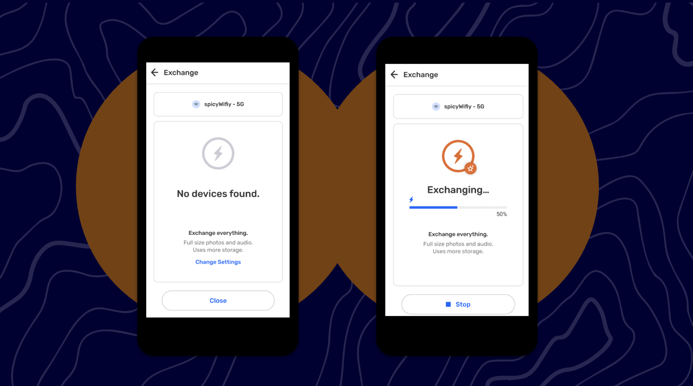
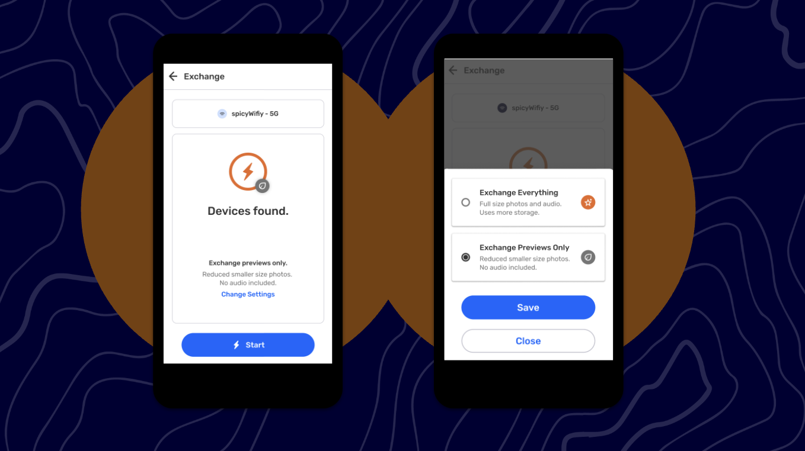
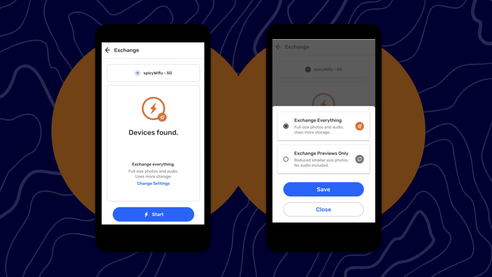

# 🏁 CoMapeo Mobile - Exchange Settings - Updated

Last Edited: September 3, 2025 5:29 PM
Guide Status: Ready to read

<aside>
📌 **A quick start guide to CoMapeo Mobile’s newest features and improvements. For internal use.**
Available in [CoMapeo V5](https://www.notion.so/Release-Notes-CoMapeo-v5-0-1de1b08162d580b38c94ec18de3a998e?pvs=21)

</aside>

---

# Exchange Settings

Introducing new media formats, such as audio files, to CoMapeo increases the chances of a user running out of disk space. CoMapeo now allows user on low-end phones with limited memory to selectively exchange data and avoid using too much disk space. Available via the updated Exchange screen, this first phase of the feature will enable you to :

- **Exchange previews** -  The interface will only consider current media and will not exchange audio.
- **Exchange everything** - set by default. This mean you would be able to exchange all media, including audio. You could consider this device the “archive device” in your team.

<aside>

### **Choosing Exchange Previews Only**

**Instructions**

1. Go to **Exchange screen** and tap on **Change Settings**
2. A bottom sheet will open to propose the option to select “Exchange Everything” ****and “Exchange Previews Only”
3. To select “Exchange Previews Only” tap  on the radio button and then tap **Save**
4. Once selected, the Exchange Screen will show you are exchanging previews only
</aside>

<aside>

### **Choosing Exchange Everything**

**Instructions**

1. **Exchange Everything** is set by default at first app launch, but you have previously selected **Previews Only ;**
2. A bottom sheet will open to propose the option to select “Exchange Everything” ****and “Exchange Previews Only”
3. To select “Exchange Everything” tap  on the radio button and then tap **Save**
4. Once selected, the Exchange Screen will show you are exchanging everything (like on Mapeo Legacy)
</aside>

<aside>

### **Details**

- We have been transitioning away from using the word “sync” and now using the word “exchange”.  We have done a Copy Audit to replace it in CoMapeo, vut is possible you may find the word “sync” somewhere we may have missed
- When exchanging previews, audio will be exchanged but not usable. When you tap on the audio file, it will not work and an error will appear
- When the device is exchanging data, the link Exchange Settings will not be visible
</aside>

<aside>

### Known issue

- **Exchange previews** is supposed to be set by default. An update to this is currently in development.
</aside>