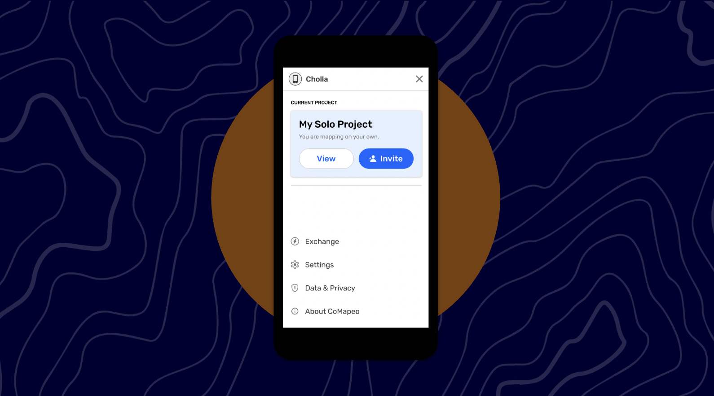
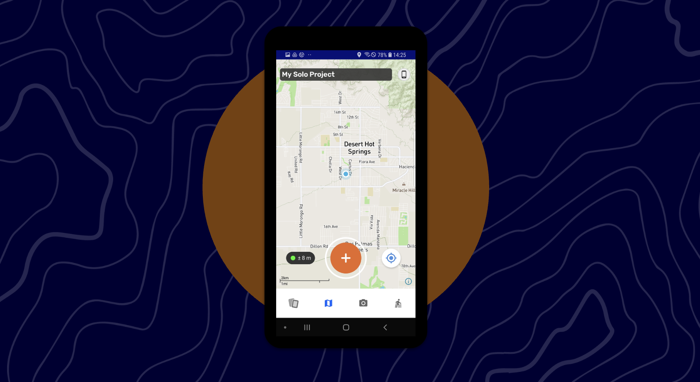
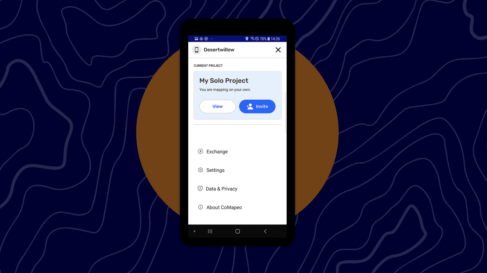
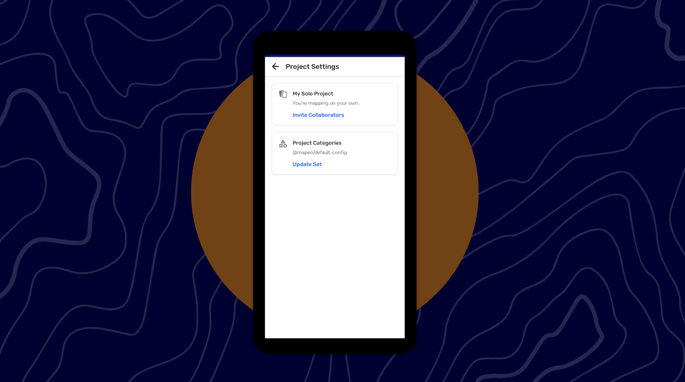
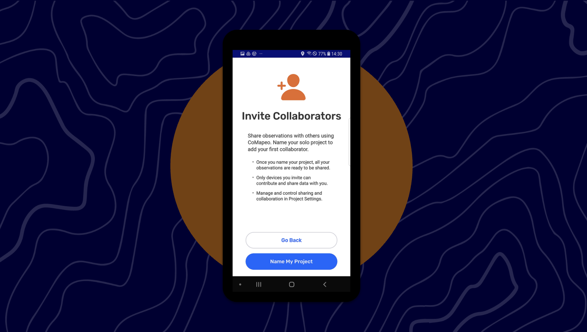
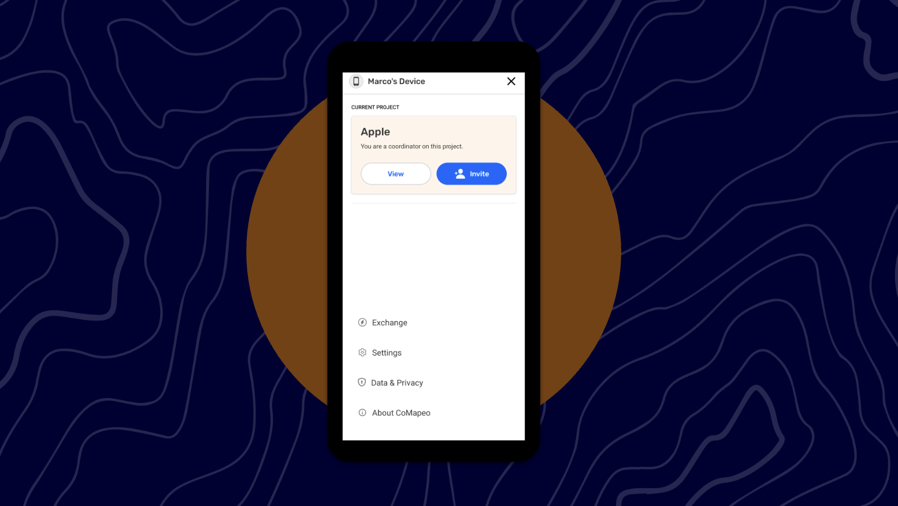
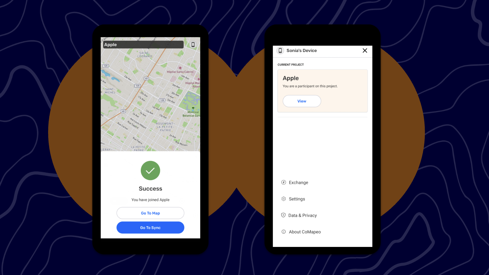
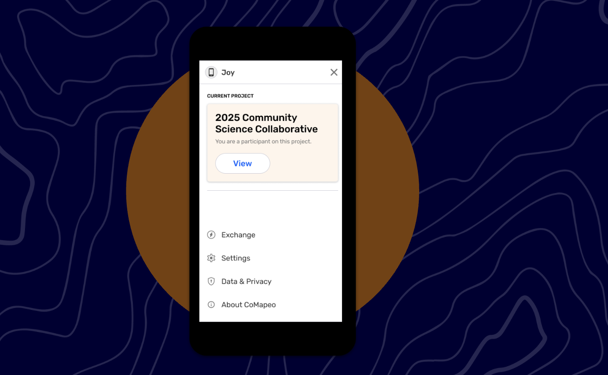
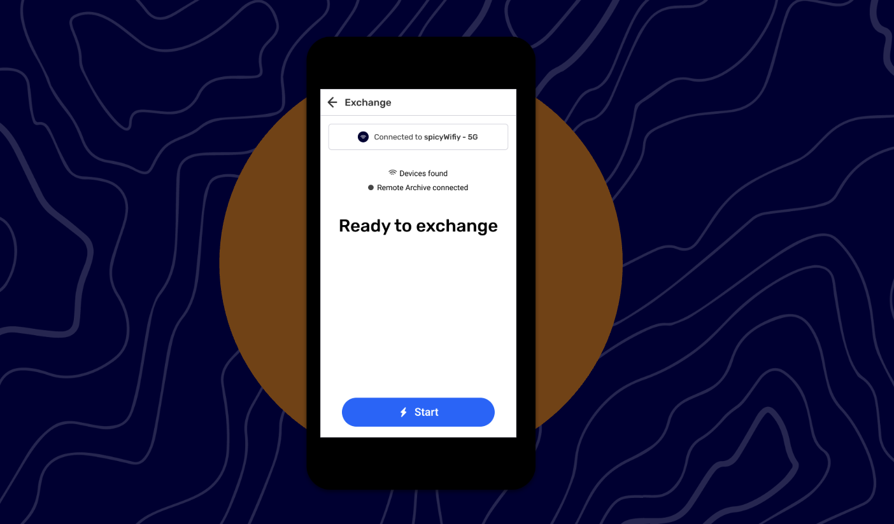

# 🏁 CoMapeo Mobile - Invite devices to default project

Last Edited: September 3, 2025 5:33 PM
Guide Status: Ready to read

<aside>
📌 **Important to note -  This is a temporary workflow in V3, until adding Multi-projects in the next release (v4), early June. Expect a few more updates to the UI.** 

CoMapeo V3 can only support one project at a time. 

When mapping on its own, the device is adding collected observations to the default project (also known as “My Solo Project”). 

Any time a device want to join a new project from their “My Solo Project”, then CoMapeo will require for all collected observations to be deleted first. To preserve any collected observations in a default project, Awana Digital recommends sharing each observation to an email using the Share feature on each observation.

Any time a device want to join a new project from another project (whether it be the default or custom named project), then CoMapeo will require the device to **leave the project first**. This step reverts the device back to “My Solo Project”, the default project, and will also require for all collected observations on the device to be deleted in order to do so.

</aside>

---

# **Invite devices to default project**

On CoMapeo v2, you can launch the app for the first time and create observations. However, if you want to map with others, and exchange data, you have to create a project and consequently lose all the data you had previously collected. 

This update allows you to launch the app for the first time, collect observations, and when you are ready to map with others, simply name the project. Once the project is named, you can see the observations already collected, invite collaborators and exchange data.

<aside>

### CoMapeo Roles

At any time, a person using CoMapeo experiences it as one of three roles:

- **Mapping On Your Own**
    
    When first using CoMapeo, users begin with an individual mapping experience called 'My Solo Project.' Any observations collected during this initial 'Mapping On Your Own' phase cannot be shared with other users. To exchange Observations with collaborators, users must rename 'My Solo Project' to a custom project name.
    
- **Coordinator**
    
    When a user renames 'My Solo Project' to any custom name, they are automatically designated the Coordinator role for that project. As a Coordinator, a user can invite collaborators to join their project.
    
    A user can also become a Coordinator if they receive and accept a Project Invite to be a Coordinator from an existing Coordinator of a project.
    
- **Participant**
    
    Users may also receive Project Invites from Coordinators to join projects as Participants. When accepting this invitation, the user becomes a Participant of that specific project.
    
</aside>

<aside>

### **I am mapping on my own. How does it work?**

1. Once you have gone through the onboarding steps, you will land on the map view and see at the top of the app the default header displaying “My Solo Project”, this means you are mapping on your own.
2. When mapping on your own, you can collect, edit and delete observations, import custom categories, add a custom map, and use most features that don’t involve sharing data.
</aside>

<aside>

### **I am mapping on my own and want to invite team members to map with me. What do I do?**

- To invite team members, tap on the device icon on the top right of your screen, this will direct you to the main menu
- You will see that you are part of the “My Solo Project” and are mapping on your own.
- From there, you can tap on View or  +Invite
- Tapping on View directs you to the Project Settings. This screen displays all details and actions related to your specific project
    - In Project Settings, tapping on Invite Collaborators will open **Invite Collaborators** screen
    

- Tapping +Invite automatically opens the **Invite Collaborators** screen

- On the **Invite Collaborators** screen, you can either Go Back and not name your project, or tap on Name My Project
- Tap on  Name My Project and enter the name of your project (This cannot be edited after it’s saved) and import custom categories (optional)
- Once saved, you will be invited to either start inviting devices or go directly to the map.

- If you go back to the main menu, you will see “My Solo Project” has now been updated to the name you have entered, and you are ready to invite team members.
</aside>

<aside>

### **I’ve named my project and I’m ready to invite team members. What do I do?**

- Once you named your project you can invite members via the menu
- Tap on +Invite
    - This screen will list all devices on the same wifi network. You will be able to invite these devices to your project
    - Follow the invite flow
- You can also get to the invite flow by opening the menu, tapping View on the project card, then View Team.
    - Tapping the Invite Device button at the top of the page will open the same invite flow.
</aside>

<aside>

### **I’ve been invited to a project. What do I do?**

- If you are mapping on your own, the default header displaying “My Solo Project” is visible throughout the app.
- You receive an invite to join a project as a Participant, and you accept
- Once accepted, you will see the default header displaying “My Solo Project” change to the name of the project you have joined.

- Tap on the device icon on the top right of your screen to access the menu, you will also see the name of the project you have been invited to and whether you are a Participant or Coordinator.

</aside>

# What’s new? What’s missing?

<aside>

### UI Improvements

- On the **Observation List,** you will be able to see if; You are mapping on your own, You are a Participant or You are a Coordinator
    - **Important to note  -** Once Data Export is introduced, the button to download Observations will be replacing this element
    
    
    

### **Menu** improvements

- The menu now spans the width of the screen.
- Under "Current Project" you will see the project name and your role
    - Tapping on View will direct you to Project Settings
- Exchange will direct you to the updated Exchange screen

- Settings will direct you to the App Settings

</aside>