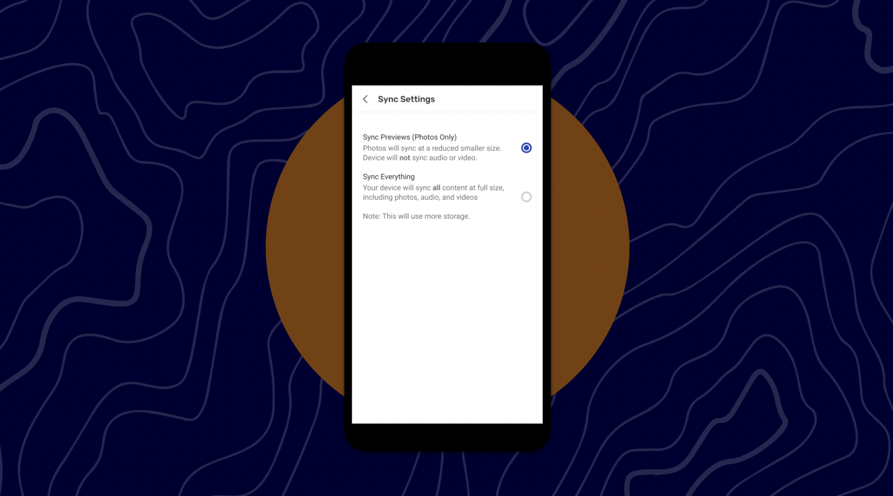

# 🏁 CoMapeo Mobile - Media Manager

Last Edited: September 3, 2025 5:33 PM
Guide Status: Archive

<aside>
📌 **A quick start guide to CoMapeo Mobile’s new features : Media Manage**

</aside>

---

# **Media Manager**

Introducing new media formats, such as audio files, to CoMapeo increases the chances of a user running out of disk space. CoMapeo now allows user on low-end phones with limited memory to selectively exchange data and avoid using too much disk space.

In this first phase of Media Manager, the feature will enable to you to :

- Exchange previews - by default, the interface will only consider current media and will not exchange audio.
- Exchange everything - This mean you would be able to exchange all media, including audio. You could consider this device the “archive device” in your team.

<aside>

**How do I choose to exchange all my data?**

1. Go to the main menu and click on Project Settings and then Sync Settings
2. Select “Sync Everything” by clicking on the radio button
3. When selecting it, a bottom sheet will appear explaining what data will be exchanged moving forward
4. Once selected, you will be exchange all media. Much like you were able to with Mapeo Legacy
</aside>

<aside>

**How do I choose to exchange previews only?**

1. Go to the main menu and click on Project Settings and then Sync Settings
2. Select “Sync Previews” by clicking on the radio button
3. When selecting it, a bottom sheet will appear explaining what data will be exchanged moving forward
4. Once selected, you will be exchange only previews. 
</aside>

<aside>

**Details :**

- We are transitioning away from using the word “sync” and now using the word “exchange”. Copy edits will be integrated shortly.
- When exchanging previews, audio will be exchanged but will not work. When you click on the audio file, it will not work and an error will appear.
</aside>