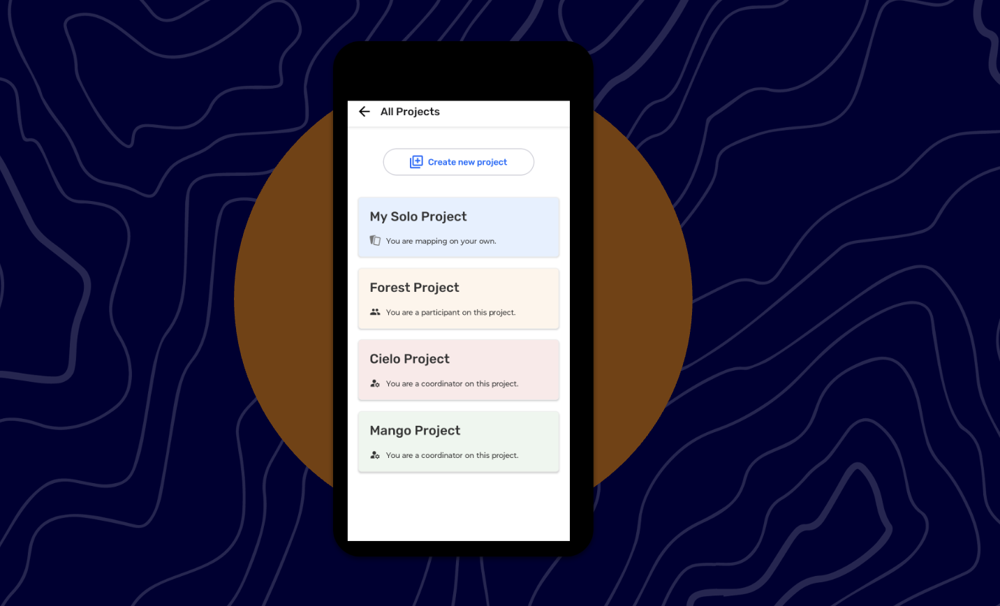
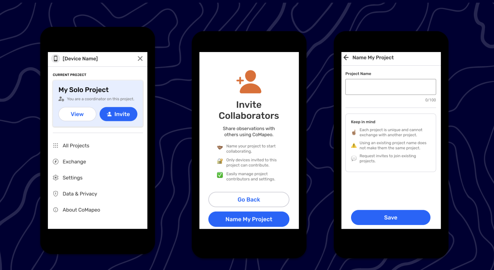
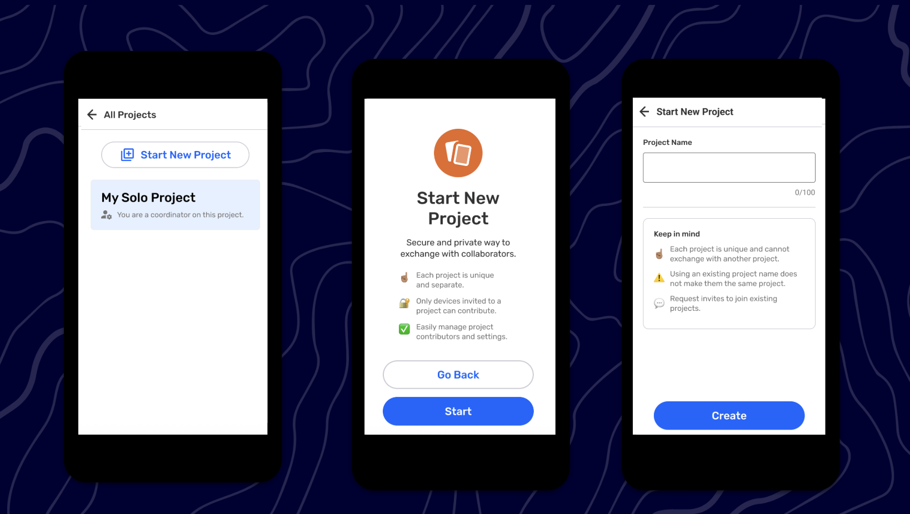
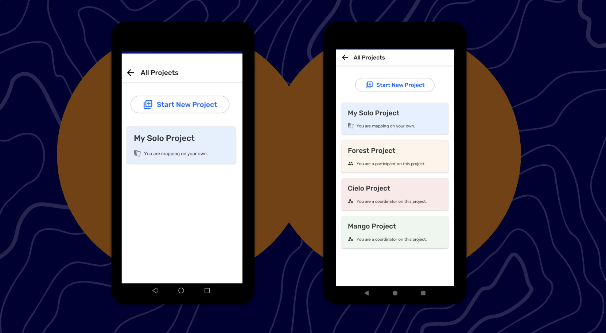
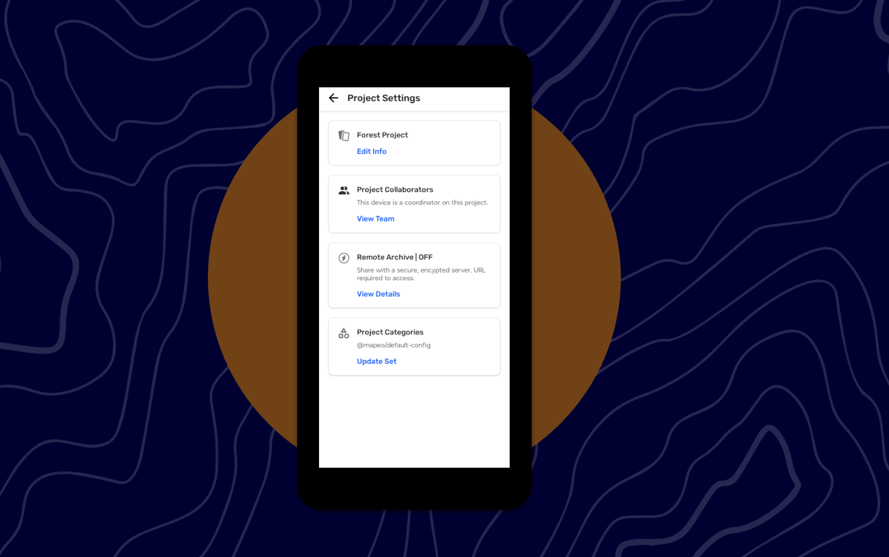
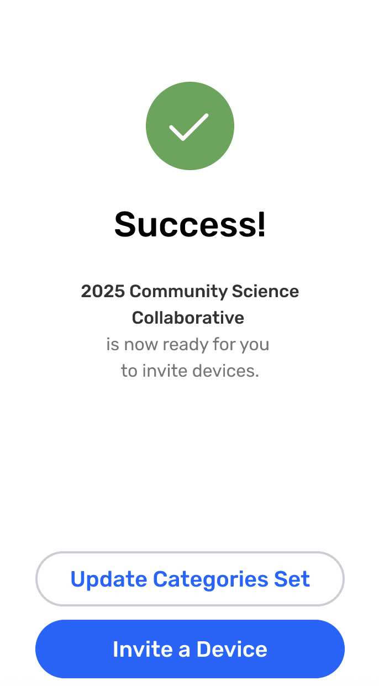
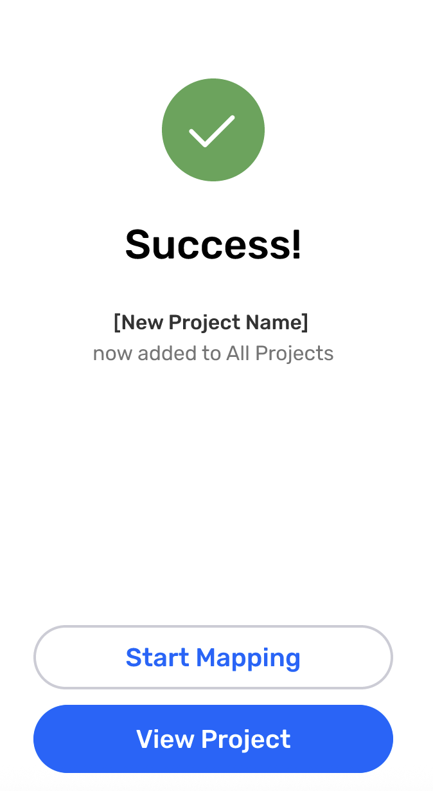

# 🏁 CoMapeo Mobile - Multi Project

Last Edited: September 3, 2025 5:35 PM
Guide Status: Ready to read

<aside>
📌 **A quick start guide to CoMapeo Mobile’s newest features and improvements. For internal use.**
Available in [CoMapeo V5](https://www.notion.so/Release-Notes-CoMapeo-v5-0-1de1b08162d580b38c94ec18de3a998e?pvs=21)

</aside>

---

# Multi Projects

### Background

CoMapeo v3 could only support one project at a time. 

When a user launched the app for the first time, they were automatically mapping on their own. If they needed to map with others, they needed to name their solo project before being able to invite other devices to that project. That being said, any data collected when mapping on their own was kept in tact. 

However, if a user accepted an invitation to another project—whether mapping on their own or from another project—they were forced to leave the current project *and* lose any data collected before being able to join the new project. This was an unsustainable experience for our users.

### What’s New

CoMapeo v5 introduces Multiple Projects, which supports many projects existing at once while also protecting all observations gathered across projects on a device. A user can map on their own, be on another project, receive an invite and join new projects all without having to leave their current project or losing any data.

<aside>

### Multiple Feature x CoMapeo Roles

At any time, a person using CoMapeo experiences it as one of three roles:

- **Mapping On Your Own**
    
    When first using CoMapeo, users begin with an individual mapping experience called 'My Solo Project.' Any observations collected during this initial 'Mapping On Your Own' phase cannot be shared with other users. To exchange Observations with collaborators, users must rename 'My Solo Project' to a custom project name.
    
- **Coordinator**
    
    When a user renames 'My Solo Project' to any custom name, they are automatically designated the Coordinator role for that project. As a Coordinator, a user can invite collaborators to join their project.
    
    A user can also become a Coordinator if;
    
    - they create a new project by tapping on  ‘All Projects’ then ‘Start New Project’
    - they receive and accept a Project Invite to be a Coordinator from an existing Coordinator of a project.
- **Participant**
    
    Users may also receive Project Invites from Coordinators to join projects as Participants. When accepting this invitation, the user becomes a Participant of that specific project.
    
</aside>

---

### Collaborating with Other Devices

When mapping on your own, there are **two** ways to start collaborating with other devices using CoMapeo.

<aside>

### **Inviting Collaborators to “My Solo Project”**

When mapping on your own, your first project is simply “My Solo Project”. You can gather an unlimited amount of observations to this project.

If you’d like to share observations from “My Solo Project” using CoMapeo’s Exchange feature, then you will need to give “My Solo Project” a new name. 

Once successfully renamed, the project is ready to invite devices and use the Exchange feature.

**Instructions**

1. From any main tab, tap the device icon in the top right corner to open the main menu.
2. The Current Project card is near the top of the main menu. It should display “My Solo Project” and your current role, “Mapping On Your Own.”
3. Tap the **+Invite** button on the Current Project card.
4. Review the highlights about Inviting Collaborators and tap on **Name My Project** when ready.
5. On Name My Project, enter a clear and concise project name. Tap on **Save** when done.
6. When the project is successfully renamed and saved, your project is ready to collaborate with other devices.

</aside>

<aside>

### **Collaborating with others while keeping “My Solo Project”**

There are times when a user does not want to share any observations from “My Solo Project”. In this case, the user can “Start New Project” to collaborate with another device.

**Instructions**

1. Tap on **All Projects** from the main menu.
2. This screen will list all projects this device is apart of, whether as a Coordinator or as a Participant
3. Tap on **Start New Project** at the top
4. Review the highlights about Start New Project and tap on **Next** when ready.
5. Enter a name for the project and tap **Create** when done.
6. When the project is successfully named and saved, the project is ready to collaborate with other devices.

 

**Important Note**

- “My Solo Project” will continue to be available from the All Projects screen.

</aside>

## Managing Multiple Projects

<aside>

### What is the **All Projects** screen ?

The All Project screen can be accessed from the Menu Options. It displays:

- The **Start New Project** button which creates a new project
- Projects listed in chronological order from newest to oldest project joined/created
- Each project card display the project’s title, user’s role on that project, and the color selected by the Coordinator for the project.
</aside>

<aside>

### **Managing Projects as a Coordinator**

**Instructions**

1. On the main menu, the Current Project is displayed as card near the top
2. This card should display the Current Project’s Name and the device’s Role. 
3. Tap on View to access the Project Settings.

**Important Note**

Coordinators control the following:

- Project Info, including Project Name, Description, and Color
- Collaborators
- Remote Archive Setting

---

**How to edit Project Info?**

1. From the Project Settings, tap on **Edit Info** in the first module.
2. Update the project name in the
3. Edit project name if needed. Any edits to the project name are applied to everyone on that project.
4. Optional: Add a short description of the project.
5. Optional: Assign a new color to your project card.

Note : If 2 coordinators edit the Project Name, the most recent change will be the one that shows (just like if two users edit an observation).

**How to view all Collaborators?**

1. From the Project Settings, tap on **View Team**  in the second module.
2. The Team screen will appear. This screen has not changed since the release of CoMapeo.

**How to turn on Remote Archive?**

1. From the Project Settings, tap on **View Details**  in the third module.
2. The Remote Archive Settings screen will appear.
3. Add or remove a server as needed. This screen has not change since it was release.

Note: If you (or another coordinator) has not added a server, the title will display Remote/Archive OFF. If you (or another coordinator) has added a server, the title will display Remote/Archive ON

</aside>

<aside>

### Managing Projects as a Participant

(Add participant screenshot)

1. On the main menu, the Current Project is displayed as card near the top
2. This card should display the Current Project’s Name and the device’s Role. 
3. Tap on View to access the Project Settings.

**Important Notes**

As a Participant you have access to the following;

- You can see the name of the project
- See the “View Team” page and see all devices on that project
- See if the Remote Archive feature was activated

</aside>

<aside>

### Success screen Updates

- Once you successfully named your “My Solo Project”, the success screen will look slightly updated
- You can tap on “Update Categories Set” and go to the Categories screen to upload a custom category file
- Or tap on “Invite a Device” and start inviting devices

- Once you successfully started a new project, the success screen will look slightly updated
- You can tap on “Start Mapping” and go to the map screen
- Or tap on “View Project” and go to the Project Settings
</aside>

<aside>

### Details

- When you are on 2 or more projects and reopen the app after a day (local time zone);
    - If you were mapping on you own, and have another project where you are mapping in a team - app reopens to the project that you are collaborating with
    - If you are on multiple projects with multiple teams - app reopens to the last project used
- You can upload different custom categories in different projects
- Exchange is project specific, between the consenting devices
- The Passcode feature will be activated App-wide, it is not project specific
- You can upload custom map and it will be App-wide, it is not project specific
</aside>