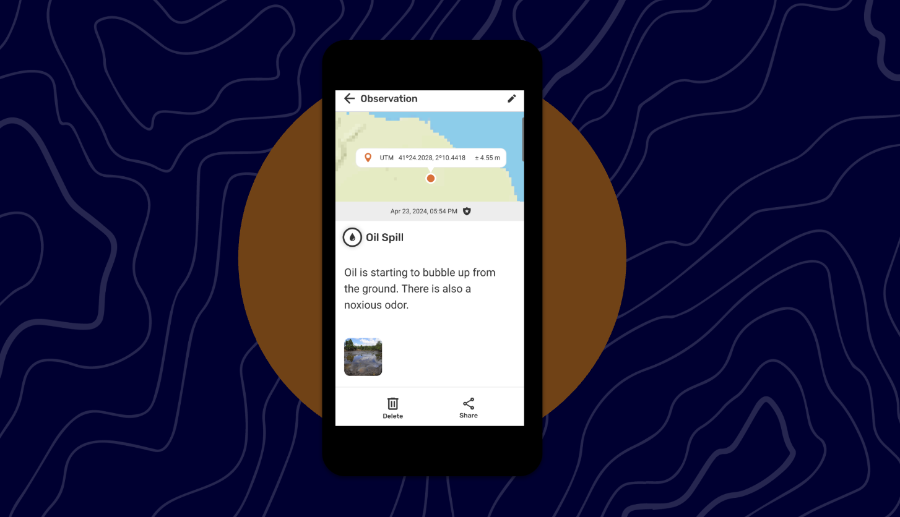
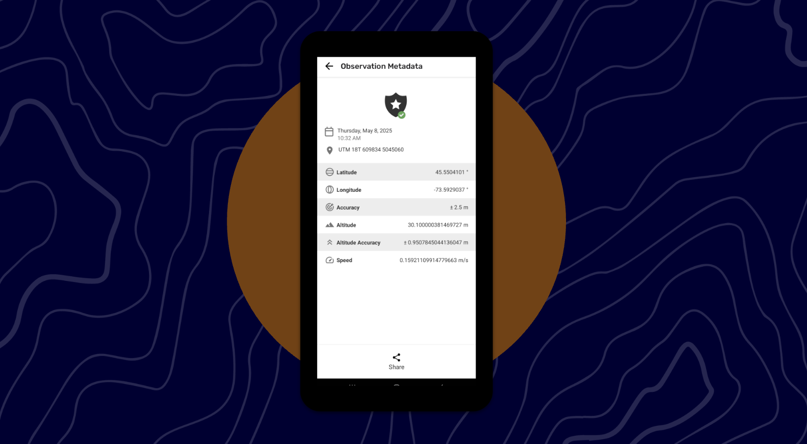
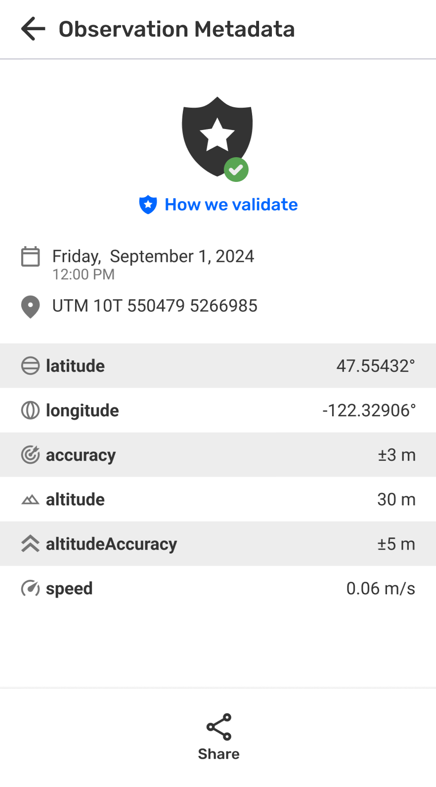
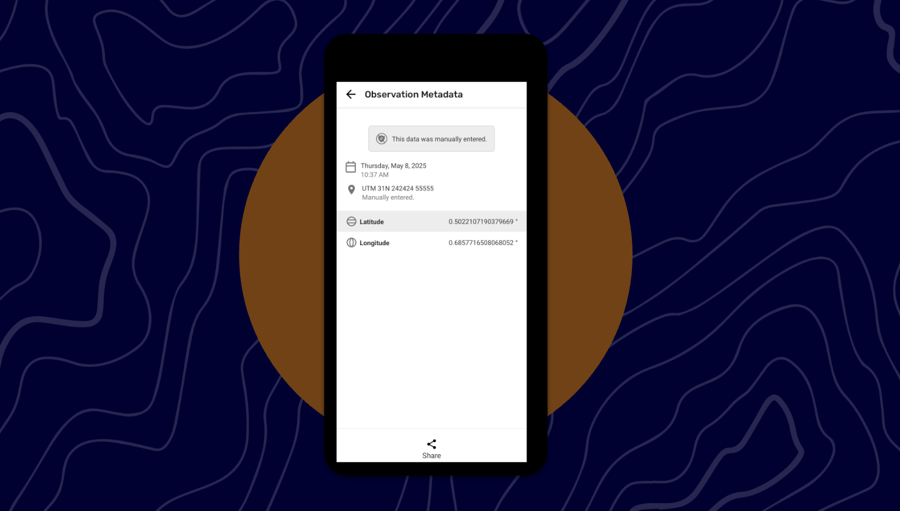
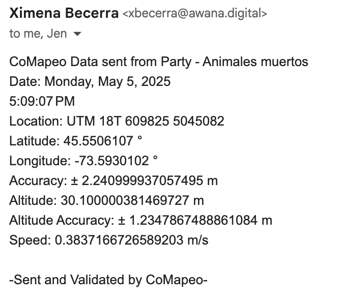

# 🏁 CoMapeo Mobile - Exposing Observation Metadata

Last Edited: September 3, 2025 5:29 PM
Guide Status: Ready to read

<aside>
📌 **A quick start guide to CoMapeo Mobile’s newest features and improvements. For internal use.**
Available in [CoMapeo V5](https://www.notion.so/Release-Notes-CoMapeo-v5-0-1de1b08162d580b38c94ec18de3a998e?pvs=21)

</aside>

---

# Exposing Observation Metadata

### Background

CoMapeo has been gathering both Observation GPS and Photo Metadata. This feature allows you to view and share the metadata of individual Observations, in case it’s being challenged for their authenticity.

### What’s New

There are 2 states to Observation Metadata, depending on if the data is validated or not. To clarify, **validated data** is data that has been collected automatically and not edited. Data that is manually entered is not validated. If the GPS Coordinates are manually entered, CoMapeo will display that data is **un-validated.**

<aside>

### **How do I access to the Observation Metadata?**

1. Go to the Observation list and tap on an Observation. 
2. You can either;
    - Tap the grey bar that has the date and shield (the entire bar is tappable), or
        
        
        
    - Tap the GPS coordinates bubble (the entire bubble is tappable)
        
        
        
    
</aside>

<aside>

### Validated Metadata

- Once you access the Observation Metadata, you will see the available metadata:
    - Date and time
    - GPS coordinates
    - Latitude
    - Longitude
    - Accuracy
    - Altitude
    - Altitude accuracy
    - Speed
- By tapping Share you be able to share this metadata via Email or What’sapp
    
    <aside>
    
    **Email** 
    
    **Subject :** CoMapeo Data sent from (Project Name) -  (Category) - (Date)
    
    **Body :** CoMapeo Data sent from (Project Name) - (Category)
    
    Date (Date + Time w seconds)
    
    Location ( 00000 N, 0000 E)
    
    Latitude (Latitude)
    
    Longitude (Longitude)
    
    Accuracy (Accuracy)
    
    Altitude (Altitude)
    
    Altitude accuracy (Altitude accuracy)
    
    Speed (Speed)
    
    -Sent and validated by CoMapeo-
    
    </aside>
    
    <aside>
    
    **What’s App**
    
    CoMapeo Data sent from (Project Name) -  (Category)- (Date)  
    
    (Date (Date/Time)
    
    Location (00000 N, 0000 E)
    
    Latitude (Latitude)
    
    Longitude (Longitude)
    
    Accuracy (Accuracy)
    
    Altitude (Altitude)
    
    Altitude accuracy (Altitude accuracy)
    
    Speed (Speed)
    
    -Sent and Validated by CoMapeo-
    
    </aside>
    
</aside>

<aside>

### What’s missing?

- The text link **How we validate** will show information about our validation process. Since we haven’t drafted this validation process yet, this text link has been omitted. This item will be introduced in an upcoming release.
    
    
    
</aside>

<aside>

### Un-validated Metadata

- Once you access the Observation Metadata, you will see the available metadata;
    - “This data was manually entered”
    - Date
    - Time
    - GPS coordinates
    - Latitude
    - Longitude
- By tapping Share you be able to share this metadata via Email or What’sapp
    
    <aside>
    
    **Email**
    
    **Subject :**
    
    CoMapeo Data sent from (Project Name) - (Date) - (Category)
    
    **Body:**
    
    CoMapeo Data sent from (Project Name) - (Category)
    
    Date (Date)
    
    Location ( 00000 N, 0000 E)
    
    Latitude (Latitude)
    
    Longitude (Longitude)
    
    -Location was manually entered-
    
    -Sent by CoMapeo-
    
    </aside>
    
    <aside>
    
    **What’s App**
    
    CoMapeo Data sent from (Project Name) - (Date) - (Category)
    (Date (Date)
    Location ( 00000 N, 0000 E)
    Latitude (Latitude)
    Longitude (Longitude)
    
    -Location was manually entered-
    -Sent by CoMapeo-
    
    </aside>
    
</aside>

<aside>

### Known Issue

- The formatting isn’t ideal when sharing via Email. An upcoming release will include an improvement to the formatting.
    
    
    
</aside>