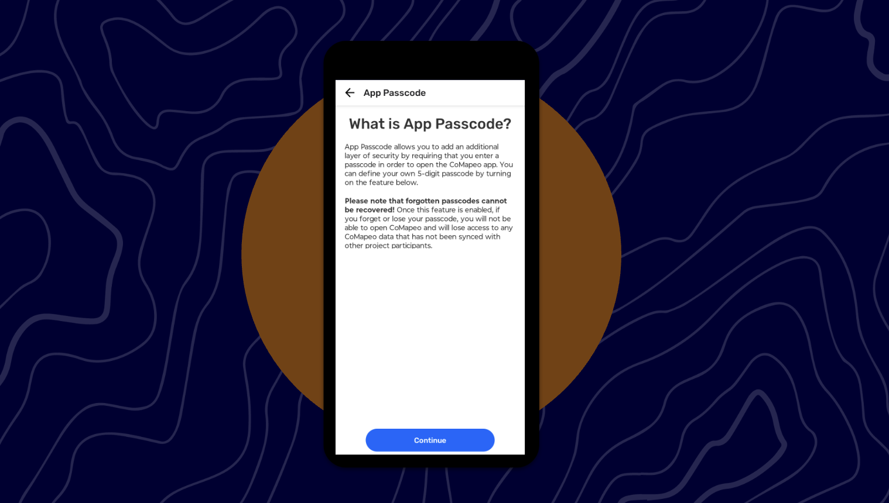
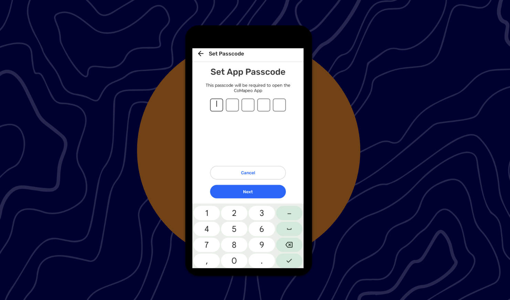

# 🏁 CoMapeo Mobile - Security features

Last Edited: September 3, 2025 5:27 PM
Guide Status: Ready to read

<aside>
📌 **A quick start guide to CoMapeo Mobile’s new features :  App Passcode and Obscure Passcode**

</aside>

---

# App Passcode

The **App Passcode** allows a user to protect CoMapeo from casual prying eyes (such as somebody picking up someone's phone and browsing the app). However, feedback from users highlighted the risk that when faced with a physical threat, a user could just be forced to enter their password. In an attempt to mitigate this, **Obscure Mode** would hide the actual data and would display an empty version of CoMapeo.

<aside>

### **How do I activate App Passcode?**

1. Tap on the device icon on the top right of your screen, this will direct you to the main menu
2. Tap on **Settings** and then **Security**
3. You will see the option to select App Passcode or Obscure Passcode
    1. You will need to activate App Passcode before using Obscure Passcode
4. Tap **App Passcode** and read the instructions
5. Tap on **Continue** and you will be able to set a 5-digit passcode
    1. You will re-enter the 5-digit passcode and tap **Next**
6. Once you have read the warning to remember your passcode, you can tap on **Save App Passcode**
7. Back on the Security screen, see the **Passcode is set**
8. Whenever you close and open the app, you will be required to enter your 5-digit passcode
</aside>

<aside>

### **How do I deactivate App Passcode?**

- Go back to the **Security** and tap on **App Passcode**
- Enter your 5-digit passcode
- Tap on the checkbox next to the Use App Passcode
    - You will have the option to **Turn Off** the feature or Cancel
    - Tap on **Turn Off**
    - You will see the Passcode is not set
- Tap on **Change App Pascode**
    - You will be able to update your 5-digit passcode
</aside>

<aside>

### **How do I activate Obscure Passcode?**

- Once your App Passcode is set, go to the **Security screen** and tap on **Obscure Passcode**
- Tap on the checkbox next to the Use Obscure Passcode
    - You will see the code 00000 set by CoMapeo to use whenever you want to hide your actual data
</aside>

<aside>

### **I activated Obscure Passcode, what do I do?**

- Once it is set and you relaunch the app, you will be able to enter your own passcode (the 5-digit passcode you have set yourself) or 00000 (Obscure Passcode)
    - Tapping your own passcode, CoMapeo will open open as usual
    - Tapping the Obscure Passcode, CoMapeo will open with no data available
        - You will be able to use the app as usual but no Observation will be saved
</aside>

<aside>

### What’s missing?

- When Obscure Passcode is set, and the app is reopened, you should see a different welcome screen.
    - This improvement will be re-introduced in an upcoming release
</aside>

<aside>

### **What’s next :**

- Once the multi-projects will be introduced, these features will be App-wide, which means once the passcode is set - it will be set to the whole app.
</aside>