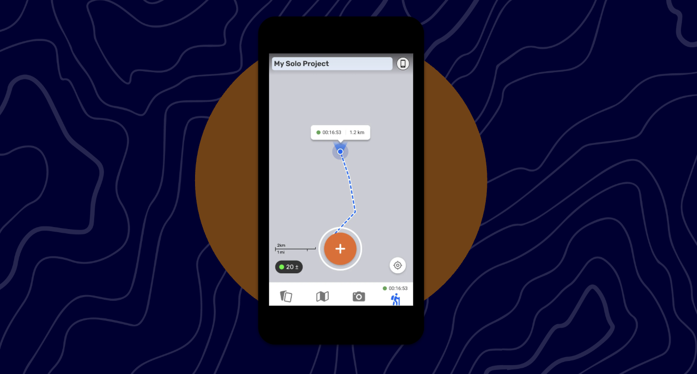
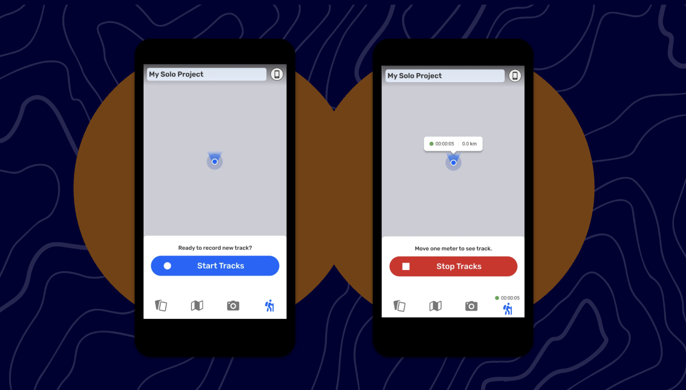
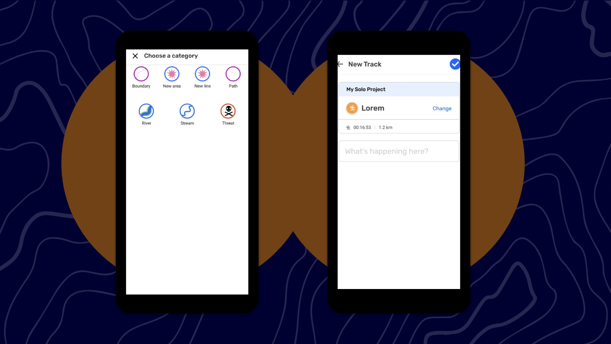
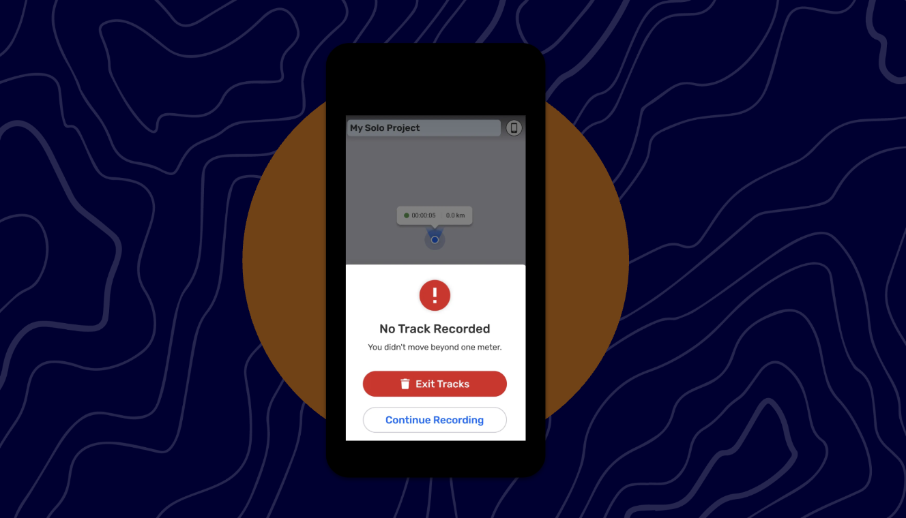
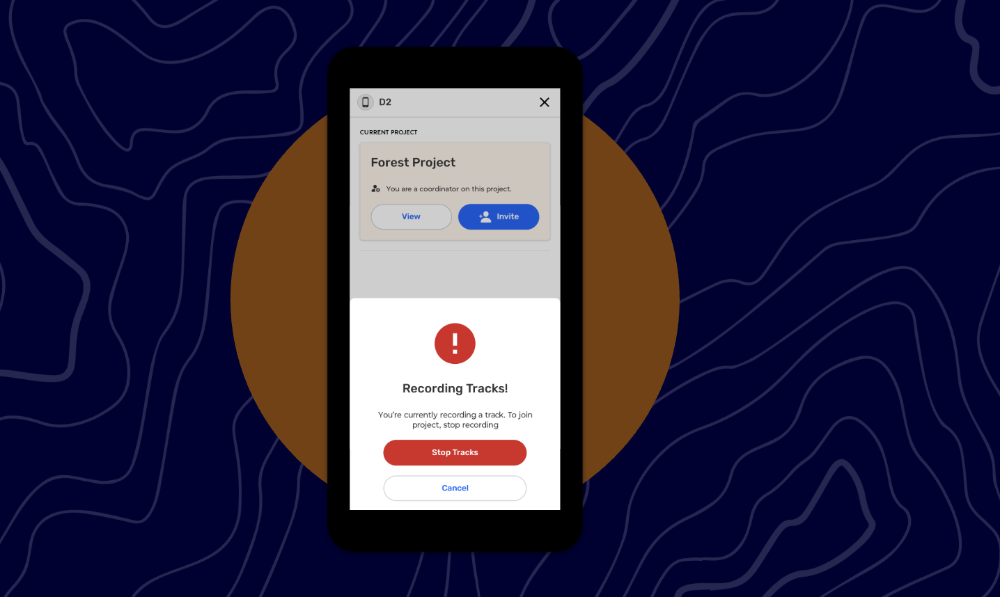

# 🏁 CoMapeo Mobile - Tracks Improvements

Last Edited: September 3, 2025 5:28 PM
Guide Status: Ready to read

<aside>
📌 **A quick start guide to CoMapeo Mobile’s newest features and improvements. For internal use.**

</aside>

---

# Tracks Improvements

### Background

[Tracks MVP](https://www.notion.so/Record-tracks-MVP-c1b4ec2a48974e12ba84aa36c6ddba5c?pvs=21) was released in CoMapeo early 2025. Since then, we have been gathering feedback from the Awana Digital team and our partners during field trainings. 

### What’s New

Improvements address the following feedback:

- Unclear copy of the steps to follow to record a track
- The saving a track flow is confusing
- Categories are missing
- The track line on the map could be improved

<aside>

### Starting a Tracks Recording

**Instructions**

1. Tap the walking man icon, and if it is your first time recording at Track you will be asked to give permission for CoMapeo to use GPS
2. Tap Start Tracks to begin recording your movement on the map 
3. You can go to the map, and start collecting observations. These observations will be linked to the track being recorded
4. On the map, you will begin to see a dotted line, the distance and how long you have been walking
</aside>

<aside>

### Saving a Tracks Recording

**Instructions**

1. You can close Tracks anytime and keep recording. To stop recording a Track, open Tracks back up and tap Stop Track.
    1. Make sure to move at least one meter to be able to save a tracks
2. Select a category to assign to that track
3. Then on the New Track screen, you can see **Category + Time Length & Distance Stamp**
4. Tap save in the top right

**How do I view my Track?**

1. Saved Tracks will be listed as “Track” in the Observation list, in chronological order of when they were saved.
2. The Track will display Category + Time Length & Distance Stamp
</aside>

<aside>

### Error: Tracks Stopped without Moving

1. If you did not walk more than a meter when the track is active, this error will appear
2. You have to option to exit the track feature, or continue
</aside>

<aside>

### Accepting a Project Invite while Tracks is active

1. If a track is active, and you receive/accept a project invite, you will see this warning
    1. Tapping on “Stop Tracks” leads you to saving the track being recording
    2. Tapping on “Cancel” will lead you back to the project invite state, from there you can decline the invite
</aside>

<aside>

### Details

- **Sharing** - Currently, a Track cannot be shared because of the many Observations attached to it, causing too much media to be shared at one time. CoDesign will meet with App Dev to discuss our options.
- **Background Location Permission** - For the feature to work, CoMapeo will be asking for background location permission, which means Tracks will be active even when the app is closed. To stop from tracking, you can click on Stop Track to stop the feature, or stop sharing their location via the device’s Settings
</aside>