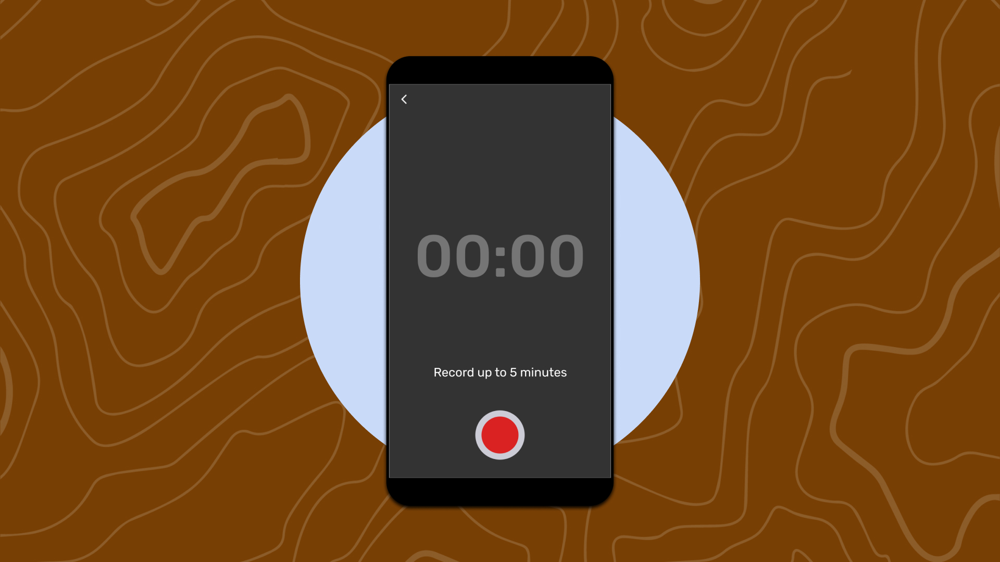
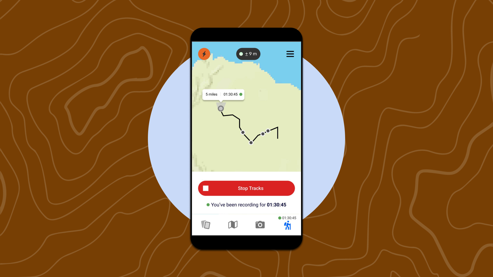
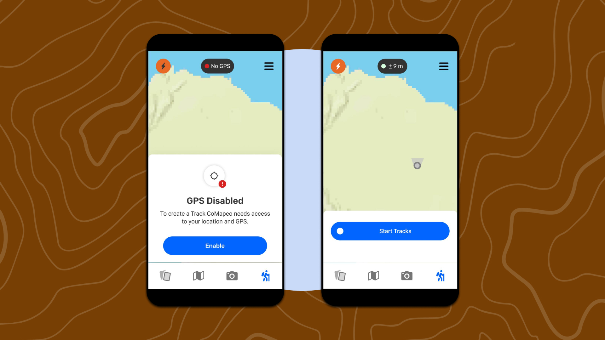
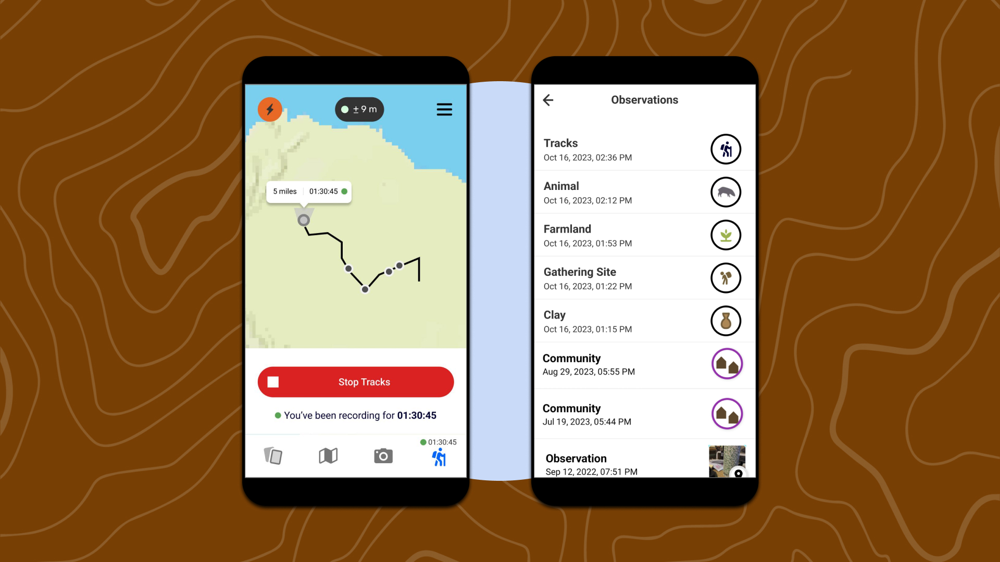
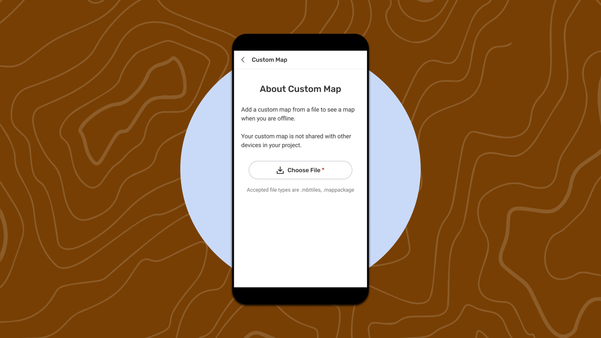

# 🏁 CoMapeo Mobile 1.1.0 - Audio, Tracks, Map File Picker

Last Edited: September 3, 2025 5:26 PM
Guide Status: To Update

[CoMapeo Mobile 1.1.0 - Audio, Tracks, Map File Picker - delete](%F0%9F%8F%81%20CoMapeo%20Mobile%201%201%200%20-%20Audio,%20Tracks,%20Map%20File%20P%201eb1b08162d58043bed7c04fbe25bee5/CoMapeo%20Mobile%201%201%200%20-%20Audio,%20Tracks,%20Map%20File%20Pic%201341b08162d5804a9000dc4718f725f5.md)

<aside>
📌 **A quick start guide to CoMapeo Mobile’s new features :Audio Recordings, GPS Tracks and Map File Picker - for internal use**

</aside>

---

# Audio

With our new Audio feature you can now record sounds and narrative along with observations to add an extra layer of context to your data. This features introduces 2 main elements: Recording and Playback. See a quick video of the feature : https://www.canva.com/design/DAGWZ889dY4/_pf6w87Jgn8oFVcEcMDHiA/watch?utm_content=DAGWZ889dY4&utm_campaign=designshare&utm_medium=link&utm_source=editor 

<aside>

**How do I record audio?**

1. Create a new Observations or edit an existing Observation. 
2. Tap [Audio in the bottom bar. If this is your first time recording Audio you will be asked permission for CoMapeo to use your microphone and record.
3. Give permission for CoMapeo to use audio
4. Next, tap the large red record button to begin recording audio 
5. You will be able to record up to 5 minutes of audio. You will see a status updating you on how much time you have left.
</aside>

<aside>

**How do I stop and save Audio?**

1. To stop recording, tap the stop button. 
2. You will be able to playback the recorded Audio
3. To save your Audio, tap close in top left. You will see a success message with the option to return to the editor *or* to record another audio.
</aside>

<aside>

**Details :**

- Access to audio - For now, you have access to the Audio feature only by creating an Observation.
- Sharing - An audio recording is an mp4 file that can be shared in the following ways :
    - Once you save an observation, the audio recording can be shared as a single file by clicking on the saved audio recording and then clicking on the share icon.
</aside>

---

# GPS Tracks

With Tracks you will be able to document paths, boundaries, and more, by recording geo-referenced tracks directly within CoMapeo. See a quick video of the feature : https://www.canva.com/design/DAGWZrU91cs/Wbo7ytIcNvcrssMPS-rBww/watch?utm_content=DAGWZrU91cs&utm_campaign=share_your_design&utm_medium=link&utm_source=shareyourdesignpanel

<aside>

**How do I start Tracks?**

1. Open the Tracks menu from the bottom navigation bar.
2. If it is your first time recording at Track you will be asked to give permission for CoMapeo to use GPS
3. Tap [Start Tracks to begin recording your movement on the map. You will begin to see a visible line (and how long you have been tracking) representing your path on the map.
</aside>

<aside>

**How do I stop and save Tracks?**

1. You can close Tracks anytime and keep recording. To stop recording a Track, open Tracks back up and tap Stop Track.
2. You’ll enter the New Observation screen, where you can add details and answer questions.
Tap save in the top right.
3. To see observations taken along the Track you will be able to see them in a list collected in the Track Observation.

**How do I view my Track?**

1. Saved Tracks will be listed as “Track” in the Observation list, in chronological order of when they were saved.
</aside>

<aside>

**Details :**

- **Observation Detail View** -  When clicking on an observation, you will be able to view the track it was part of.
- **Track Detail View** - When clicking on a Track, you will be able to see all the observations created while the feature was active.
- **Sharing** - Currently, a Track cannot be shared because of the many Observations attached to it, causing too much media to be shared at one time. CoDesign will meet with App Dev to discuss our options.
- **Background Location Permission** - For the feature to work, CoMapeo will be asking for background location permission, which means Tracks will be active even when the app is closed. To stop from tracking, you can click on Stop Track to stop the feature, or stop sharing their location via the device’s Settings.
- **Saving a Track -** In order to be able to save a Track, you need to have moved a certain distance on the map.
    - For example, if you tap on [Start Tracks], do not move, didn’t collect Observations, and click [Stop Tracks] - the bottom sheet will close.
</aside>

---

# Map File Picker

The Map File Picker allows you to add a single custom map to CoMapeo, without needing to place files in specific folders. Select your map file from anywhere it lives on your device and add it to your map.

<aside>

**How do I add a custom map to CoMapeo?**

1. Open the menu and tap [App Settings], [Map Management], then [Background Map]
2. Tap the button Choose File to open the file picker.
3. Navigate to the style-map-package that you want to add and select it.
4. That’s it! You’ll see your map added and can remove it at any time. 

<aside>

⚠️ Only one map file can be active at a time.
Ensure your map file is in the *smp.file* format to avoid import errors.

</aside>

</aside>

<aside>

**How do I remove or replace the custom map?**

1. Open the menu and tap [App Settings], [Map Management], then [Background Map]
2. Tap the button Remove Map
3. The confirmation modal will appear, tap on the Delete Map button
4. That’s it! You can replace the map or go back to using the default map.
</aside>

---

# What’s new? What’s missing?

## Background Maps

CoMapeo Mobile now supports [style-map-packages](https://github.com/digidem/styled-map-package) only. The app dev team is working on a tool that could help you convert **mbtiles** files to our new **SMP** format. 

## Configs

Update : the extension of the created configuration needs to be `.comapeocat`

[Path to updating configs for CoMapeo](https://www.notion.so/Path-to-updating-configs-for-CoMapeo-614733e4acb740a4a15944ba2ac8b304?pvs=21) 

## Missing items that existed in Mapeo

- Settings / Experiments / Obscure Passcode
    - This feature will be re-implemented to CoMapeo before the end of 2024.
- Settings / Map Settings / Map Manager
    - The introduction of the map file picker allowed us to delay development on the Map Manager. We will discuss when to develop this feature early 2025.