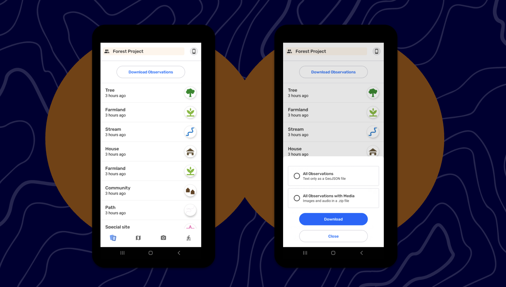
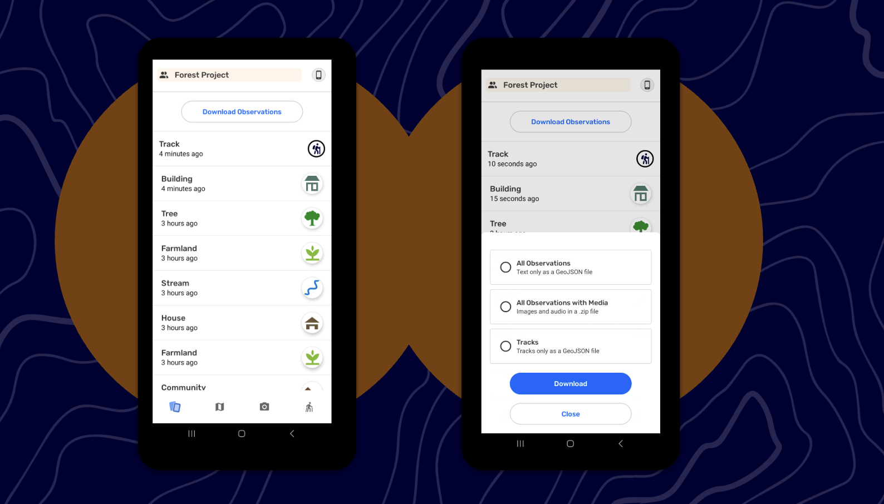

# 🏁 CoMapeo Mobile - Data Export

Last Edited: September 3, 2025 5:28 PM
Guide Status: Ready to read

<aside>
📌 **A quick start guide to CoMapeo Mobile’s newest features and improvements. For internal use.**

</aside>

---

# Data Export

<aside>

### **Exporting all my collected Observations without any media attachments**

Instructions

1. Once you have gone through the onboarding steps, record at least one observation 
2. Tap to the Observation List screen
3. Tap on the Download Observations button to see the available options
4. Select “All Observations” and tap on Download
5. You will see the standard Android share sheet that allows the export to be sent via email, a messaging app, or saved to disk via an app that gives access to files on the device (not all Android devices have a “files” app installed by default)
6. This exports all Observations as **GeoJSON file**

---

**File Naming** 
The GeoJSON file follows this file naming convention : CoMapeo_[Project Name]_Obsvns_YYYY-MM-DD.geojson

---

**Important to note** 

For technical reasons, even if you don’t have any media attachments, you will see the option of exporting Observations with media

</aside>

<aside>

### What’s included in this GEOJson file?

- 
</aside>

<aside>

### **Exporting all my collected Observations plus media attachments**

**Instructions**

1. Once you have gone through the onboarding steps, record at least one observation 
2. Tap to the Observation List screen
3. Tap on the Download Observations button to see the available options
4. Select “All Observations with Media” and tap on Download
5. You will see the standard Android share sheet that allows the export to be sent via email, a messaging app, or saved to disk via an app that gives access to files on the device (not all Android devices have a “files” app installed by default)
6. This exports all Observations with media in a **ZIP file**
    - Once unzipped, the Observations are exported as a **GeoJSON file** and the media is available in a folder

---

**File Naming** 

The export follows this file naming convention : 

Zip File : CoMapeo_[Project Name]_Obsvns_YYYY-MM-DD.zip

Folder name : CoMapeo_[Project Name]_Obsvns_YYYY-MM-DD

1. File name : CoMapeo_[Project Name]_Obsvns_YYYY-MM-DD.geojson
2. Folder name with media : CoMapeo_[Project Name]_Obsvns_YYYY-MM-DD_Media
3. Missing attachment file name : Log of missing data.txt
</aside>

<aside>

### **Exporting Saved Tracks**

**Instructions**

1. Once you have gone through the onboarding steps, record at least one track 
2. Tap to the Observation List screen
3. Tap on the Download Observations button to see the available options
4. Select “Tracks” and tap on Download
5. You will see the standard Android share sheet that allows the export to be sent via email, a messaging app, or saved to disk via an app that gives access to files on the device (not all Android devices have a “files” app installed by default)
6. This exports all Tracks is a **GeoJSON file**

---

**File Naming** 
The GeoJSON file follows this file naming convention : CoMapeo_[Project Name]_Tracks_YYYY-MM-DD.geojson

---

**Important to note** 

- You have the choice to export *either* tracks or observations. If you wants both then you need to do two exports.
- Coordinators and Participants can export data

</aside>