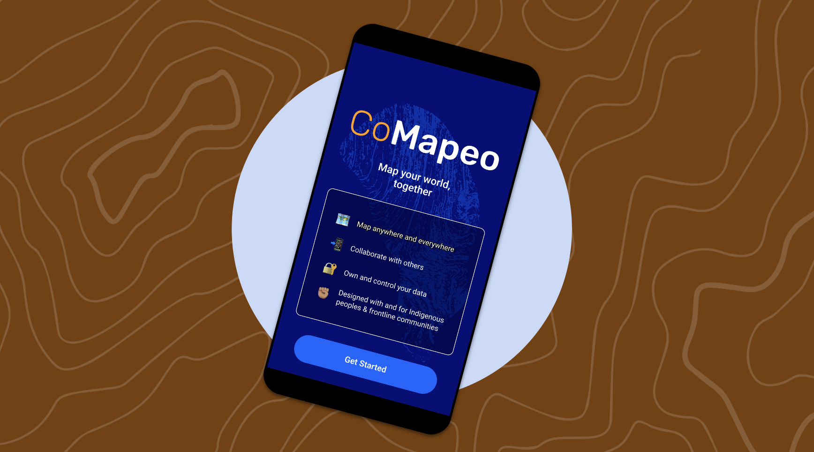
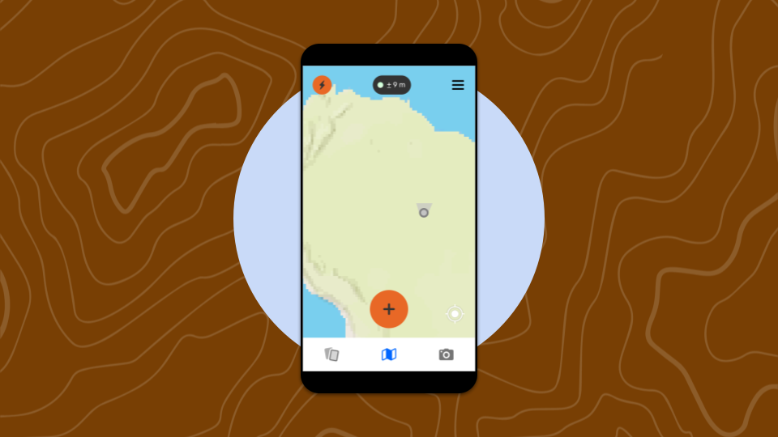
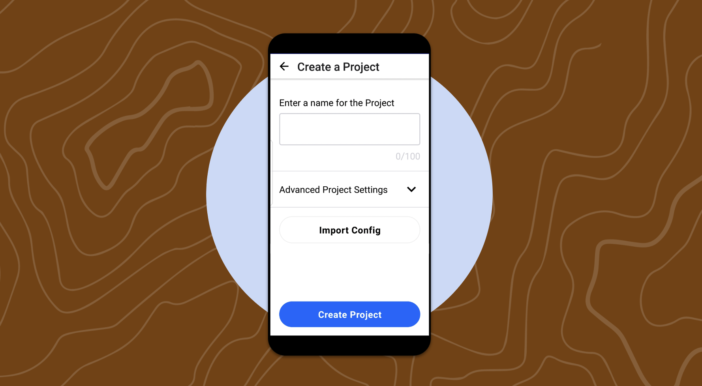
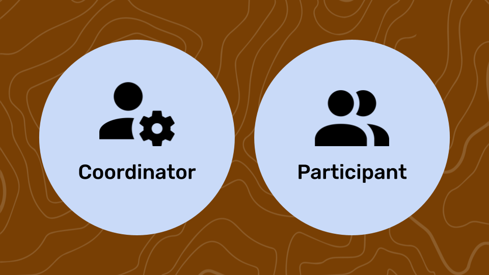
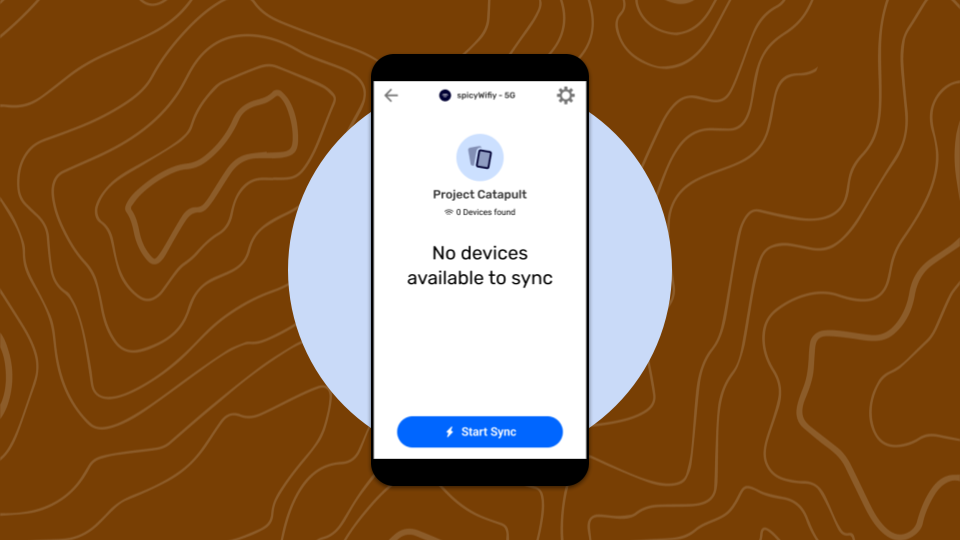
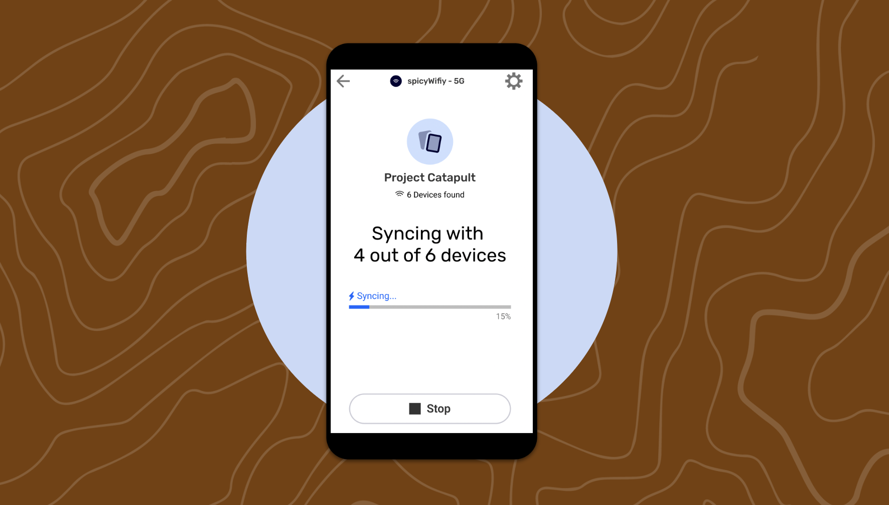
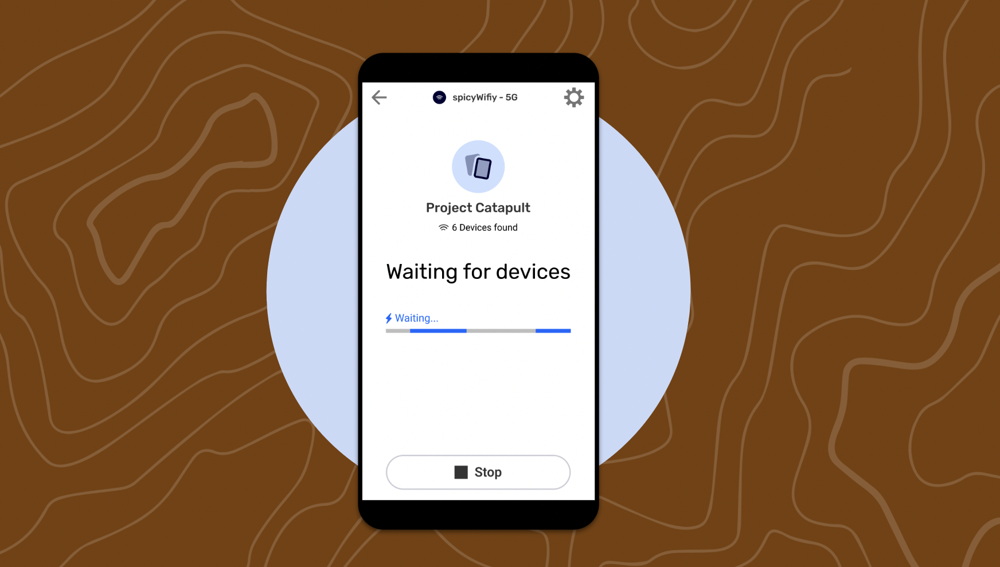
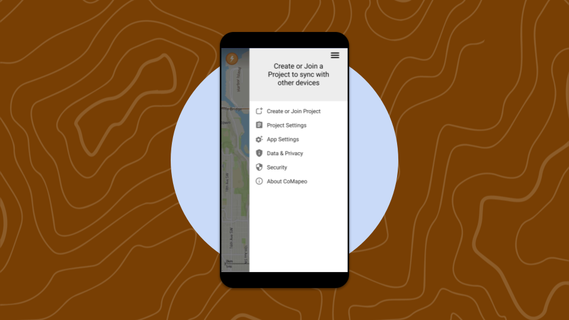

# 🏁 CoMapeo MVP Mobile - Quick Start Guide for Unaccompanied Users

Last Edited: September 3, 2025 5:30 PM
Guide Status: To Update

<aside>
📌 **A quick start guide to CoMapeo MVP Mobile**

</aside>

---

# CoMapeo: Who it’s for and what can they do with it?

CoMapeo is a digital mapping app for territory monitors and mappers. CoMapeo helps groups of monitors and mappers to easily create a private collaborative mapping databases, document territory observations and details, and securely share observations between team members.

---

# Getting Started

There are 3 steps to Onboarding:

1. **Welcome Screen**
You will be invited to [Get Started] and asked for device permissions upon startup.
2. **Metrics & Privacy Policy**
The app will present the metrics it collects, and you can choose to [opt in] or [opt out]. This can also be changed later via **Settings > Data Privacy**.
    1. See Privacy Policy in English : [**CoMapeo Data & Privacy**](https://www.notion.so/CoMapeo-Data-Privacy-d8f413bbbf374a2092655b89b9ceb2b0?pvs=21) 
3. **Device Naming**
You must enter a name for the device. This is the name other devices will see when inviting you to project, and will display in the list of project members.

After completing the above steps, CoMapeo is ready to use on your device.

---

# **Using CoMapeo for the First Time**

After Onboarding, CoMapeo will always start in the Map view. You may enter the app and begin exploring its features. When you use CoMapeo for the first time, your device is not part of a project and is not assigned any roles (Coordinator or Participant.)

<aside>

**What can I do without being part of a project?**

- Create and save observations
- Import configuration and adjust preferences
- Share individual observations via the device menu
- Access settings like Security, Language, and Coordinates
</aside>

<aside>

**Current limitations**

- Any observations taken before you are on a project will not be saved when you join or create a project later. **All your observations will be lost!**
    - Post-MVP
        - Losing data after creating/joining a project isn’t good, we will go back to CoDesign to discuss how to best navigate this issue. Either to add a new screen, or provide a way to migrate data to a new project.
- When not on a project you cannot connect with other devices and sync.
</aside>

<aside>

### **FOR TRAINING**

</aside>

In order for users to not lose data, it would be best to create a project and invite all participants to that project before they start collecting any data. 

---

# **Projects**

If you intend to map alone, and do not intend to gather observations for a project, then feel free to start using CoMapeo. If you intend to gather observations with a team, then either join or create the project first, before creating any observations.

<aside>

**How do I create a project?**

1. Open the menu and tap [Create or Join Project], then [Create a Project].
2. Enter a name for your project (note: in MVP the name cannot be edited later).
3. (Optional) Open Advanced Project Settings to import a config file.
4. Tap [Create Project] and confirm with the success message.
5. You can now either tap on  [Invite Device] or  [Go to Map] and are now Project Coordinator 
</aside>

<aside>

**How do Coordinators invite devices to a project?**

⚠️ You can only invite devices that are on the same wifi network that also have the CoMapeo app open.

Project Coordinators can invite other devices by:

1. Going to the **Menu → Project Settings → Your Team**.
2. OR immediately after creating a project by tapping [Invite Devices]

There are 4 steps to inviting: 

1. Tap [Invite Device]
2. Select a device from the list. (Both devices must be on the same Wi-Fi network and have the same CoMapeo version.)
3. Choose the device’s role (Coordinator or Participant)
4. Tap [Send Invite]

All Roles can go to → **Menu → Project Settings → Your Team** to see what devices are part of the project

</aside>

<aside>

**Current limitations**

- Coordinators cannot remove devices from a project at this time.
- Project Name cannot be edited or changed afterwards
- Roles cannot be changed after they were set during the project invite
- Known Issues
    - **Asking for an invite :** There is currently no user flow for a user to send an invite request to a Coordinator. In the app, there is a screen that invites the user to ask the Coordinator to send them an invite. A future conversation is to be scheduled to improve this process.
    - **Lag time when accepting an invite** : The success screens of both the Coordinator who sent an invite and the user who accepted the invite won’t be synced. The Coordinator will quickly see the accepted invite, but it will take quite a few seconds for the user to see they have successfully joined a project.
    - **Sending an invite twice** : If a Coordinator sends a project invite and the invitee declines, the Coordinator can resend the invitation but the invitee won’t see that invite.
        - Workaround : Invitee needs to close the app (not in the bg mode) and relaunch it, and should see the invite.
        - A future conversation will be scheduled improve this process.
</aside>

<aside>

### **FOR TRAINING**

</aside>

There must be at least one Coordinator as part of the Project. If a project only has 1 Coordinator and that device goes to leave the project, the app will remind them that they need to invite another Coordinator to the project.

If a Coordinator leaves a project with no other Coordinators then the consequence is that there will be no one to manage its details, settings, invite devices, or any other permissions they control. And that it won’t be possible to add a Coordinator to the project (since the only devices left will be Participants).

---

# **Project Roles**

We have introduced two roles to CoMapeo: **Project Coordinator** and **Project Participant**. 

In future updates Coordinators will have greater control over project setup and permissions.

<aside>

**What is a Project Coordinator?**

The device that creates a project becomes a Project Coordinator. Other devices can be invited as Coordinators to the project when invited by an existing Project Coordinator. Project Coordinators should be trusted devices as they are in charge of managing project details and inviting devices to a project.

Coordinators can:

- Take and share observations
- Edit observations created by others
- Invite devices to the project (to be Coordinators or Participants)
- Manage project details
- Import config (categories)
- Leave project
</aside>

<aside>

**What is a Project Participant?**

A Project Participant is any device that has joined the Project. They can create, sync, and share observations but cannot manage the project’s settings or users.

Participants can:

- Take and share observations
- Edit observations they created
- View project data
- Leave project

Participants **cannot**:

- Edit observations created by others
- Invite other devices to the project
- Import config (categories)
- Edit project details (e.g. project name)
</aside>

<aside>

**When do you select roles?**

When you first open and use the app your device does not have a role.

Your device can be invited to a project as a Participant or a Coordinator.  If you create a project, then your device automatically is the first Coordinator for that project.

</aside>

## Data Synchronization

<aside>

**How do I Sync with other devices?**

Participants and Coordinators can sync with devices by tapping the Sync icon on the upper top left of the Home/Map screen. 

To start Sync tap [Start Sync]. Any devices found on the network will be able to join Sync while it is happening. 

</aside>

<aside>

**How do I stop Sync?**

Users can manually stop sync by tapping [Stop Sync]. This will close the sync process completely. 

You can also navigate away from the Sync screen. The process will continue in the background until all data is synced, then Sync will stop. 

</aside>

<aside>

**What do the different labels in Sync mean?**

Starting from the top going down:

- A label for the wifi network
- the project name
- the number of devices found. Lets the user know the number of devices CoMapeo has found on the same network, same project, and with CoMapeo open. This number will update in realtime as devices come and go
- the number of devices currently syncing with you
- Sync status. This is where we will show what stage of sync you are in (currently syncing, waiting, etc)
</aside>

<aside>

**What are the different stages of Sync?**

There are a few stages of Sync and screens you might come across before or after starting Sync. 

**Before starting Sync**

Some stages you might see *before* you tap [Start]

- No devices available to sync

Means CoMapeo has not found any other devices that are on the same network *and* project. (need to be the same CoMapeo version as well)

- Complete! You’re up to date. All data synced
    
    This is a 100% completion state. You’ll see this when all the devices found on the network share the same data. There’s no action to take here because there is nothing to sync!
    

**After starting Sync**

- “Number” devices available (for example, “6 devices available”)
    
    Lists the number of devices found on network and project. These are the number of devices available to sync with if you choose to start sync.
    
- Waiting for Devices
    
    
    

You have tapped [Start Sync] but no other devices have tapped sync yet so you are waiting for them to join the Sync party.

- Syncing with “number” of devices
    
    These are the number of devices that have joined you in tapping [Start Sync] and are syncing with you and each other. 
    
    If you navigate away from the sync screen no worries, the process will continue in the background until it completes. 
    
- Complete! Waiting for “number” other devices
    
    *This is a partial completion state*
    You’ll see this when your device has completed sync with “x number” of devices. There are other devices that were found (on the network, on the same project) that did not join the sync party so you are encouraged to sync with them. You do that by waiting for them to Start Sync.
    
    You can wait for them to join or stop Sync. After a few seconds if no one else joins Sync then the process will auto stop.
    
- Complete! You’re up to date. All data synced
    
    This is a 100% completion state. All the devices that joined sync have completed sharing data. You can keep Sync going and wait and see if any other devices are going to join or you can tap [Stop] to close out.
    
    If you navigate to a different screen at this stage after a couple of seconds the process will also auto-stop.
    
</aside>

<aside>

### **FOR TRAINING**

</aside>

If you go to the Sync Screen and no devices are found make sure they are on the same network and same project.

---

# Settings Menu

The new CoMapeo menu is in the upper right side of the screen on the Home/Map screen.  Here is a tree of all the settings contained within:

- Create or Join Project
- Project Settings
    - Device Name
    - Your Team
    - Project Configuration
- App Settings
    - Language
    - Coordinate system
- Data & Privacy
- Security
    - App Passcode
- About CoMapeo

- Known Issue / Future fix
    
    The overall design and flow of the main menu is not ideal, we have scheduled a design audit soon after this MVP release to discuss future improvements. Improvements scheduled for October.
    

---

# What’s new? What’s missing?

## Background Maps

CoMapeo Mobile MVP does not support background maps. 

## Configs

Update : the extension of the created configuration needs to be `.comapeocat`

[Path to updating configs for CoMapeo](https://www.notion.so/Path-to-updating-configs-for-CoMapeo-614733e4acb740a4a15944ba2ac8b304?pvs=21) 

## Missing items that existed in Mapeo

- Settings / Experiments / Obscure Passcode
    - This feature will be re-implemented to CoMapeo before the end of 2024.
- Settings / Map Settings / Map Manager
    - The Map Manager was removed and will be soon replace by a Map File Picker in October. The Map Manager feature will be reworked in 2025.