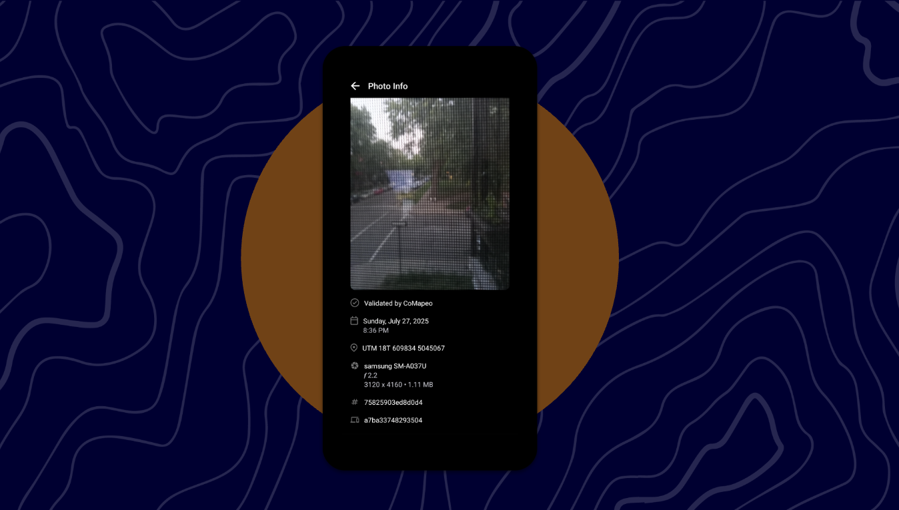
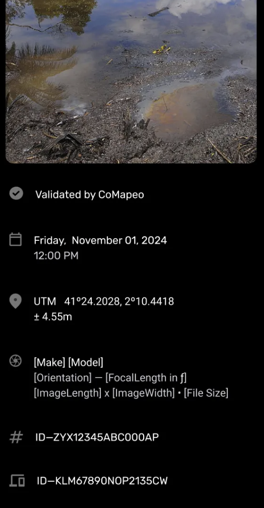
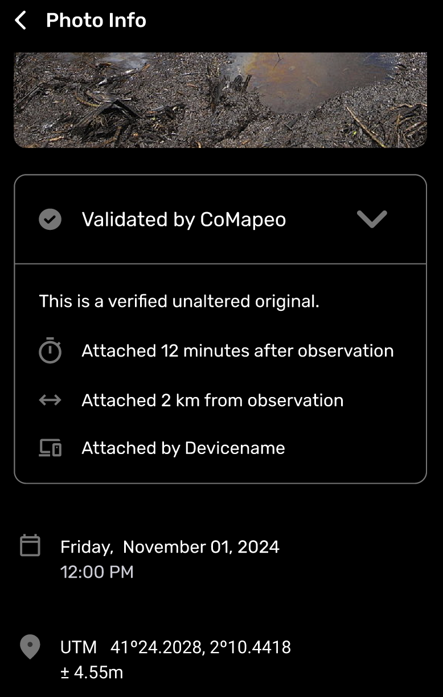

# 🏁 CoMapeo Mobile - Exposing Photo Data

Last Edited: September 3, 2025 5:29 PM
Guide Status: Ready to read

<aside>
📌 **A quick start guide to CoMapeo Mobile’s newest features and improvements. For internal use.**
Available in [CoMapeo V5](https://www.notion.so/Release-Notes-CoMapeo-v5-0-1de1b08162d580b38c94ec18de3a998e?pvs=21)

</aside>

---

# Exposing Photo Data

### Background

CoMapeo has been gathering both Observation GPS and Photo Metadata but it was not being displayed.

### What’s New

We are introducing Photo Info which allows users to view and share an individual photo’s metadata, in case it’s being challenged for their authenticity.

<aside>

### Viewing Photo Info

1. Go to any Observation with photos 
2. Tap on a photo thumbnail
3. The new Photo Info screen will appear. It displays the following details about the photo:
    - **Validated by CoMapeo**
    - Date and timestamp
    - GPS coordinates of the photograph
    - Device metadata : device type, camera details including aperture, and photo size
    - Observation ID
    - Device ID
</aside>

<aside>

### Upcoming Improvement

In an upcoming CoMapeo update, the “Validated by CoMapeo” header will become a module that describes important details about a photo’s authenticity.

Whenever tapped, the Validated by CoMapeo module expands to displays key metrics about the photo’s integrity.

This includes:

- amount of time the photo was attached after the observation was created;
- the distance from the original location of observation creation; and
- the device from where the photo originated.

When tapped again, the Validated by CoMapeo module collapses to its original state.

</aside>