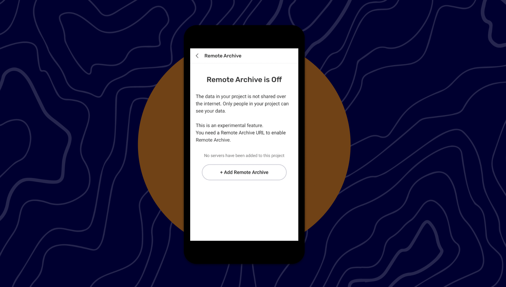

# 🏁 CoMapeo Mobile 1.2 - Remote Archive

Last Edited: September 3, 2025 5:32 PM
Guide Status: To Update

<aside>
📌 **A quick start guide to CoMapeo Mobile’s new features :  Remote Archive - for internal use**

</aside>

---

# **Remote Archive**

Formerly known as “Mapeo Cloud Sync”, **Remote Archive** allows you to exchange data over the internet without needing to be on the same wifi and location as another user. This version of the feature, called “Community Edition”, is designed to run on a server with no UI for editing or viewing the data — it is just for exchange and storage of data.

<aside>

**How do I start Remote Archive?**

1. Create a project on CoMapeo and have the link to the server you would like to exchange data with.
2. Open the menu and tap [Project Settings], then [Remote Archive]
    1. If no server was added, you will see “Remote Archive is OFF”
3. Tap  [Remote Archive] and then tap [+ Add Remote Archive]
4. In the URL field, type or copy/paste the URL to the server
    1. If you’re copying the URL, make sure to remove any `http:` or replace it with `https:`. You can’t add insecure HTTP servers. For example, `comapeo.example` and `https://comapeo.example` are okay, but `http://comapeo.example` is not.
5. If successful, tap [Project Settings] then [Your Team], you will see the server under Participants
</aside>

<aside>

**How do I remove Remote Archive?**

- On CoMapeo Mobile 1.2.0, it is not possible to remove a server from the project once it has been added.
    - In an upcoming version of CoMapeo in Q2, the coordinator will be able to remove/replace a server from the project
- In this version and in the future, if you are a participant, you cannot remove the Remote Archive from the project.
</aside>

<aside>

**How do I exchange data with Remote Archive?**

- When you are on the Exchange (Sync) screen and start exchanging data, your data will be shared with the Remote Archive automatically
    - On CoMapeo Mobile 1.2.0 it is not possible to not exchange with the Remote Archive but this is a feature that may come in the future.
</aside>

<aside>

**Details :**

- A server can be considered as any other device that was added to a project, with the difference that a server is in a perpetual state of being available to exchange data.
    - This means if is a new user is added to the project, gathers observations, and then opt-ins to exchange data, that data will be automatically exchange with the server.
- If you are a Participant, and the Remote Archive feature wasn't activated, you will not see the Remote Archive section in [Project Settings].
- You will need to be connected to the Internet to add a server
    - You will also need to be connected to the internet to exchange data with the server
</aside>

<aside>

**What’s next :**

- By the end of the year, improvements to the feature will be introduced, such as allowing the user to remove the server, or an easier process to add a server.
</aside>

# What’s new? What’s missing?

- The Media Manager feature was removed from this version of CoMapeo in order to not delay this release